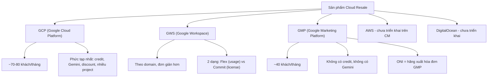
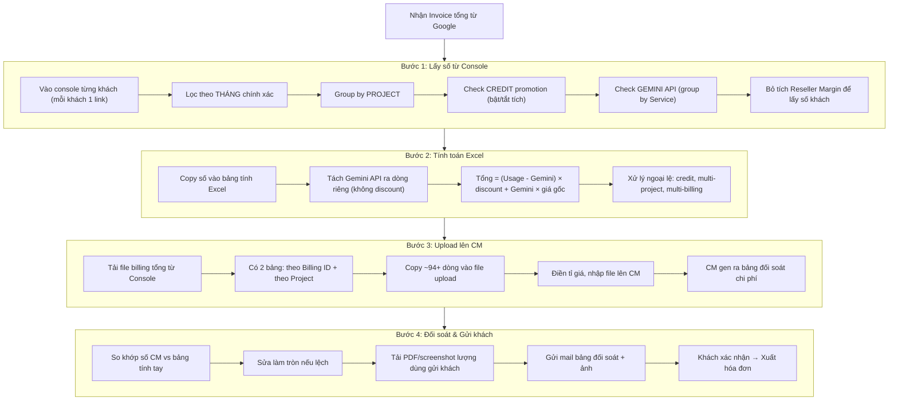
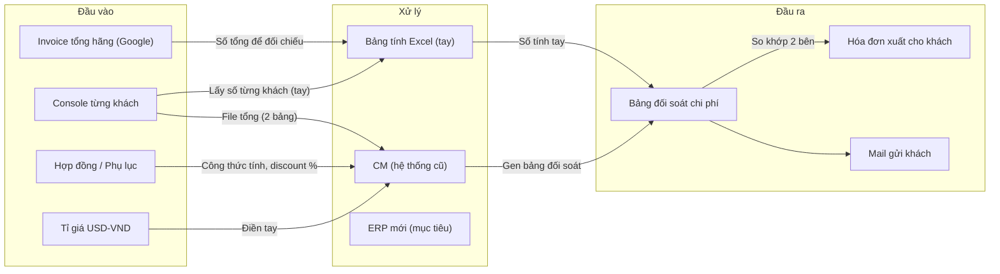

# Phân Tích Hội Thoại — Quy Trình Tính Billing & Đối Soát Chi Phí

> [!NOTE]
> Phân tích từ 5 file ghi âm cuộc họp giữa **Kế toán (Diễn giả 00 / Người nói 1)** và **Dev team (Diễn giả 01 / Người nói 2, 3)** về quy trình tính billing hàng tháng cho khách hàng reseller cloud.

---

## 1. Nhân Vật & Vai Trò

| Vai trò | Mô tả |
|---|---|
| **Kế toán (Chị)** | Người thực hiện toàn bộ quy trình tính bill, đối soát, xuất hóa đơn. Dùng Console + CM (hệ thống nội bộ cũ) + Excel |
| **Dev team (Em)** | Đội phát triển ERP mới, đang tìm hiểu nghiệp vụ để tự động hóa |
| **Sale / Sale Admin** | Xác nhận credit thuộc về khách hay công ty. Mỗi sale chỉ xem được khách của mình trên console |
| **CEO** | Quyết định việc phân bổ credit promotion (của khách hay của mình) |
| **Admin / Tech** | Quản lý hợp đồng, công thức tính trên CM. Cập nhật thay đổi phụ lục |

---

## 2. Các Sản Phẩm Cần Tính Bill

---

## 3. Quy Trình Tính Bill Hàng Tháng (GCP — phức tạp nhất)

### 3.1. Timeline hàng tháng

| Ngày | Sự kiện |
|---|---|
| **Mùng 1** | GWS (Flex) có invoice |
| **Mùng 2** | GCP có invoice hãng (có thể muộn hơn) |
| **Mùng 3** | Bắt đầu tính chi tiết (chờ data ổn định 1 ngày) |
| **Mùng 5-8** | GMP có invoice (có tháng muộn đến mùng 9) |
| **Mùng 7** | Deadline cho 2 khách đặc biệt (BitVN — GCP tổng thống, Phạm Max City) |
| **Mùng 4-5** | Gửi mail đối soát cho khách |
| Sau xác nhận | Xuất hóa đơn |

### 3.2. Quy trình chi tiết

---

## 4. Quy Tắc Nghiệp Vụ Quan Trọng

### 4.1. Discount & Margin

| Quy tắc | Chi tiết |
|---|---|
| **Reseller discount** | Hãng đã trừ ~10% margin cho partner. Số trên console = số đã trừ margin |
| **Bỏ tích Reseller Margin** | Khi lấy số cho khách, phải bỏ tích để lấy số TRƯỚC discount |
| **Mỗi khách discount riêng** | Theo hợp đồng, không có chuẩn chung |
| **Gemini API không discount** | Phải tách riêng, tính giá gốc |
| **Gemini quá nhỏ (<$0.07)** | Tính gộp vào tổng, không tách riêng |

### 4.2. Credit Promotion

| Quy tắc | Chi tiết |
|---|---|
| **Nguồn credit** | Hãng cho khách HOẶC hãng cho mình (partner) |
| **Phân loại** | CEO/Sale xác nhận: của khách hay của mình |
| **Chia credit** | Có trường hợp: 4.000 credit → cho khách 2.500, giữ 1.500 |
| **Cách check** | Bật/tắt tích credit trên console, so sánh số trước và sau |
| **Free tier (F2)** | Năm thứ 2 được giảm 20% — phải check mới biết |

### 4.3. GWS (Google Workspace)

| Quy tắc | Chi tiết |
|---|---|
| **Invoice theo domain** | Không theo khách cá nhân |
| **2 dạng** | **Flex** (usage, tính hàng tháng) vs **Commit** (license, trả trước 1 năm) |
| **Cùng domain vừa Flex vừa Commit** | Phải sửa tay: bỏ phần Commit, chỉ lấy Flex |
| **CM đã hỗ trợ** | Flex đơn giản: upload CSV → CM gen bảng đối soát |
| **Không cần đối soát kỹ** | Kế toán tin tưởng số CM cho Workspace |

### 4.4. GMP (Google Marketing Platform)

| Quy tắc | Chi tiết |
|---|---|
| **Không có credit** | Đơn giản hơn GCP |
| **Không có Gemini** | Không cần tách |
| **1 billing link có thể chứa 23 project/khách** | Phải lọc từng khách ra |
| **ONI** | Là hãng xuất hóa đơn cho GMP |
| **CM hỗ trợ tốt** | Ít công thức, chỉ có phí dịch vụ |

### 4.5. Ngoại Lệ

| Trường hợp | Xử lý |
|---|---|
| **Khách có nhiều project** | Cộng tay tất cả project |
| **Khách có nhiều billing** | Mở nhiều lần, cộng cộng cộng |
| **Khách chia nhiều pháp nhân** (VD: 1 HĐ → 9 công ty) | File tính riêng, gửi riêng cho khách phân bổ |
| **Thay đổi pháp nhân** | Con A → Con B nhận hóa đơn. Ký HĐ mới |
| **Thay đổi phụ lục/công thức** | Kế toán biết qua CC mail hoặc khách phản hồi. Không có thông báo chính thức |

---

## 5. Pain Points — Vấn Đề Hiện Tại

> [!WARNING]
> Các vấn đề chính mà ERP cần giải quyết

### 5.1. Thao tác thủ công quá nhiều

- **Copy-paste từng khách**: ~70-80 khách GCP × thao tác 5-6 bước = **nửa ngày đến 1.5 ngày**
- **Lấy data Gemini API**: Phải group by Service, copy riêng, không có cách tự động
- **Sửa làm tròn**: CM hay bị lệch 1-2 đồng do rounding
- **Multi-project/billing**: Cộng tay, không có tổng hợp tự động

### 5.2. CM (hệ thống cũ) không đủ

- ❌ Không hỗ trợ Gemini API → làm tay
- ❌ Không đọc được lượng Gemini → phải lấy trên Console riêng
- ❌ Rounding sai (chị nhắc nhiều lần "round đến hàng nghìn mà không đúng")
- ❌ Không hỗ trợ AWS, DigitalOcean
- ❌ Đôi khi thiếu data (không nhận 1 số dòng trên Console)

### 5.3. Không có alert/thông báo

- Thay đổi hợp đồng: không ai thông báo kế toán
- Credit mới: phải tự check từng khách
- Khách thêm project mới: phải tự phát hiện

### 5.4. Phụ thuộc "trực giác kế toán"

- Kế toán nhìn quen → phát hiện lệch
- Không có validation tự động
- Rủi ro khi kế toán nghỉ/thay người

---

## 6. Mong Muốn Từ Kế Toán Cho ERP

> [!IMPORTANT]
> Những yêu cầu chị Kế toán nêu rõ trong cuộc họp

### 6.1. Ưu tiên cao

| # | Yêu cầu | Trích dẫn |
|---|---|---|
| 1 | **Tự động lấy Gemini API usage** từng khách | "Chị muốn nhìn phát là biết được từng khách có lượng dùng Gemini API như nào" |
| 2 | **Tự động detect credit promotion** | "ERP ra danh sách 10 khách dùng credit → gửi cho CEO/sale xác nhận" |
| 3 | **Rút ngắn thời gian tính bill** | "Thời gian lý tưởng 1 ngày, hiện tại 1.5 ngày" |
| 4 | **Số phải chuẩn** | "Phải đảm bảo số chuẩn. Nó liên quan đến hóa đơn, đánh cho khách" |

### 6.2. Ưu tiên trung bình

| # | Yêu cầu | Trích dẫn |
|---|---|---|
| 5 | **Đối soát tự động**: ERP gen bảng → so với bảng tính tay | "IRB gen ra bảng giống của chị, chị up lên, nó so 2 cái" |
| 6 | **Xuất file Excel số cuối** toàn bộ khách | "Xuất được cái file Excel số cuối của toàn bộ khách hàng" |
| 7 | **Nhắc nợ tự động** | "Dễ nhất chắc chỉ có việc nhắc nợ" |

### 6.3. Thái độ với ERP

- **Cởi mở**: "Chị bỏ qua hết xung quanh, chỉ muốn tự động chỗ này chỗ kia"
- **Thận trọng**: "Số không chuẩn thì không ổn đâu, liên quan hóa đơn"
- **Thực tế**: "Bọn em thay CM thôi, chị check trên ERP thay vì CM"
- **Chấp nhận đối soát**: "Nếu ERP gen số → chị đối chiếu với bảng tính → nếu khớp thì OK"

---

## 7. Data Flow — Luồng Dữ Liệu

---

## 8. Hai Bảng Upload Quan Trọng (Đầu Vào CM)

| Bảng | Nội dung | Ghi chú |
|---|---|---|
| **Bảng theo Billing ID** | Mỗi billing = 1 dòng, số tổng | Khoảng 94 dòng |
| **Bảng theo Project** | Mỗi project = 1 dòng, chi tiết | 600+ dòng (1 khách có thể có nhiều project) |

> Kế toán copy-paste **thủ công** cả 2 bảng này từ Console vào file Excel rồi upload lên CM.

---

## 9. Tóm Tắt Theo Từng File Audio

| File | Nội dung chính |
|---|---|
| [b1.md](file:///c:/Users/thanh/Desktop/ERP_Cloudaz/audio/b1.md) | Thay đổi pháp nhân, lấy số từ console, hóa đơn tổng hãng, credit promotion, cách check credit |
| [b2.md](file:///c:/Users/thanh/Desktop/ERP_Cloudaz/audio/b2.md) | Gemini API tách riêng, file upload CM (2 bảng), CM gen bảng đối soát, tỉ giá, công thức tính, thay đổi thuế phí tháng 7 |
| [b3.md](file:///c:/Users/thanh/Desktop/ERP_Cloudaz/audio/b3.md) | Khách dùng cả GWS + GCP, khách nhiều billing, đối chiếu CM vs bảng tính tay, CM đôi khi thiếu data, rounding |
| [b4.md](file:///c:/Users/thanh/Desktop/ERP_Cloudaz/audio/b4.md) | Mong muốn ERP: auto Gemini + credit, luồng tính bill GCP, bộ lọc console, GWS Flex vs Commit |
| [b5.md](file:///c:/Users/thanh/Desktop/ERP_Cloudaz/audio/b5.md) | GWS Flex workflow, GMP workflow (1 link nhiều khách, không credit/Gemini), timeline hàng tháng, đối soát ERP vs bảng tính, công nợ |
