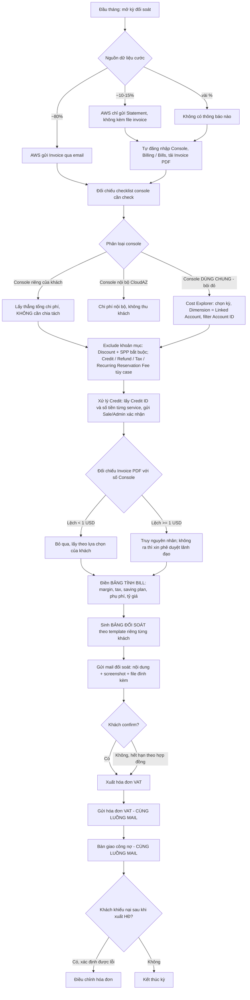

# Phân tích chi tiết quy trình Billing / Đối soát / Xuất hóa đơn — AWS (CloudAZ)

> **Nguồn:** Biên bản trao đổi `docs/Aws/Traodoi.md` (bản ghi âm chuyển văn bản — phỏng vấn giữa BA và cán bộ phụ trách billing AWS).
> **Ngày lập:** 2026-08-28
> **Tài liệu liên quan:** `docs/GetBillingProcess/aws.md`, `docs/GetBillingProcess/do.md`, `docs/GetBillingProcess/solution.md`, `docs/thu-hoi-cong-no/*`
> **Trạng thái:** Phân tích nghiệp vụ AS-IS + Đề xuất tự động hóa TO-BE — **cần nghiệp vụ review & xác nhận**.

---

## 1. Mục đích & phạm vi

### 1.1. Mục đích
Chuẩn hóa toàn bộ quy trình thủ công hiện tại của nghiệp vụ **lấy cước → tách chi phí → đối soát → xuất hóa đơn → bàn giao công nợ** cho mảng **AWS**, làm đầu vào cho:
- Đặc tả yêu cầu (SRS) module Billing AWS trong ERP_Cloudaz.
- Thiết kế mô hình dữ liệu và rule engine tính cước.
- Xác định ranh giới tự động hóa được / không tự động hóa được.

### 1.2. Phạm vi

| Trong phạm vi | Ngoài phạm vi |
|---|---|
| Thu thập invoice/statement AWS | Nghiệp vụ kỹ thuật cloud (khởi tạo, vận hành service) |
| Phân loại console & tách chi phí khách/nội bộ | Giải trình kỹ thuật nguyên nhân tăng/giảm cước (đội Cloud/IaaS) |
| Tính tiền thu khách (margin, credit, tax, saving plan) | Quy trình ký hợp đồng, đàm phán giá |
| Lập bảng đối soát, gửi mail, thu confirm | Nghiệp vụ hạch toán kế toán chi tiết |
| Xuất hóa đơn VAT & bàn giao sang công nợ | Quy trình thu hồi công nợ (đã có tài liệu riêng) |

### 1.3. Vai trò liên quan

| Vai trò | Trách nhiệm trong quy trình |
|---|---|
| **Nhân sự Billing** (người được phỏng vấn) | Lấy cước, tách chi phí, tính tiền, lập bảng đối soát, gửi mail, đối chiếu invoice |
| **Sale / AM** | Xác nhận mã credit của khách hay của công ty; tỷ lệ chia credit theo hợp đồng; giải trình cho khách |
| **Admin AWS / đội Cloud (IaaS)** | Giải thích Account ID lạ, ý nghĩa service, nguyên nhân chênh lệch chi phí |
| **Kế toán** | Xuất hóa đơn VAT, theo dõi & thu công nợ |
| **Ban lãnh đạo** | Phê duyệt ngoại lệ khi chênh lệch invoice/console không tìm được nguyên nhân |

---

## 2. Từ điển thuật ngữ (giải mã bản ghi âm)

Bản ghi âm bị lỗi nhận dạng khá nhiều. Bảng dưới ánh xạ từ ngữ trong transcript sang thuật ngữ chuẩn, tránh hiểu sai khi đọc lại nguồn.

| Từ trong transcript | Thuật ngữ chuẩn | Ghi chú |
|---|---|---|
| conso / con mà / con số / cần sôi | **Console** (AWS Management Console), cũng dùng chỉ **một tài khoản payer/organization** | Ngữ cảnh quyết định nghĩa |
| off | **Account** (tài khoản AWS) | "off của Cloud Z" = account của CloudAZ |
| dio | **DigitalOcean (DO)** | Dịch vụ dùng để so sánh, quy trình đơn giản hơn |
| hãng / FS / iOS / AOS | **AWS** (nhà cung cấp) | |
| build / bu / bill | **Bills** (Billing → Bills) hoặc **bảng tính bill** | |
| code / cao | **Cost Explorer** | "vào code chọn thời gian" = mở Cost Explorer chọn kỳ |
| link cao / AK | **Linked Account** (dimension trong Cost Explorer) | |
| dis cao / disco | **Discount** (dòng chiết khấu) | |
| solution cao / SPP | **Solution Provider Program** (chiết khấu đối tác) | |
| aic computer cloud | **Elastic Compute Cloud (EC2)** | |
| SLO / SL / reseller SL | **SSO** (IAM Identity Center) — portal reseller quản lý tập trung | |
| Iem | **IAM** (tài khoản IAM view-only khách cấp) | |
| saving | Mục **Savings / Credits** trong Billing Console | |
| usit / us | **Usage** (loại invoice cước sử dụng định kỳ) | |
| sub | **Subscription** (loại invoice phí đăng ký / phí phát sinh) | |
| recursing resent fee | **Recurring Reservation Fee** (phí trả trước gói cam kết) | |
| refun | **Refund** (hoàn tiền từ hãng) | |
| tắc / tax | **Tax** (thuế) | |
| envoy / en voice | **Invoice** | |
| marin | **Margin** (tỷ lệ lợi nhuận / chiết khấu hãng) | |
| PSGO | **Pay As You Go** | |
| commit | **Committed contract** (hợp đồng cam kết trả trước 6–12 tháng) | |
| đối soát | Reconciliation — bảng kê chi phí gửi khách xác nhận | |
| bảng tính build | **Bảng tính bill** (Google Sheet tính cước, hiện làm thủ công) | |
| analog | Ban lãnh đạo / cấp phê duyệt | Suy đoán từ ngữ cảnh — **cần xác nhận** |

---

## 3. Bức tranh tổng thể

### 3.1. Đặc điểm cốt lõi phân biệt AWS với các dịch vụ khác

> **Câu chốt trong transcript:** *"Các bước thực hiện là như nhau (lấy thông tin → điền bảng tính → ra số tiền → gửi mail đối soát). Chỉ khác mỗi bước tìm ra số tiền."*

Nghĩa là **khung quy trình dùng chung với DO / GWS / GCP**, nhưng **bước "xác định số tiền phải thu của khách" của AWS phức tạp hơn hẳn**, vì 4 lý do:

1. **Console dùng chung** — một console AWS có thể chứa đồng thời chi phí của công ty và của **tới ~30 khách hàng** (ví dụ console `7793`). Phải tách thủ công theo Account ID.
2. **Console chỉ hiển thị số phải trả hãng** — không tách sẵn "chi phí khách" / "cần thu bao nhiêu". Phải tự filter/exclude nhiều khoản mục.
3. **Credit không có mã ở mức tổng hợp** — trang Savings chỉ cho tổng tiền; phải mò từng service để lấy Credit ID rồi gửi Sale xác nhận.
4. **Chênh lệch giữa Invoice PDF và số trên Console** — tồn tại thật, **chưa khắc phục được** (DO thì khớp 100%).

### 3.2. Sơ đồ luồng tổng thể



---

## 4. Chi tiết từng bước (AS-IS)

### B0. Chuẩn bị — checklist console & bảng ánh xạ Account ID

**Đầu vào:** Danh sách toàn bộ console AWS mà CloudAZ có quyền truy cập + Hợp đồng khách hàng.

**Thao tác:**
1. Duy trì **bảng checklist console** — liệt kê tất cả console cần check hàng tháng.
2. Phân loại và **ghi chú màu** cho từng console:
   - Console **của khách** (CloudAZ chỉ có quyền view).
   - Console **nội bộ** CloudAZ (chi phí nội bộ công ty).
   - Console **dùng chung** — **bôi đỏ**, vì *"nhiều cái dồn vào thì ngồi check tay từng cái một"*.
3. Duy trì **bảng ánh xạ Account ID ↔ Khách hàng**, trích xuất **từ hợp đồng**.

**Quy tắc xác định chủ sở hữu Account ID:**

| Tình huống | Kết luận |
|---|---|
| Account ID **có** ghi trên hợp đồng | Chi phí **của khách** → thu khách |
| Account ID **không** có trên hợp đồng | Chi phí **của CloudAZ** (nội bộ) |
| Account ID **mới xuất hiện** (tháng trước không có, tháng này có) | **Phải hỏi Admin** trước khi tính |

**Quan hệ Khách hàng ↔ Account ID:** quan hệ **1–N**.
- Một khách có thể có **nhiều** Account ID (khách `DX` có 2 ID, khách `NSC` có tới 4 ID).
- Khi tính tiền phải cho phép **tùy chọn gộp hoặc tách** từng ID — tùy yêu cầu từng khách.
- Ngược lại, một console có thể chứa **nhiều khách** (console `7793` hiện có ~30 khách dùng chung).

> ⚠️ **Rủi ro hiện tại:** bảng ánh xạ nằm trong file thủ công, phụ thuộc trí nhớ. Người mới mất **2–3 tháng** mới quen.

---

### B1. Thu thập dữ liệu cước đầu vào

AWS **không gửi invoice đồng nhất** cho tất cả console:

| Tỷ lệ | Kiểu thông báo | Hành động cần làm |
|---|---|---|
| **~80%** | Gửi **Invoice** qua email | Nhận & lưu file |
| **~10–15%** | Chỉ gửi **Statement** (thông báo cước, **không đính kèm invoice**) | Phải **tự đăng nhập console → Billing → Bills → tải invoice** |
| **Vài %** | **Không thông báo gì** (console ít phát sinh) | Phải **vào từng console check tay** |

> **Hệ quả nghiệp vụ:** không thể chỉ dựa vào email inbox làm nguồn dữ liệu duy nhất. Bắt buộc phải có cơ chế **chủ động quét (pull) từ console** cho 20% còn lại.

---

### B2. Truy cập console — hai mô hình

| Mô hình | Điều kiện áp dụng | Cách vào | Quyền |
|---|---|---|---|
| **A. Tập trung qua SSO / Reseller Portal** | Console **nội bộ CloudAZ**; hoặc console khách **khi khách đồng ý** cho đưa vào portal | Đăng nhập portal SSO CloudAZ, chuyển đổi account | Đầy đủ theo phân quyền |
| **B. Đăng nhập riêng bằng tài khoản IAM khách cấp** | Khách **không đồng ý** đưa console vào portal chung | Vào bằng **link đăng nhập riêng của khách** | Chỉ **view-only** |

**Trong console, nhân sự billing chỉ dùng 3 mục:**
1. **Bills** — tải Invoice khi hãng không gửi mail; kiểm tra mã credit và các khoản phát sinh bất thường.
2. **Cost Explorer** — lọc chi phí theo kỳ / Linked Account / Service.
3. **Savings / Credits** — xem tổng credit và saving plan.

> *"Những cái còn lại là kỹ thuật anh không quan tâm, anh chỉ cần tiền."*

---

### B3. Xác định số tiền — nhánh CONSOLE RIÊNG (đơn giản)

**Điều kiện:** console chỉ có duy nhất 1 khách sử dụng, không lẫn chi phí CloudAZ.

**Thao tác:** vào đúng console của Account ID đó → lấy **tổng chi phí** → **không phải chia tách gì cả**.

> *"Nó là một mình khách dùng một account riêng, trên đấy chỉ có của khách thôi, mình không chẻ cái gì của mình vào đây cả."*

**Ưu tiên triển khai:** nghiệp vụ đề xuất **làm nhánh này trước** vì đơn giản hơn.

---

### B4. Xác định số tiền — nhánh CONSOLE DÙNG CHUNG (phức tạp)

Đây là phần khó nhất của toàn bộ quy trình.

**Vấn đề gốc:** Console AWS chỉ hiển thị **duy nhất một số — tổng tiền CloudAZ phải trả hãng**. Không có cột "chi phí khách" hay "cần thu bao nhiêu".

#### B4.1. Các bước filter trong Cost Explorer

1. **Chọn kỳ (Date range)**
   - Mặc định **1 tháng** (vì thu theo tháng).
   - Ngoại lệ: khách **committed** trả trước 6 tháng / 1 năm → cuối kỳ phải tổng hợp: đã trả trước bao nhiêu, thực dùng bao nhiêu, còn thừa/thiếu bao nhiêu. **AWS rất ít khách committed (~1–2 khách)** — khác GWS (hàng trăm khách).

2. **Đổi Dimension từ `Service` sang `Linked Account`**
   - Mặc định AWS group theo **Service** → chỉ ra tổng của **tất cả khách** cho service đó.
   - Đổi sang **Linked Account** → hiển thị **Account ID + tên hiển thị (display name)**.
   - ⚠️ **Tên hiển thị có thể bị đổi tùy ý** → **KHÔNG dùng tên làm khóa đối chiếu, chỉ dùng Account ID.**

3. **Filter theo Account ID của khách cần tính**
   - Đối chiếu Account ID trên Cost Explorer với bảng ánh xạ tách từ hợp đồng.
   - Nếu khách có nhiều ID → **cộng tay** từng dòng (mỗi ID một dòng).

4. **Exclude các khoản mục không thu khách** (chi tiết ở mục 5).

> **Minh chứng mức ảnh hưởng của bước exclude (số liệu trong transcript):** tổng trước exclude ≈ **167.938 USD**; sau khi exclude Discount + Solution Provider chỉ còn **~18.000 USD**.
> ➜ Bước này **quyết định hoàn toàn** con số cuối cùng — sai một filter là sai toàn bộ.

#### B4.2. Tính năng lọc chéo của Cost Explorer
- Chọn **Account ID** → xem account đó dùng những **service** nào.
- Chọn **Service** → xem có những **khách** nào đang dùng service đó.

➜ Nhân sự billing **không dùng** tính năng này (chỉ cần tổng tiền). Đây là nhu cầu của **đội kỹ thuật CloudAZ / kỹ thuật của khách**.

---

## 5. Ma trận Include / Exclude các khoản mục

Sau khi lọc được chi phí theo Account ID, phải loại trừ tiếp các khoản mục sau:

| Khoản mục | Bắt buộc exclude? | Bản chất | Ghi chú xử lý |
|---|---|---|---|
| **Discount** | ✅ **Luôn luôn (100%)** | Chiết khấu hãng dành cho CloudAZ | *"Chắc chắn là của mình rồi, không thể chạy đâu được"* |
| **Solution Provider (SPP)** | ✅ **Luôn luôn (100%)** | Chiết khấu chương trình đối tác | Một số khách không có dòng này |
| **Credit** | ⚠️ Tùy trường hợp | Tín dụng hãng cấp | **Phải xác minh của mình hay của khách** — xem mục 6 |
| **Refund** | ⚠️ Tùy trường hợp | Hãng hoàn tiền khi đạt tiêu chí nào đó | Phải tách: refund cho **end-user** hay cho **partner** |
| **Tax (thuế)** | ⚠️ Tùy trường hợp | Thuế hãng tính | Xem 5.1 |
| **Recurring Reservation Fee** | ⚠️ Tùy trường hợp | Phí trả trước gói cam kết / tiết kiệm | Xem 5.2 |

> **Nguyên tắc tách chung:** *"Tách ra chỉ có hai kiểu thôi — một là của mình, hai là của khách."*

### 5.1. Quy tắc xử lý Tax
- Hãng **không phân biệt** khách dùng qua partner hay dùng trực tiếp → thuế bị **hiện chung** vào console.
- **Mặc định: CloudAZ chịu thuế thay khách** (theo quy định hợp đồng) → **không thu thuế của khách → phải loại ra**.
- Nếu hợp đồng quy định khách chịu → giữ lại.
- Khi tách phải xác định rõ: **thuế gì, theo vùng miền nào, theo quy định pháp luật hay quy định của hãng, tại sao lại phát sinh ở đó.**

### 5.2. Quy tắc xử lý Recurring Reservation Fee / Saving Plan

Gói tiết kiệm (Savings Plan) gồm **2 phần**:
- **Phần trả trước (upfront)** — ví dụ gói 10.000 USD, trả trước 2.000 USD.
- **Phần phân bổ hàng tháng** — 8.000 USD còn lại phân bổ dần từng tháng.

> **Lý do hãng không trừ hết ngay tháng đầu:** *"Nếu trừ tháng đầu tiên, nhỡ khách nó lấy hết xong nó dừng dịch vụ thì móm. Bắt buộc ông phải sử dụng dịch vụ của tôi thì ông mới được trừ."*

**Hai kịch bản với phần trả trước:**

| Kịch bản | Xử lý |
|---|---|
| Khách **trả riêng** 2.000 USD trước | **Phải loại 2.000 USD ra** khỏi bảng tính, nếu không khách **trả 2 lần** |
| Khách muốn **cộng chung** vào chi phí tháng, trả một lượt | Vẫn phải **tách ra kiểm tra** đúng đủ 2.000 USD, **sau đó mới cộng lại** |

**Số Saving Plan hiển thị trên console là số CỦA THÁNG NÀY**, không phải số còn lại / số đã dùng.

> Về mặt nghiệp vụ Saving Plan không gây tranh cãi: *"Cái này là của khách rồi thì mình cứ trừ đi thôi."* Phần hay nhầm lẫn là **Credit**.

### 5.3. Lưu ý về tính đầy đủ của danh sách
> *"Đây là những cái từ lúc anh làm đến giờ nó có phát sinh. Còn sau này có phát sinh thêm cái gì nữa thì anh không biết."*

➜ **Yêu cầu thiết kế:** danh sách khoản mục exclude **PHẢI cấu hình được (configurable)**, không hard-code. Hệ thống cần **cảnh báo khi xuất hiện khoản mục lạ** chưa có trong danh mục.

---

## 6. Xử lý CREDIT — nghiệp vụ khó và tốn thời gian nhất

### 6.1. Bất cập của AWS Console

| Vị trí | Thông tin có được | Thông tin THIẾU |
|---|---|---|
| Trang **Savings** | ✅ **Tổng tiền** credit | ❌ Không biết là **1 mã hay 10 mã** cộng lại; ❌ Không có Credit ID |
| Trong **từng Service** (mục Credit) | ✅ **Credit ID (tên mã)** + số tiền tương ứng | ❌ Phải mở **từng service, check tay từng cái một** |

> **So sánh với DigitalOcean:** DO chỉ cần tick một ô là bung ra chi tiết **từng mã + số tiền** (10 mã = 10 dòng). **AWS không có tính năng này.**

### 6.2. Quy tắc phân bổ credit của AWS

Credit **không trừ thẳng vào tổng**, mà **chia theo từng service** với **hạn mức tối đa riêng cho mỗi service**.

> Ví dụ: credit 1.000 USD, nhưng EC2 chỉ được trừ tối đa 500 USD. *"Không phải một trừ tất cả 1.000 đô đâu."*

Nhân sự billing **không nắm được quy tắc phân bổ của AWS**, chỉ **nhìn kết quả**: *"Anh không thể hiểu được tại sao nó lại trừ chỗ này 5 mà chỗ kia 10 mà không phải ngược lại thì chịu."*

### 6.3. Luồng xác minh credit (thủ công, hiện tại)

```
1. Vào trang Savings   → lấy TỔNG tiền credit
2. Vào từng Service    → mò tất cả mã có chữ "Credit"
3. Ghi lại cặp [Credit ID ↔ Số tiền] cho từng mã
4. Gửi toàn bộ danh sách cho SALE / ADMIN
5. Sale trả lời:
     - Mã này của CloudAZ hay của khách?
     - Nếu là mã CHUNG: bao nhiêu tiền của mình / bao nhiêu của khách (theo hợp đồng)
6. Áp dụng kết quả vào bảng tính
```

### 6.4. Quy tắc phân chia 2 tầng

1. **Tầng 1 — chia theo mã:** mã nào của CloudAZ, mã nào của khách.
2. **Tầng 2 — chia theo số tiền trong cùng một mã:** một mã credit 10.000 USD có thể theo hợp đồng chia **50/50** → 5.000 USD của công ty, 5.000 USD của khách.

> *"Hãng sẽ không bao giờ biết được, nó chỉ cấp theo mã thôi. Ngoài việc chia theo mã còn phải chia theo số tiền nữa."*

### 6.5. ⭐ Quy tắc mặc định khi thiếu thông tin (Business Rule quan trọng)

> **Nếu Sale không phản hồi / không có thông tin → MẶC ĐỊNH credit thuộc về KHÁCH HÀNG.**

**Lý do nghiệp vụ:**
- Đây là console của khách, số liệu của khách.
- Triết lý *"mình tối ưu lợi nhuận cho khách"*.
- Nếu tính nhầm thành của mình, khách yêu cầu giải trình và phải **trả thêm vài nghìn USD** → không giải thích được, mất uy tín.
- *"Thậm chí là 0,1 đô nó cũng hỏi."*

### 6.6. Tác động khối lượng công việc

> *"Có tháng anh nhớ là anh phải check tận gần **3 tuần**, hơn **20 mã credit**."*
> *"Cũng may là dạo này hãng hơi ít cấp credit, chứ trước nó tủ lắm."*

➜ Đây là **điểm nghẽn số 1** của toàn bộ quy trình.

---

## 7. Đối chiếu Invoice PDF ↔ số trên Console

### 7.1. Vì sao phải đối chiếu
- **Console** chỉ là *"một tập hợp những con số, không biết ai nhét vào, tại sao nó ra"* → **không đủ căn cứ pháp lý để thanh toán**.
- **Invoice** mới là chứng từ hợp lệ: có logo, có số hóa đơn, có **chỉ dẫn thanh toán vào tài khoản nào**.
- Ngoài ra: phát hiện trường hợp **hãng đã tính tiền nhưng không gửi invoice về** → nếu không đối chiếu sẽ không biết mà trả.

### 7.2. Cách đối chiếu

| Vế trái | Vế phải |
|---|---|
| **Tổng của TẤT CẢ invoice PDF** tải về trong kỳ (cộng lại) | **Số tổng lấy trên Console** (Cost Explorer / Bills) |

**Ví dụ thực tế trong transcript:** 129,xx (cộng invoice) vs 142,79 (console); 23,xx vs 50,xx (lệch ~0,27); có khách khớp tuyệt đối 81,28 vs 81,28.

### 7.3. ⭐ Quy tắc xử lý chênh lệch (Business Rule)

| Mức chênh lệch | Xử lý |
|---|---|
| **< 1 USD** | **Chấp nhận, không truy nguyên nhân.** Lấy số theo **lựa chọn của khách** — khách được quyền chọn lấy theo Invoice hãng hay theo Console (khách cũng vào console được, cũng biết là có lệch) |
| **≥ 1 USD** | **Bắt buộc tìm nguyên nhân.**<br/>• Do làm tròn / tính sai → **sửa lại**.<br/>• **Không tìm được nguyên nhân** → **xin phê duyệt lãnh đạo**: khách muốn lấy số nhỏ hơn, có đồng ý hỗ trợ không?<br/>&nbsp;&nbsp;— Duyệt → lấy theo yêu cầu khách.<br/>&nbsp;&nbsp;— Không duyệt → lấy số của CloudAZ, **đội Kỹ thuật + Sale phải vào giải trình cho khách** |
| **100–200 USD** | *"Tìm ngay"* — chắc chắn có lỗi tính toán, không thể có chuyện lệch nhiều như vậy |

> **Đối chiếu với DigitalOcean:** DO **khớp 100%, không lệch một đồng nào.** Chênh lệch là đặc thù riêng của AWS và **hiện chưa khắc phục được**.

### 7.4. Xử lý invoice bất thường

| Loại invoice | Tính chất | Xử lý |
|---|---|---|
| **Usage** | Tháng nào cũng có (cước sử dụng) | Bình thường, không cần check sâu |
| **Subscription (sub)** | **Bất thường** — không xuất hiện thường xuyên | **Bắt buộc tải PDF về đọc** xem ghi cái gì: phí trả chậm? lãi trả chậm? phí vượt hạn mức? phí gì hãng thu thêm? |

**Nguyên tắc chung:** *"Cứ cái gì mà tháng trước đang bình thường, tháng sau tự nhiên nó nhảy ra một đống thì phải ngồi check."*

Sau khi xác định bản chất phí:
- Phí hợp lý → trả.
- Phí không hợp lý → **phản hồi hãng hỏi tại sao có phí này**.
- Xác định phí **thuộc CloudAZ hay thuộc khách** (CloudAZ là partner trung gian giữa end-user và hãng, nên có thể rơi vào cả hai).

---

## 8. Bảng tính Bill — từ chi phí hãng ra số tiền thu khách

Các trường đã nhận diện được từ transcript (bảng AWS **phức tạp hơn bảng DO**; DO chỉ cần Invoice + ID):

| # | Trường | Mô tả | Ghi chú |
|---|---|---|---|
| 1 | Console | Mã console chứa chi phí | **Bảng AWS có thêm cột này** so với DO |
| 2 | Account ID | ID khách trên console | Có thể nhiều ID / khách |
| 3 | Tên khách hàng | | |
| 4 | Chi phí phải trả hãng | Số sau khi filter & exclude | |
| 5 | Tax (thuế) | | Mặc định CloudAZ chịu |
| 6 | Discount / SPP | Hai giá trị chiết khấu | Đưa vào để kiểm tra ngược |
| 7 | Saving Plan | Phần phân bổ tháng này (+ phần trả trước nếu có) | |
| 8 | **Tỷ lệ chiết khấu hãng (margin)** | **Kiểm soát: phải nằm trong 6,8% – 8%** | Xem 8.1 |
| 9 | Tỷ lệ phí dịch vụ | Phí dịch vụ CloudAZ thu khách | |
| 10 | Phụ phí (nếu có) | | |
| 11 | Thành tiền (USD) | | |
| 12 | **Tỷ giá** | **Theo lựa chọn của từng khách** | Xem 8.2 |
| 13 | Thuế VAT | | |
| 14 | **Số tiền hóa đơn (VND)** | Kết quả cuối cùng | |
| 15 | ☑ Đã gửi mail | Tick tracking (*"nhiều quá, không tích thì quên"*) | |
| 16 | ☑ Khách đã confirm | Qua mail hoặc bản cứng | |
| 17 | ☑ Cần bản cứng | Nếu có → ghi **ngày gửi** | |
| 18 | Ghi chú đề nghị thanh toán | Cần mấy bản, bản gì | |

### 8.1. Kiểm soát tỷ lệ margin (control point)
- Hợp đồng CloudAZ ký **với hãng** quy định mỗi tháng hãng cắt lại bao nhiêu % lợi nhuận.
- Bảng tính dùng để **kiểm tra ngược** xem con số hãng trả có đúng hợp đồng không.

| Dịch vụ | Tỷ lệ kỳ vọng | Ngưỡng chấp nhận |
|---|---|---|
| **AWS** | **~6,8% – 8%** | 6,99% / 7,75% / 8% đều chấp nhận |
| DigitalOcean | ~25% | 24,82% / 25,1% đều được, trung bình phải đạt 25% |

> **Ngưỡng cảnh báo:** *"Trừ khi nó tụt xuống một hai (%) thì phải check ngay."*
> ➜ **Yêu cầu hệ thống:** tự động cảnh báo khi margin thực tế nằm ngoài ngưỡng cấu hình.

### 8.2. Tỷ giá — tùy chọn theo khách
Mỗi khách có thể chọn khác nhau:
- Tỷ giá **Vietcombank** / **Techcombank** / ngân hàng khác.
- Tỷ giá **cuối tháng** / tỷ giá **ngày gửi**.

➜ **Yêu cầu hệ thống:** cấu hình **nguồn tỷ giá + thời điểm chốt tỷ giá ở cấp khách hàng**.

---

## 9. Bảng đối soát & luồng email

### 9.1. Template bảng đối soát — đa dạng hơn cả DO

> *"Cái thằng này nó còn đa dạng hơn. Có ông thích ngang, có ông thích cộng chung vào, có ông thích tách riêng ra."*

**Nguyên tắc cốt lõi:** **các CHỈ SỐ giống nhau, chỉ khác CÁCH THỂ HIỆN.**

| Chiều tùy biến | Các lựa chọn |
|---|---|
| **Bố cục** | Dòng ngang / Cột dọc |
| **Mức chi tiết** | Copy nguyên mẫu chi tiết từ console xuống / Chỉ tổng hợp tổng tiền |
| **Gộp/tách ID** | Gộp tất cả ID của khách / Tách riêng từng ID |
| **Gộp/tách dịch vụ** | Mỗi dịch vụ một bảng riêng / Gộp nhiều dịch vụ vào một mail |

> **Yêu cầu bắt buộc từ nghiệp vụ:** *"Khi làm phần mềm thì phải cho tùy chọn tất cả. Hôm nay có 4 template, hôm sau anh muốn thêm thì cũng phải cho thêm được."*
> ➜ Template phải **quản lý được động (CRUD template)**, không hard-code số lượng.

### 9.2. Cấu trúc email đối soát
Mỗi email gồm 3 thành phần:
1. **Nội dung mail** (body).
2. **Screenshot** minh chứng.
3. **File đính kèm** (bảng đối soát, invoice).

### 9.3. ⭐ Nguyên tắc "MỘT LUỒNG MAIL" (mail thread)

Toàn bộ vòng đời của một kỳ được giữ **trong CÙNG MỘT LUỒNG MAIL**:

```
[1] Mail đối soát  →  [2] Khách confirm  →  [3] Mail gửi hóa đơn VAT  →  [4] Mail đòi công nợ
                                  (tất cả cùng một thread)
```

**Lý do:** *"Để khách biết là từ đầu đến cuối số tiền là như thế. Sau này họ cần xem lại đối soát, xem lại hóa đơn thì cùng check trong thread rồi."*

**Hệ quả ở bước công nợ:** khi đòi nợ **chỉ cần thông báo tổng số tiền** (ví dụ *"anh chị đang nợ 63,9 triệu"*), **không phải giải thích lại từ đầu** — vì khách đã confirm bảng đối soát chi tiết ở trên thread.

> *"Bởi vì khi họ xác nhận đối soát, họ đã phải tính ra con số khớp rồi họ mới xác nhận."*

### 9.4. Gộp / tách mail khi khách dùng nhiều dịch vụ

| Giai đoạn | Cách gộp |
|---|---|
| **Đối soát** | Mỗi dịch vụ **một bảng riêng**, nhưng có thể **gửi chung trong một mail** (gộp theo từng bảng, **không trộn số liệu vào nhau**) |
| **Công nợ** | Có thể **gộp tổng** các dịch vụ: *"Google Workspace tháng này bao nhiêu, DO bao nhiêu"* → **tổng luôn, không ghi chi tiết** |

**Các tổ hợp có thể xảy ra:** đối soát riêng + công nợ riêng; đối soát riêng + công nợ chung; đối soát chung + công nợ chung.

> **Nguyên tắc nền:** *"Mình không có cơ chế cứng bắt khách phải theo, mà dựa trên sự thỏa thuận đồng thuận hai bên."*
> ➜ **Yêu cầu hệ thống:** cấu hình chính sách gộp/tách **ở cấp khách hàng**, cho **cả 2 giai đoạn (đối soát và công nợ)**, xác định **ngay từ khi đối soát**.

### 9.5. Tách bạch hóa đơn VAT
- Bảng đối soát **không phải** hóa đơn VAT.
- **VAT xuất sau khi khách confirm đối soát**, rồi **gửi bổ sung vào cùng luồng mail**: *"Bên em đã xuất hóa đơn rồi, em gửi anh chị hóa đơn này."*

---

## 10. Ràng buộc thời gian (SLA) & khối lượng

### 10.1. Lịch biểu

| Mốc | Nội dung |
|---|---|
| **Mùng 1 – 15 hàng tháng** | Cao điểm — 2 nhân sự (billing + kế toán) *"dí mặt vào đây không còn thời gian làm gì"* |
| **~Mùng 5 – 7** | Nhiều khách yêu cầu nhận thông báo đối soát trước mốc này |
| **Trước ngày khách yêu cầu confirm (vd mùng 3)** | Phải gửi trước để khách kịp xác nhận |
| **Cửa sổ xử lý thực tế: ~3–4 ngày** | Toàn bộ vướng mắc phải giải quyết xong trong khoảng này |

**Hai ràng buộc song song phải thỏa mãn đồng thời:**
1. **Thời hạn xuất hóa đơn theo luật** (bắt buộc).
2. **Thời hạn đối soát theo yêu cầu từng khách** (thỏa thuận hợp đồng).

### 10.2. Quy tắc khi khách không confirm (Business Rule)

> **Khách không xác nhận → chờ hết thời hạn theo HỢP ĐỒNG (không phải theo hãng) → VẪN XUẤT hóa đơn.**
> *"Mình không thể chờ mãi mãi được, hãng có chờ mình đâu."*

- Thời hạn chờ mặc định thực tế: **2–3 ngày**, nhưng **phải cấu hình được**.
- **Ưu tiên nguồn:** nếu lấy được dữ liệu hợp đồng thì **lấy thời hạn theo hợp đồng** — *"hợp đồng là bằng chứng làm việc hai bên."*
- **Ngoại lệ:** có trường hợp hợp đồng ký một đằng nhưng sau đó **xin gia hạn thêm ít ngày cho khách**, không ký lại hợp đồng → hệ thống phải cho **cấu hình ngoại lệ (override) ở cấp khách hàng/kỳ**.
- **Sau khi xuất hóa đơn**, nếu khách quay lại và xác định đúng nguyên nhân (CloudAZ tính nhầm hoặc hãng sai) → **bắt buộc phải điều chỉnh**.

### 10.3. Khối lượng & năng lực hiện tại

| Chỉ số | Giá trị |
|---|---|
| Số khách hiện tại (ước tính từ transcript) | ~50–70 |
| Thời gian xử lý mỗi kỳ | **5–7 ngày** (cao điểm mùng 1–15) |
| Thời gian tính cho **một** khách phức tạp | **2–3 ngày** (bao gồm chờ Sale phản hồi) |
| Trường hợp xấu nhất đã gặp | **~3 tuần** chỉ để check hơn 20 mã credit |
| **Ngưỡng gãy** | Nếu số khách **tăng gấp đôi** → *"chịu, phải tuyển thêm người hoặc phải giãn thời gian ra 10–15 ngày"* |

### 10.4. Yêu cầu độ chính xác

> *"Phải chính xác 100%, anh không được quyền sai. Thậm chí 0,01 đô cũng không được sai."*

**Lý do:** khách là doanh nghiệp, chi phí hợp lý được trừ khi tính thuế → họ **không ngại trả đúng**, nhưng **đòi hỏi giải trình chính xác tuyệt đối**. *"Nhiều khách bảo: anh chị không thiếu tiền, nếu đúng của công ty anh chị trả; còn nếu không, em phải trả lại cho anh chị."*

---

## 11. Phân tích điểm nghẽn (Pain Points)

| # | Điểm nghẽn | Mức độ | Nguyên nhân gốc | Tác động |
|---|---|---|---|---|
| **P1** | **Xác minh mã Credit** | 🔴 Nghiêm trọng | AWS không cho xem Credit ID ở mức tổng hợp; phụ thuộc Sale phản hồi | Tới **3 tuần/kỳ**; là nút chặn dài nhất |
| **P2** | **Tách chi phí console dùng chung** | 🔴 Nghiêm trọng | 1 console tới ~30 khách; phải filter + cộng tay từng Account ID | Dễ sai sót, tốn giờ công lớn |
| **P3** | **Chênh lệch Invoice ↔ Console** | 🟠 Cao | Đặc thù AWS, chưa có lời giải | Cần escalate lãnh đạo, kéo dài kỳ |
| **P4** | **Phụ thuộc phản hồi Sale / Admin** | 🟠 Cao | Sale có việc riêng, không thể "dí phút trước trả lời phút sau" | Chờ **2–3 ngày** cho mỗi lần hỏi |
| **P5** | **Đa dạng template & tùy chọn theo khách** | 🟠 Cao | Chính sách "khách muốn gì cũng chiều" | Không chuẩn hóa được → khó tự động |
| **P6** | **Phát sinh bất thường không lường trước** | 🟡 Trung bình | Hãng đẻ ra invoice Subscription, phí mới bất kỳ lúc nào | Không thể hard-code danh mục |
| **P7** | **Tri thức nằm trong đầu người** | 🟡 Trung bình | Bảng ánh xạ ID, quy tắc từng khách chỉ có trong file thủ công | Người mới mất **2–3 tháng** onboarding; rủi ro nhân sự |
| **P8** | **Cửa sổ thời gian quá hẹp** | 🟠 Cao | Vừa luật thuế vừa yêu cầu khách | Áp lực cực lớn mùng 1–15 |

---

## 12. Mục tiêu & cơ hội tự động hóa (TO-BE)

### 12.1. Kỳ vọng của nghiệp vụ

> *"Mong muốn là link toàn bộ luồng này sang để có thể tính tự động được. Tự động cái quy trình của anh **tối đa có thể**."*
> *"Nếu tự động thì anh chỉ cần **1–2 tiếng** là tính được, chứ giờ anh phải mất cả ngày."*

**Nguyên tắc nghiệm thu do nghiệp vụ đặt ra (rất quan trọng khi thống nhất scope):**

> *"Ví dụ anh yêu cầu em phải tự động tất cả, nhưng giới hạn kỹ thuật của em không thể tất cả được thì em phải tự động **tối đa 90%**, 10% anh làm tay. Chứ không phải em chỉ làm được 20% — kể cả kỹ thuật làm được nhưng em chưa có thời gian nên không làm — thì anh không đồng ý."*

➜ **Ranh giới không tự động hóa phải là giới hạn KỸ THUẬT, không phải giới hạn NGUỒN LỰC**, và phải được nêu rõ + lý giải.

### 12.2. Đánh giá khả năng tự động hóa từng bước

| Bước | Khả năng tự động | Cách tiếp cận đề xuất | Ghi chú |
|---|---|---|---|
| B1. Thu thập invoice/statement | 🟢 **~95%** | Data Exports (CUR 2.0) → S3 → Athena; kết hợp bóc mail tự động | 20% console không gửi mail vẫn lấy được qua CUR |
| B0. Ánh xạ Account ID ↔ Khách | 🟢 **~90%** | Master data trong ERP, đồng bộ từ hợp đồng | Còn lại: duyệt tay ID mới |
| B3. Console riêng — lấy tổng | 🟢 **~100%** | Query CUR theo `line_item_usage_account_id` | Nên **làm trước** |
| B4. Console dùng chung — tách theo ID | 🟢 **~95%** | `GROUP BY` Account ID trên CUR — thay thế hoàn toàn thao tác Cost Explorer thủ công | **Giá trị lớn nhất**, xóa bỏ P2 |
| B4.4. Exclude Discount/SPP/Tax/Refund | 🟢 **~95%** | Rule engine theo `line_item_line_item_type` (`Credit`, `Refund`, `Tax`, `Discount`, `RIFee`, `SavingsPlan*`) | Danh mục **configurable** |
| Kiểm soát margin | 🟢 **100%** | So sánh tự động với ngưỡng cấu hình + cảnh báo | |
| Xử lý Saving Plan | 🟡 **~70%** | Tự tách upfront vs amortized từ CUR; cần đánh dấu khách đã trả trước riêng | |
| **Xác minh Credit của ai** | 🔴 **~30%** | Hệ thống **tự bóc được Credit ID + số tiền** (giải quyết phần cơ học); **nhưng "của ai" vẫn phải người xác nhận** | Nên xây **workflow phê duyệt trong ERP** thay cho chat/mail thủ công; lưu lịch sử để **tái sử dụng cho kỳ sau** |
| Đối chiếu Invoice ↔ Console | 🟡 **~80%** | Tự động so sánh + phân loại theo ngưỡng 1 USD; tự escalate khi ≥ 1 USD | Không tự giải thích được nguyên nhân |
| Xử lý invoice Subscription bất thường | 🟡 **~50%** | Tự phát hiện & cảnh báo khoản mục mới/bất thường so với tháng trước | Vẫn cần người đọc & quyết định |
| Bảng tính bill → số tiền thu | 🟢 **~100%** | Công thức trong hệ thống | |
| Sinh bảng đối soát theo template | 🟢 **~95%** | Template engine (đã có tiền lệ ở `sprint_1/mailTemplate`) | Cần CRUD template |
| Gửi mail & theo dõi confirm | 🟢 **~95%** | Mail service + tracking trạng thái + thread ID | |
| Xuất VAT & bàn giao công nợ | 🟢 **~90%** | Tích hợp MISA meInvoice (đã có `HDTD_Tich_Hop_MISA_meInvoice_*`) | |

**Ước tính mức tự động hóa tổng thể khả thi: ~85–90%**, phần còn lại tập trung vào: xác nhận chủ sở hữu credit, giải trình chênh lệch, và quyết định các khoản phí bất thường.

### 12.3. Kiến trúc dữ liệu đề xuất (bám theo `solution.md`)

```
AWS Data Exports (CUR 2.0, Parquet)
        ↓ (tự động, hàng ngày)
    Amazon S3
        ↓ (Athena SQL)
  ERP_Cloudaz Backend
        ↓
  [Rule Engine tách chi phí]  ←  Master data: Account ID ↔ Customer, hợp đồng, margin, template, tỷ giá
        ↓
  [Bảng tính bill tự động]
        ↓
  [Bảng đối soát + Mail]  →  [Confirm]  →  [VAT/MISA]  →  [Công nợ]
```

**Lưu ý về độ trễ:** CUR không realtime, AWS đổ dữ liệu theo batch. Phải thiết kế **chốt số sau ngày mùng 3–5** — điều này **xung đột trực tiếp** với yêu cầu khách muốn nhận đối soát trước mùng 5–7.
➜ **Cần làm rõ với nghiệp vụ** (xem mục 15, Q7).

### 12.4. Vẫn phải giữ đường truy cập console thủ công
Kể cả khi CUR chạy tốt, hệ thống **vẫn cần cho phép tải/đối chiếu Invoice PDF**, vì:
- Invoice là chứng từ pháp lý duy nhất có chỉ dẫn thanh toán.
- Nghiệp vụ đối chiếu Invoice ↔ Console là **bắt buộc**, không bỏ được.

---

## 13. Mô hình dữ liệu đề xuất (sơ bộ)

| Thực thể | Trường chính | Ghi chú |
|---|---|---|
| `Provider` | code (AWS/DO/GWS/GCP/GMP), tên | |
| `Console` | mã console, provider, loại (**KHÁCH / NỘI BỘ / DÙNG CHUNG**), phương thức truy cập (SSO / IAM riêng), URL đăng nhập | Thay cho "checklist console bôi màu" |
| `CloudAccount` | **account_id (PK nghiệp vụ)**, console_id, display_name, customer_id, nguồn xác định (hợp đồng / admin xác nhận), trạng thái (**MỚI — chờ duyệt** / ĐÃ XÁC NHẬN) | ⚠️ **Không dùng display_name làm khóa** |
| `Customer` | mã KH, tên, chính sách gộp/tách ID, template đối soát, nguồn tỷ giá, thời điểm chốt tỷ giá, chính sách chọn Invoice/Console khi lệch, hạn confirm, gộp/tách mail đối soát, gộp/tách mail công nợ, có cần bản cứng | Nơi tập trung mọi "tùy chọn theo khách" |
| `Contract` | customer_id, danh sách account_id, tỷ lệ margin cam kết, tỷ lệ phí dịch vụ, ai chịu thuế, thời hạn confirm, ngoại lệ gia hạn | |
| `BillingPeriod` | kỳ (YYYY-MM), trạng thái (MỞ / ĐANG TÍNH / CHỜ CONFIRM / ĐÃ XUẤT HĐ / ĐÓNG) | |
| `CostLine` | period, account_id, service, charge_type, amount | Nạp từ CUR |
| `ExclusionRule` | charge_type/pattern, bắt buộc?, ai chịu (CloudAZ / Khách / Theo hợp đồng), hiệu lực từ | **Configurable** — đáp ứng mục 5.3 |
| `CreditItem` | period, account_id, **credit_id**, service, amount, **chủ sở hữu (CloudAZ / KHÁCH / CHUNG)**, tỷ lệ chia, người xác nhận, thời điểm xác nhận | Cốt lõi của workflow P1; **tái sử dụng kết quả kỳ trước** |
| `InvoiceDoc` | period, console_id, loại (Usage / Subscription), số invoice, số tiền, file PDF | |
| `ReconciliationDiff` | period, customer_id, số invoice, số console, chênh lệch, mức xử lý, người phê duyệt | |
| `ReconciliationSheet` | period, customer_id, template_id, số liệu, file xuất | |
| `MailThread` | period, customer_id, thread_id, các mốc (đối soát / confirm / VAT / công nợ) | Hiện thực nguyên tắc "một luồng mail" |
| `Template` | tên, loại (ngang / dọc / chi tiết / tổng hợp), nội dung | **CRUD được**, không giới hạn số lượng |

---

## 14. So sánh AWS vs DigitalOcean (tham chiếu)

| Tiêu chí | AWS | DigitalOcean |
|---|---|---|
| Gửi invoice qua mail | ~80% (còn lại statement / không gửi) | Gửi đầy đủ |
| Console dùng chung nhiều khách | ✅ Có (tới ~30 khách/console) | ❌ Không |
| Cần tách theo Account ID | ✅ Bắt buộc | ❌ Không |
| Bảng tính bill | Console + ID + tên khách + nhiều chỉ số | Chỉ Invoice + ID |
| Chi tiết mã Credit | ❌ Phải mò từng service | ✅ Tick một ô là ra hết |
| Khớp Invoice ↔ Console | ❌ Có chênh lệch | ✅ **Khớp 100%** |
| Tỷ lệ chiết khấu hãng | ~6,8 – 8% | ~25% |
| Đa dạng template khách | Đa dạng hơn | Ít hơn |
| Khách committed | Rất ít (1–2 khách) | — |

---

## 15. Câu hỏi cần làm rõ với nghiệp vụ (Open Questions)

| # | Câu hỏi | Vì sao quan trọng |
|---|---|---|
| **Q1** | Ngưỡng chênh lệch **1 USD** là quy định chính thức hay thói quen? Có văn bản không? Áp cho từng invoice hay tổng kỳ? | Ảnh hưởng trực tiếp logic tự động escalate |
| **Q2** | Quy tắc mặc định "credit thuộc về khách khi Sale không phản hồi" đã được lãnh đạo phê duyệt chính thức chưa? Có SLA phản hồi cho Sale không? | Rủi ro tài chính nếu hệ thống tự áp dụng |
| **Q3** | Danh sách **đầy đủ** các `charge_type` cần exclude? Transcript mới liệt kê Discount, SPP, Credit, Refund, Tax, Recurring Reservation Fee | Cần đủ để cấu hình rule engine |
| **Q4** | Ai chịu thuế — có phải **luôn luôn** CloudAZ, hay có khách hợp đồng quy định khách chịu? | Quyết định exclude hay không |
| **Q5** | Chính xác có bao nhiêu console, bao nhiêu Account ID, bao nhiêu khách AWS hiện tại? | Ước lượng khối lượng & thiết kế hiệu năng |
| **Q6** | Đang có bao nhiêu **template đối soát** thực tế? Xin file mẫu tất cả các loại | Thiết kế template engine |
| **Q7** | ⚠️ Dữ liệu CUR có độ trễ, thường chốt sau mùng 3–5; nhưng khách yêu cầu nhận đối soát trước mùng 5–7. **Cửa sổ thực tế còn lại là bao nhiêu?** Có chấp nhận số ước tính rồi điều chỉnh không? | **Rủi ro thiết kế lớn nhất** |
| **Q8** | Việc **bật AWS Data Exports** trên console của khách (view-only) có khả thi về mặt quyền không? Với console khách không cho vào SSO thì lấy CUR kiểu gì? | **Rủi ro kỹ thuật lớn nhất** — nếu không được thì phải crawl console |
| **Q9** | "Xin phê duyệt của analog" — chính xác là cấp nào? Quy trình phê duyệt hiện tại ra sao? | Thiết kế workflow phê duyệt |
| **Q10** | Khách **committed** AWS xử lý thế nào cụ thể? (đối chiếu số trả trước ↔ thực dùng ↔ thừa/thiếu) | Tuy ít khách nhưng logic khác hẳn |
| **Q11** | Có cần hỗ trợ **hóa đơn điều chỉnh** sau khi đã xuất VAT trong phạm vi này không? | Transcript có nhắc "phải điều chỉnh thôi" |
| **Q12** | Thời hạn chờ confirm mặc định (2–3 ngày) và cơ chế ngoại lệ gia hạn — cấu hình ở cấp nào (hệ thống / khách / kỳ)? | |

---

## 16. Tài liệu & dữ liệu cần thu thập tiếp

Nghiệp vụ đã cam kết cung cấp trong transcript:

- [ ] **Bảng checklist console** (danh sách console cần check hàng tháng, có phân loại màu).
- [ ] **Bảng tính bill AWS** (file mẫu thực tế — *"hai file này, mỗi hãng hai cái"*).
- [ ] **Bảng ánh xạ Account ID ↔ Khách hàng** tách từ hợp đồng.
- [ ] **Toàn bộ Invoice AWS** (*"anh gửi cho chú tất cả invoice"* — bao gồm cả invoice Usage và Subscription).
- [ ] **Các mẫu bảng đối soát** của tất cả các kiểu template hiện có.
- [ ] Mẫu **Statement** (loại email không kèm invoice) để thiết kế bóc tách.
- [ ] Ví dụ thực tế một kỳ có **chênh lệch Invoice ↔ Console** để phân tích nguyên nhân.
- [ ] Ví dụ thực tế một kỳ có **nhiều mã credit** để thiết kế workflow xác minh.

---

## 17. Khuyến nghị triển khai theo giai đoạn

| Giai đoạn | Nội dung | Lý do ưu tiên |
|---|---|---|
| **GĐ 1** | Master data (Console, CloudAccount, Customer, Contract) + **luồng console RIÊNG của khách** | Nghiệp vụ trực tiếp đề xuất: *"Bây giờ anh chỉ làm cái riêng trước, vì cái riêng đơn giản hơn"*. Xóa bỏ P7 (tri thức trong đầu người) |
| **GĐ 2** | Nạp CUR/Data Exports + **rule engine tách theo Account ID & exclude** cho console DÙNG CHUNG | Xóa bỏ **P2** — điểm nghẽn lớn thứ hai, giá trị/công sức cao nhất |
| **GĐ 3** | **Workflow xác minh Credit** (tự bóc Credit ID + phê duyệt nội bộ + tái sử dụng kỳ trước) | Tấn công **P1** — điểm nghẽn số 1 |
| **GĐ 4** | Bảng tính bill tự động + cảnh báo margin + đối chiếu Invoice ↔ Console theo ngưỡng | Tự động hóa phần tính toán, xóa **P3** một phần |
| **GĐ 5** | Template engine bảng đối soát + luồng mail (một thread) + tracking confirm | Xóa bỏ **P5** |
| **GĐ 6** | Xuất VAT (MISA) + bàn giao công nợ (tái sử dụng module đã có) | Khép kín vòng đời |

> **Triết lý triển khai do nghiệp vụ nêu:** *"Cứ làm ra sản phẩm demo đã, xong rồi lúc dùng có vấn đề gì thì bắt đầu sửa fix. Nó phải ra được thì mới sửa được."*
> ➜ Phù hợp cách tiếp cận **lặp ngắn, demo sớm, ưu tiên nhánh đơn giản trước**.

---

## Phụ lục A — Các câu trích dẫn gốc đáng lưu ý

| Chủ đề | Trích dẫn |
|---|---|
| Bản chất khác biệt AWS | *"Các bước thực hiện như nhau nhưng trong cái bước tìm ra số tiền thì sẽ phải làm một kiểu khác."* |
| Tùy chọn cho khách | *"Chắc chắn phải có lựa chọn gộp hay không, vì công ty mình rất chiều khách, muốn gì cũng được hết."* |
| Giới hạn hỗ trợ | *"Mình vẫn phải có giới hạn, nhưng hỗ trợ tối đa trong giới hạn cho phép."* |
| Tiêu chí nghiệm thu tự động hóa | *"Phải tự động tối đa 90%, 10% anh làm tay. Chứ không phải em chỉ làm được 20%."* |
| Độ chính xác | *"Phải chính xác 100%, thậm chí 0,01 đô cũng không được sai."* |
| Credit mặc định | *"Nếu không có thông tin anh sẽ mặc định của họ, bởi vì mình tối ưu lợi nhuận cho khách."* |
| Ranh giới vai trò | *"Anh chỉ biết tháng này 10.000 thì anh thu đủ 10.000. Còn tại sao nó phát sinh thêm thì hỏi đội quản trị."* |
| Áp lực thời gian | *"Từ mùng 1 đến 15 hàng tháng là ngồi dí mặt vào đây, không còn thời gian làm gì."* |
| Ngưỡng gãy năng lực | *"Lên khoảng gấp đôi số đấy thì chịu, chắc phải tuyển thêm người."* |
| Không có cơ chế cứng | *"Mình không có cơ chế cứng bắt khách phải theo, mà dựa trên sự thỏa thuận đồng thuận hai bên."* |

---

## Phụ lục B — Lưu ý khi đọc file nguồn

`Traodoi.md` là bản speech-to-text **chưa hiệu đính**, chứa:
- Nhiều đoạn hội thoại **ngoài lề** (chuyện nhà cửa, tầng lửng, mua sticker/logo, điện thoại...) — **không liên quan nghiệp vụ**, có thể bỏ qua.
- Lỗi nhận dạng nặng ở tên riêng và thuật ngữ tiếng Anh — tra bảng ở **mục 2** trước khi diễn giải.
- Một số con số minh họa (167.938 / 18.000 / 129 / 142,79 / 81,28) là **ví dụ trên màn hình đang chia sẻ**, không phải số liệu chính thức.
- Các mã `7793`, `9230`, `3061`, `VNP`, `DX`, `NSC`, `VNPay`, `Interspace` là **định danh console/khách hàng thật** — cần đối chiếu với dữ liệu thật trước khi dùng.
