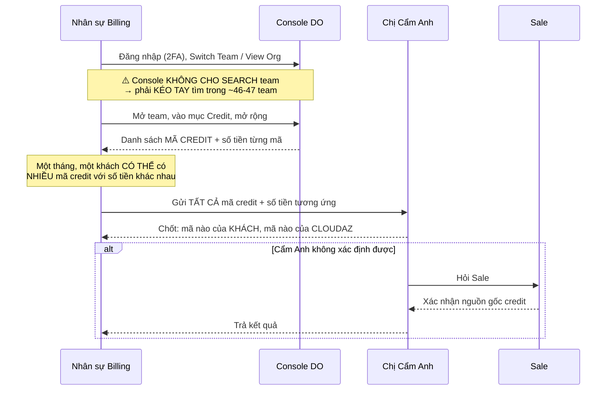

# Phân tích chi tiết quy trình Billing / Đối soát / Xuất hóa đơn — DigitalOcean (CloudAZ)

> **Nguồn:** Biên bản trao đổi `docs/DigitalOcean/Traodoi.md` (bản ghi âm chuyển văn bản — phỏng vấn giữa BA và cán bộ phụ trách billing DigitalOcean).
> **Ngày lập:** 2026-08-28
> **Tài liệu liên quan:** `docs/GetBillingProcess/do.md`, `docs/GetBillingProcess/solution.md`, `docs/Aws/PhanTich_QuyTrinh_Billing_AWS.md`, `docs/thu-hoi-cong-no/*`
> **Trạng thái:** Phân tích nghiệp vụ AS-IS + Đề xuất tự động hóa TO-BE — **cần nghiệp vụ review & xác nhận**.

---

## 1. Mục đích & phạm vi

### 1.1. Mục đích
Chuẩn hóa quy trình thủ công hiện tại của nghiệp vụ **nhận invoice → điền bảng tính bill → lập bảng đối soát → gửi mail → thu confirm → xuất hóa đơn → bàn giao công nợ** cho mảng **DigitalOcean (DO)**, làm đầu vào cho:
- Đặc tả yêu cầu (SRS) module Billing DO trong ERP_Cloudaz.
- Thiết kế mô hình dữ liệu, template engine và rule engine tính cước.
- Xác định ranh giới tự động hóa được / không tự động hóa được.

> **Lưu ý quan trọng về vị thế của DO trong dự án:** DO là dịch vụ **đơn giản nhất** trong nhóm (AWS / DO / GWS / GCP / GMP). Khung quy trình dùng chung với AWS, nhưng bước "xác định số tiền" của DO **gần như không có xử lý phức tạp** vì invoice của hãng đã tách sẵn theo từng Team = từng khách hàng. Vì vậy **DO là ứng viên tốt nhất để làm PILOT tự động hóa**.

### 1.2. Phạm vi

| Trong phạm vi | Ngoài phạm vi |
|---|---|
| Nhận & bóc tách invoice DO (PDF gửi mail / tải từ console) | Nghiệp vụ kỹ thuật cloud (khởi tạo, vận hành Droplet, Spaces...) |
| Truy cập console DO (2 mô hình: Org riêng / Team dùng chung) | Giải trình kỹ thuật nguyên nhân tăng/giảm lượng dùng (đội Cloud/IaaS) |
| Xác minh & phân loại **Credit** (của hãng hay của khách) | Quy trình ký hợp đồng, đàm phán giá, chính sách bán hàng |
| Tính tiền thu khách (chiết khấu, phí dịch vụ, tỷ giá, VAT) | Nghiệp vụ hạch toán kế toán chi tiết |
| Lập bảng đối soát (3 template), gửi mail, thu confirm | Quy trình thu hồi công nợ (đã có tài liệu riêng) |
| Xuất hóa đơn VAT & tạo hồ sơ thanh toán bản cứng | Nghiệp vụ gửi chuyển phát của Hành chính nhân sự |

### 1.3. Vai trò liên quan

| Vai trò | Trách nhiệm trong quy trình |
|---|---|
| **Nhân sự Billing** (người được phỏng vấn) | Nhận/tải invoice, điền bảng tính, tra credit trên console, lập bảng đối soát, gửi mail, **xuất hóa đơn VAT**, tạo hồ sơ thanh toán |
| **Chị Cẩm Anh** (đầu mối chốt credit) | **Người chốt cuối cùng** xác định mã credit thuộc về khách hay thuộc về CloudAZ |
| **Sale / AM** | Nguồn thông tin khi Cẩm Anh không xác định được credit; giải trình **chính sách bán hàng** (vì sao tỷ lệ 5% mà không phải 6–7–8%) cho khách |
| **Anh Đông** (Admin DO) | Cấp quyền truy cập console DO cho nhân sự mới |
| **Chị Hằng** (Kế toán công nợ) | Tiếp nhận sau khi đã xuất & gửi hóa đơn; thông báo đến hạn, theo dõi & thu công nợ |
| **Hành chính nhân sự** | Nhận hồ sơ thanh toán đã trình ký → gửi bản cứng cho khách |
| **Đội quản trị / Cloud** | Hỗ trợ truy nguyên khi lượng dùng biến động bất thường |

---

## 2. Từ điển thuật ngữ (giải mã bản ghi âm)

Bản ghi âm là speech-to-text **chưa hiệu đính**, lỗi nhận dạng nặng. Bảng dưới ánh xạ từ ngữ trong transcript sang thuật ngữ chuẩn.

| Từ trong transcript | Thuật ngữ chuẩn | Ghi chú |
|---|---|---|
| conso / con sổ / con của / con rối | **Console** (DigitalOcean Control Panel) | Ngữ cảnh quyết định nghĩa: giao diện quản trị **hoặc** một tài khoản/organization |
| off / OC / view OR / view O | **Organization / Own account** — tài khoản riêng của khách | *"khách dùng OC riêng"* = khách có organization riêng, không nằm trong org dùng chung của CloudAZ |
| switch team / S tính | **Switch Team** — chức năng chuyển team trong console | Đường vào nhóm khách dùng **chung** organization của CloudAZ |
| team | **Team** (DO Team Account) | **1 Team = 1 khách hàng = 1 pháp nhân** (xem mục 3.2) |
| hãng | **DigitalOcean** (nhà cung cấp) | |
| invoice / envoice / incoin / min voice | **Invoice** | Riêng *"min voice"* ở cuối transcript = **MInvoice** — phần mềm hóa đơn điện tử |
| total du / total use | **Total Due** / **Total Usage** trên invoice | Xem cảnh báo phân biệt ở mục 5.2 |
| dis cao / disco / đít cao | **Discount / Partner Discount** | Chiết khấu đối tác DO cấp cho CloudAZ (~25%) |
| credit / zit / digit credit app | **Credit** — số dư khuyến mại/bù trừ | Có thể của hãng cấp cho CloudAZ, hoặc của khách |
| đăng suất / đặc suất | **Team bị xóa / hủy liên kết** | Khách dừng dịch vụ → console mất quyền xem team đó |
| bảng tính / bảng tính của anh | **Bảng tính bill** (Google Sheet thủ công) | Nơi tính từ chi phí hãng ra số thu khách |
| bảng đối soát / đối sát / lối soát | **Bảng đối soát** (Reconciliation statement) | Bảng kê gửi khách xác nhận |
| biên bản nghiệm thu / phiên bản nghiệm thu | **Biên bản nghiệm thu dịch vụ** | Chứng từ đính kèm tùy khách |
| Cmin / cầm anh / Cẩm Anh | **Chị Cẩm Anh** — đầu mối chốt credit | |
| chị Hàm / chị hàng / chị Hằng | **Chị Hằng** — kế toán công nợ | |
| Mi ô tô / m ô tô | Tên khách hàng (nhiều khả năng **Mioto**) | ⚠️ Cần xác nhận tên chính xác |
| con fong / Freddy / up robot / app promote / Appro / express / Interspace / tch point | Tên khách hàng thật | ⚠️ Nhận dạng sai nhiều — **cần đối chiếu danh sách khách thật** |
| JCP / gcp | **GCP** (Google Cloud Platform) | Dịch vụ khác, nhắc khi bàn gộp/tách mail |
| Misa | **MISA** — phần mềm kế toán (nhắc khi so sánh cơ chế phân quyền) | |

---

## 3. Bức tranh tổng thể

### 3.1. Đặc điểm cốt lõi của DigitalOcean

> **Câu chốt trong transcript:** *"Cái để tính tiền ấy là như nhau"* — dù khách dùng org riêng hay dùng chung, **logic tính tiền không đổi**, chỉ khác giao diện tra cứu.

Bốn đặc điểm khiến DO **đơn giản hơn AWS**:

1. **Invoice đã tách sẵn theo Team.** Mỗi Team ID có invoice riêng, số tiền riêng. **Không phải chia tách chi phí như AWS** — kể cả với khách nằm trong org dùng chung: *"cái dùng chung này thì cũng là từng ID một rồi, nó cũng chia ra tất cả"*.
2. **Hãng gửi invoice PDF về mail tự động** cho **tất cả** khách hàng — về hộp thư của nhân sự billing. **Không bắt buộc đăng nhập console** để lấy invoice.
3. **Quan hệ 1–1 giữa Team và khách hàng.** Không có chuyện một Team bị chia nhỏ cho nhiều khách.
4. **Chỉ có 2 chỉ tiêu tính toán** trong hợp đồng hiện tại: **chiết khấu** và **phí dịch vụ**.

Ba điểm **vẫn phải vào console thủ công**:

1. **Xác minh chi tiết Credit** — invoice chỉ hiện tổng credit, không hiện mã. Muốn biết mã credit → phải vào console.
2. **Template đối soát kiểu "giống console"** — phải copy nguyên trạng bảng trên console (xem mục 7.2).
3. **Truy nguyên biến động bất thường** về lượng dùng.

### 3.2. Cấu trúc tài khoản DO tại CloudAZ

```
DigitalOcean Console (một console duy nhất, dùng chung cho toàn bộ khách)
│
├── Nhánh A — "View Org / Own account"  ── khách dùng ORGANIZATION RIÊNG
│     ├── Khách X  (org riêng, tài khoản riêng của họ)
│     └── Khách Y
│     → Hiện tại chỉ có ~2 khách
│     → Áp dụng khi khách ĐÃ CÓ org riêng và có nhu cầu tiếp tục dùng
│     → Một org riêng có thể chứa NHIỀU Team
│
└── Nhánh B — "Switch Team"  ── khách dùng CHUNG organization của CloudAZ
      ├── Team 1  = Khách A
      ├── Team 2  = Khách B
      ├── ...
      └── Team ~46–47
      → ĐÂY LÀ MẶC ĐỊNH: khách mới luôn được ưu tiên đưa vào nhánh này
```

**Các quy tắc nghiệp vụ (Business Rules) rút ra:**

| # | Quy tắc | Trích dẫn nguồn |
|---|---|---|
| **BR-01** | **1 Team = 1 công ty khách hàng.** Không chia nhỏ một Team cho nhiều khách. | *"Một team chính là một công ty dùng... Không có chuyện là một team này xong rồi cái số này lại chia nhỏ ra cho nhiều khách nữa."* |
| **BR-02** | Khách muốn dùng thêm → **tạo ID mới → sinh Team mới**; hoặc gom nhiều Team vào một **org riêng**. | *"Họ sẽ phải tạo một ID khác thì nó sẽ đẻ ra một cái team khác, hoặc là họ sẽ gom tất cả cái team đấy vào một cái org riêng."* |
| **BR-03** | **Ưu tiên mặc định:** khách mới → org dùng chung của CloudAZ. Ngoại lệ: khách đã có org riêng và muốn giữ. | *"Bình thường khi mà có khách mới sẽ ưu tiên cho vào cái dùng chung này. Trừ trường hợp là họ đang có org riêng và có nhu cầu dùng."* |
| **BR-04** | **CloudAZ join vào tài khoản có sẵn của khách**, không tạo tài khoản hộ khách. Do đó tên hiển thị là do **khách tự đặt**. | *"Bản chất của cái này là mình sẽ join vào cái tài khoản có sẵn của họ, chứ mình không tạo tài khoản cho họ từ đầu."* |
| **BR-05** | Khách **dừng dịch vụ** → Team bị xóa/hủy liên kết → console **mất quyền xem**, không truy vấn lịch sử được nữa. | *"Khi không thì nó sẽ cắt cái quyền đấy thì mình sẽ không xem được nữa."* |

> ⚠️ **Rủi ro dữ liệu quan trọng (BR-05):** khi khách dừng dịch vụ, dữ liệu trên console **biến mất**. ERP **phải lưu trữ (archive) toàn bộ invoice và số liệu ngay tại kỳ phát sinh**, không phụ thuộc console.

### 3.3. Sơ đồ luồng tổng thể

```mermaid
flowchart TD
    A[Đầu tháng: mở kỳ đối soát] --> B[DO gửi Invoice PDF về email của nhân sự billing]
    B --> B2{Khách yêu cầu tự lấy trên console?}
    B2 -->|Không - mặc định hiện tại| C[Dùng invoice từ email]
    B2 -->|Có - phát sinh tương lai| C2[Đăng nhập console: Billing > Billing History > Download PDF/CSV]
    C2 --> C

    C --> D[Đọc invoice: số invoice, ngày issue, Team ID, tên team, Total Due, Discount 25%]
    D --> E{Check chéo 3 chỉ tiêu:<br/>Tên team - ID team - Email}
    E -->|Khớp kỳ trước và hợp đồng| G[Điền BẢNG TÍNH BILL]
    E -->|Lệch| F[Hỏi lại: khách đổi tên? phát sinh Team/ID mới?]
    F --> G

    G --> H{Invoice có dòng CREDIT?}
    H -->|Không - trường hợp thường| K[Áp công thức hợp đồng]
    H -->|Có - BẤT THƯỜNG, phải check| I[Vào console tìm team - kéo tay, không search được<br/>Mở Credit, lấy MÃ CREDIT + số tiền]
    I --> J[Gửi chị Cẩm Anh chốt: credit của KHÁCH hay của CLOUDAZ?<br/>Cẩm Anh không rõ thì hỏi Sale]
    J -->|Của khách| J1[TRỪ vào số tiền thu khách]
    J -->|Của CloudAZ| J2[CỘNG thu vào total - CloudAZ hưởng]
    J1 --> K
    J2 --> K

    K --> L[USD phải thu = f Total Usage, chiết khấu %, phí dịch vụ %]
    L --> M[x Tỷ giá theo hợp đồng: ngân hàng, loại tỷ giá, thời điểm - đã cố định khi ký]
    M --> N[= Thành tiền VND]
    N --> O[+ VAT 10% = Số tiền khách phải thanh toán]
    O --> P{Kiểm soát bất thường<br/>credit lạ / lượng dùng tăng giảm đột biến?}
    P -->|Có| P1[Truy nguyên; không ra thì nhờ Admin/Sale hỗ trợ]
    P1 --> Q
    P -->|Không| Q[Lập BẢNG ĐỐI SOÁT theo 1 trong 3 template]
    Q --> R[Gửi mail đối soát: nội dung + hạn xác nhận + screenshot + file PDF đính kèm]
    R --> S{Khách confirm?}
    S -->|Có| T[Xuất hóa đơn VAT trên MInvoice]
    S -->|Không, quá hạn hợp đồng| T2[Mặc định ĐỒNG Ý - vẫn phải xuất]
    T2 --> T
    T --> U[Gửi hóa đơn cho khách qua mail]
    U --> V{Khách cần hồ sơ thanh toán bản cứng?}
    V -->|Không| W[Bàn giao chị Hằng theo dõi công nợ]
    V -->|Có| V1[Tạo hồ sơ thanh toán - trình ký - chuyển HCNS gửi khách]
    V1 --> W
    W --> X[Kết thúc kỳ]
```



---

## 4. Chi tiết từng bước (AS-IS)

### B0. Truy cập console & phân quyền

| Nội dung | Chi tiết |
|---|---|
| **Đăng nhập** | Console DO có **xác thực 2 bước (2FA)**. Trình duyệt lưu được **username + password**, nhưng **mã 2FA phải nhập lại mỗi lần đăng nhập**. |
| **Phạm vi console** | **Một console duy nhất** cho toàn bộ khách hàng: *"conso của nó là chung với tất cả khách, nghĩa là chỉ có một con thôi"*. |
| **Chọn khách** | Sau khi đăng nhập → chọn khách cần xem: **View Org** (khách org riêng) hoặc **Switch Team** (khách dùng chung org CloudAZ). |
| **Cấp quyền** | Nhân sự mới cần quyền → gửi yêu cầu qua **anh Đông**. Cơ chế phân quyền người dùng tương tự MISA. |
| **Quy tắc phân nhóm của hãng** | Nghiệp vụ **không nắm** logic hãng sắp xếp org/team ra sao — cần hỏi Cẩm Anh nếu muốn hiểu sâu. |

> ⚠️ **Tác động lên tự động hóa (2FA):** không thể crawl console bằng script đăng nhập thông thường. **Bắt buộc dùng REST API + Personal Access Token** như `docs/GetBillingProcess/do.md` mục 3.2 đã đề xuất. Đây là điểm khiến hướng API trở thành **lựa chọn duy nhất khả thi**, không phải chỉ là "khuyên dùng".

### B1. Thu thập invoice

| Nội dung | Chi tiết |
|---|---|
| **Kênh mặc định (hiện tại)** | **DO gửi invoice PDF về email** của nhân sự billing cho **tất cả** khách, hàng tháng. *"Anh không nhất thiết phải vào để lấy — hãng đã gửi invoice bản PDF về mail của tất cả khách rồi."* |
| **Kênh dự phòng (tương lai)** | Khách nào yêu cầu *"tôi không thích gửi mail mà bắt buộc phải vào lấy"* → đăng nhập console tải về. |
| **Số lượng** | ~**46–47 Team** (nhánh dùng chung) + ~**2 khách org riêng**. |

### B2. Đọc & kiểm tra invoice

Các trường trên invoice DO:

| Trường | Ý nghĩa | Đặc tính |
|---|---|---|
| **Invoice Number** | Số hóa đơn của hãng | **Thay đổi mỗi tháng** |
| **Issue Date** | Ngày hãng phát hành / thanh toán | |
| **Team ID** | Định danh Team | **Cố định** — trừ khi khách phát sinh ID mới |
| **Tên Team** | Do **khách tự đặt** — tên công ty, tên cá nhân, tên gì cũng được | ⚠️ **Khách đổi bất kỳ lúc nào, không cần báo CloudAZ** |
| **Tên công ty (dưới)** | Tên pháp nhân **CloudAZ** — do CloudAZ đặt | Cố định |
| **Chi tiết dòng cước** | Chi tiết theo tài nguyên | **Bỏ qua** trong quy trình đối soát hiện tại |
| **Total Due** | **Số tiền CloudAZ phải trả hãng** | Đơn vị **USD** — toàn bộ invoice bằng USD |
| **Discount / Partner Discount** | Chiết khấu đối tác — hiện **25%** | Xem BR-06 |
| **Credit** | Chỉ hiện **tổng tiền credit**, **KHÔNG hiện mã** | Muốn biết mã → phải vào console |

#### BR-06 — Quy tắc kiểm tra chiết khấu

> *"Anh chỉ cần tính là tổng cái này bằng 25% của cái này là OK... Miễn là đảm bảo hợp đồng mình ký là tối thiểu 25% thì đạt tối thiểu 25% là được, hoặc là 24,99 thì bao nhiêu cũng được quanh cái mức đấy."*

- Ngưỡng kiểm tra: **Discount ≥ ~25%** của giá trị gốc (chấp nhận sai số quanh mức đó, ví dụ 24,99%).
- **Không cần truy nguyên** vì sao hãng tính ra con số đó — *"tại sao nó tính ra được cái này thì mình không phải %"*.
- ➜ **Đây là control point tự động hóa được ngay:** hệ thống tự tính tỷ lệ discount và cảnh báo nếu < ngưỡng cấu hình.

> ⚠️ **Q — cần làm rõ:** ngưỡng "25%" là cố định cho mọi khách hay theo từng hợp đồng đối tác? Sai số chấp nhận được là bao nhiêu (0,01%? 0,5%?)?

#### BR-07 — Quy tắc check chéo 3 chỉ tiêu định danh

Trước khi điền số tiền, **bắt buộc** đối chiếu 3 chỉ tiêu giữa **invoice tháng này ↔ bảng tính tháng trước ↔ hợp đồng**:

| Chỉ tiêu | Nếu LỆCH thì nghi ngờ điều gì |
|---|---|
| **Tên Team** | Khách tự đổi tên (rất hay xảy ra, không báo trước) |
| **Team ID** | Khách phát sinh **ID/Team mới** để dùng thêm dịch vụ |
| **Email** | Khách đổi email đầu mối |

Xử lý khi lệch: **hỏi lại** (Sale/khách/Admin) để xác định là *đổi tên* hay *phát sinh team mới*. Chỉ khi 3 chỉ tiêu khớp mới điền số tiền.

> ➜ **Trong ERP:** dùng **Team ID làm khóa nghiệp vụ**, **KHÔNG dùng tên** (vì tên do khách tự đặt và đổi tùy ý). Hệ thống tự phát hiện: (a) Team ID mới chưa map khách → đưa vào hàng đợi *"chờ xác nhận"*; (b) tên/email đổi so với kỳ trước → cảnh báo, cho phép người dùng xác nhận cập nhật.

---

## 5. Bảng tính Bill — từ chi phí hãng ra số tiền thu khách

Hiện thực trên **Google Sheet**, điền tay. *"Công thức thì đơn giản, nó chỉ là cộng trừ nhân chia thôi."*

### 5.1. Cấu trúc cột (theo thứ tự nghiệp vụ mô tả)

| # | Cột | Nguồn | Ghi chú |
|---|---|---|---|
| 1 | **Sale phụ trách** | Master data khách hàng | |
| 2 | **Số invoice** | Invoice | Thay đổi theo tháng |
| 3 | **Team ID** | Invoice | Cố định — khóa nghiệp vụ |
| 4 | **Tên khách / tên Team** | Invoice | Check chéo BR-07 |
| 5 | **Email** | Invoice | Check chéo BR-07 |
| 6 | **Số tiền phải trả hãng (USD)** | Invoice — Total Due | Toàn bộ USD |
| 7 | **Thuế hãng (VAT của DO)** | Invoice | **Hiện tại = 0** |
| 8 | **Số tiền sau thuế hãng** | Công thức | Hiện **bằng cột 6** vì thuế = 0. Là công thức khi có thuế |
| 9 | **Discount / Partner Discount** | Invoice | ~25% |
| 10 | **Total Usage — lượng khách dùng thực tế** | Invoice | **⭐ Cơ sở tính tiền khách** |
| 11 | **Credit** | Console (mục 6) | Của khách → trừ; của CloudAZ → cộng |
| 12 | **Chiết khấu (%)** | **Hợp đồng** | 1 trong 2 chỉ tiêu hiện dùng |
| 13 | **Phí dịch vụ (%)** | **Hợp đồng** | 1 trong 2 chỉ tiêu hiện dùng |
| 14 | **Phụ thu** | Hợp đồng | **Hiện không dùng** — giữ cột dự phòng |
| 15 | **Số tiền USD phải thu khách** | Công thức | |
| 16 | **Tỷ giá** | Web ngân hàng theo hợp đồng | Copy tay từ web ngân hàng |
| 17 | **Thành tiền (VND)** | = cột 15 × cột 16 | |
| 18 | **Thuế GTGT 10%** | = cột 17 × 10% | |
| 19 | **Số tiền khách phải thanh toán (VND)** | = cột 17 + cột 18 | |

### 5.2. ⚠️ Điểm cần làm rõ: Total Due vs Total Usage

Transcript có một chỗ **dễ hiểu nhầm nghiêm trọng**:

> *"Tiếp theo nữa là cái số tiền mà khách sử dụng thực tế này... mình sẽ tính chi phí cho họ dựa trên cái total use."*
> *"Nghĩa là phải bóc cái discount mà hãng cho partner ra."*

Diễn giải: **cơ sở tính tiền khách là lượng dùng thực tế (Total Usage — giá gốc trước chiết khấu đối tác)**, **KHÔNG PHẢI** số CloudAZ trả hãng (Total Due = sau chiết khấu 25%). Phần chênh 25% chính là **margin của CloudAZ**, không được chuyển sang cho khách.

> ⚠️ **Q — cần xác nhận với nghiệp vụ:** công thức chính xác là
> `Số thu khách (USD) = Total Usage × (1 − chiết khấu KH%) × (1 + phí dịch vụ%) ± Credit`
> hay có thứ tự áp dụng khác? **Đây là công thức lõi, sai là sai toàn hệ thống — bắt buộc lấy file bảng tính thật để đối chiếu.**

### 5.3. Quy tắc áp công thức hợp đồng

| # | Quy tắc | Nguồn |
|---|---|---|
| **BR-08** | Hiện tại chỉ còn **2 chỉ tiêu**: **chiết khấu** và **phí dịch vụ**. | *"Thường thì sẽ chỉ có chiết khấu và thuế phí thôi. Hiện tại chỉ có hai đấy thôi."* |
| **BR-09** | Trước đây có nhiều chỉ tiêu hơn (phụ thu, tiền hỗ trợ sử dụng...) — **nay gộp hết vào "phí dịch vụ"**. Hợp đồng mới đều ghi là *phí dịch vụ*. | *"Bây giờ mình không tách chi tiết, nó sẽ dồn hết vào phí dịch vụ."* |
| **BR-10** | Vẫn **giữ cột dự phòng** cho chỉ tiêu phát sinh tương lai. | *"Cứ để thế, mai kia nó lại phát sinh thì đỡ phải thêm vào."* |
| **BR-11** | Chỉ tiêu dạng **%** → **nhân**; dạng **số tiền tuyệt đối** → **cộng/trừ**. | *"Discount với chi phí dịch vụ này là tính theo tỉ lệ phần trăm thì phải nhân. Tùy theo nó phần trăm hay là tiền."* |

> ➜ **Yêu cầu thiết kế:** rule engine phải hỗ trợ **chỉ tiêu cấu hình được** (thêm/bớt không cần sửa code), mỗi chỉ tiêu có **kiểu = PERCENT | AMOUNT** và **thứ tự áp dụng**.

### 5.4. ⭐ Quy tắc tỷ giá (BR-12)

> *"Tỉ giá đấy xác định như thế nào trên hợp đồng quy định — chính xác là tỉ giá đấy lấy tại thời điểm nào, của ngân hàng nào, loại tỉ giá nào."*
> *"Ký hợp đồng là quy định chung. Tháng nào cũng sẽ làm theo quy định theo hợp đồng như thế."*

| Nội dung | Kết luận |
|---|---|
| Tỷ giá **thay đổi theo tháng** (thậm chí theo ngày) — nhưng **quy tắc lấy tỷ giá thì cố định trong hợp đồng** | Không phải mỗi tháng đàm phán lại |
| Hợp đồng quy định đủ **3 tham số** | (1) **Ngân hàng** nào; (2) **Loại tỷ giá** nào (mua/bán/chuyển khoản); (3) **Thời điểm** nào |
| Ví dụ minh họa | *"Nếu đã lấy ngày 20 hàng tháng thì tất cả các tháng đều lấy ngày 20 của ngân hàng đấy."* |
| Thao tác hiện tại | Vào **web ngân hàng**, **copy tay** tỷ giá vào bảng tính |

> ➜ **Cơ hội tự động hóa cao:** ERP lưu 3 tham số này ở cấp **hợp đồng/khách hàng**, hàng tháng **tự lấy tỷ giá** từ nguồn tương ứng. Đây là bước tự động hóa "sạch", ít rủi ro.

### 5.5. Quy tắc thuế GTGT (BR-13)

- Công thức: `Tiền thuế = Thành tiền VND × 10%`, sau đó **CỘNG** vào gốc → số khách phải thanh toán.
- Thuế suất **10%** hiện hành nhưng **có thể thay đổi theo chính sách Nhà nước** ➜ phải là **tham số cấu hình có hiệu lực theo thời gian**, không hardcode.
- Phân biệt rõ với **thuế của hãng DO** (cột 7, hiện = 0): *"khi nào thay đổi chính sách thuế của hãng thì họ sẽ có thuế. Trước đây đã có rồi nhưng bây giờ họ giảm đi."* ➜ cột 7–8 cũng phải là **công thức**, không phải hằng số.

---

## 6. ⭐ Xử lý CREDIT — nghiệp vụ thủ công tốn thời gian nhất của DO

### 6.1. Vấn đề

Invoice **chỉ hiện tổng tiền credit**, không hiện **mã credit**. Mà mã credit mới là căn cứ xác định credit đó **thuộc về ai**.

> *"Để xem được cụ thể cái này nó là cái gì thì em phải vào console."*
> *"Anh phải xem là cái này của hãng hay credit của mình thì phải vào console."*

### 6.2. Luồng xác minh credit (hiện tại)



### 6.3. Quy tắc hạch toán credit (BR-14)

| Loại credit | Xử lý | Ý nghĩa tài chính |
|---|---|---|
| **Credit của KHÁCH** | **TRỪ** khỏi số tiền thu khách: `Số thu = Total − Credit` | Trả lại quyền lợi cho khách |
| **Credit của CLOUDAZ** | **CỘNG** vào total thu | CloudAZ hưởng phần khuyến mại hãng cấp |

> *"Nếu là credit của khách thì anh sẽ trừ cho khách đi. Còn nếu của công ty thì sẽ đi vào đây để cộng thu vào cái số total đấy."*

### 6.4. Trở ngại thao tác & cách khắc phục tạm thời

| Trở ngại | Cách nghiệp vụ đang xử lý |
|---|---|
| Console **không có chức năng search** team | **Sắp xếp thứ tự dòng trong bảng tính trùng đúng thứ tự team xuất hiện trên console** → kéo tay nhanh hơn |
| Team bị xóa (khách dừng dịch vụ) | Không xem được nữa → dùng dữ liệu đã lưu |
| Một khách có nhiều mã credit | Gửi **toàn bộ** danh sách mã + tiền cho Cẩm Anh chốt từng mã |

> ➜ **Đây là bằng chứng mạnh nhất cho giá trị tự động hóa DO:** việc "sắp xếp bảng tính theo đúng thứ tự console để dễ kéo tay" là một **workaround thuần thao tác**, sẽ **biến mất hoàn toàn** khi ERP kéo dữ liệu qua API.

### 6.5. Credit là dấu hiệu BẤT THƯỜNG (BR-15)

> *"Chi phí hàng tháng thì nó chỉ có lượng dùng hoặc là discount là thường sẽ phải có. Còn credit thì không thường xuyên, nên nếu có thì sẽ phải check."*

| Chỉ tiêu | Kỳ vọng | Cảnh báo khi |
|---|---|---|
| Lượng dùng | Luôn có | Tăng/giảm đột biến (VD: đều đặn 3.000–4.000 USD/tháng → tụt còn 500 USD, hoặc vọt lên 6.000–7.000 USD) |
| Discount | Luôn có | Tỷ lệ < ~25% |
| **Credit** | **Hiếm khi có** | **Kỳ trước không có mà kỳ này có → BẤT THƯỜNG, bắt buộc check** |

Quy trình khi phát hiện bất thường: tự truy nguyên → không ra thì **yêu cầu Admin hoặc Sale hỗ trợ** → **chỉ gửi đối soát sau khi số đã đúng**.

> ➜ **Trong ERP:** module **cảnh báo bất thường (anomaly detection)** so sánh với kỳ trước — đây chính là phần *"anh chỉ phải check lại thôi"* mà nghiệp vụ mong muốn ở mục 12.

---

## 7. Bảng đối soát

### 7.1. Nguyên tắc chung

| Nội dung | Chi tiết |
|---|---|
| **Công cụ** | Google Sheet — **không dùng phần mềm chuyên dụng** |
| **Cách làm** | **Copy bảng tháng trước → sửa chỉ tiêu** |
| **Đơn vị gộp** | Theo **công ty**. Vì **mỗi Team ID đã là một công ty** nên **không cần cộng gộp** — *"anh không phải cộng gộp gì cả, tách được riêng ra rồi"* |
| **Ngoại lệ gộp** | Khách dùng **nhiều Team** (VD: Interspace dùng 2 Team) → cần trình bày gộp |
| **Nguồn số liệu** | Lấy từ **bảng tính bill**, chuyển từ **hàng ngang** (bảng tính) sang **hàng dọc** (bảng đối soát) |
| **Nội dung** | Team ID, chiết khấu, phí dịch vụ, thành tiền, tỷ giá, thuế, tiền VND |

### 7.2. ⭐ Ba template bảng đối soát (BR-16)

> *"Có ba kiểu: một kiểu thường, và hai kiểu ngoại lệ."*

| Template | Mô tả | Khách áp dụng | Ghi chú |
|---|---|---|---|
| **T1 — Chuẩn (dọc)** | Chỉ tiêu xếp theo **cột dọc** | **Hầu hết** (~"9 phần 10") | Mặc định |
| **T2 — Ngang** | Chỉ tiêu xếp theo **hàng ngang**, kiểu bảng Excel | VD **Interspace** (dùng 2 Team) | Khách nhiều Team thường thích dạng này |
| **T3 — Giống console** | **Copy nguyên trạng** bảng hiển thị trên console DO | VD **App Robot / Approve** | ⚠️ **Bắt buộc vào console copy về** — để USD ở bảng, quy đổi VND ở dưới |

> *"Khác hoàn toàn"* — 3 template **khác nhau về cấu trúc**, không chỉ khác về định dạng.

> ➜ **Yêu cầu thiết kế:** **Template engine CRUD được**, gắn template mặc định ở cấp **khách hàng**. Không hardcode 3 loại — nghiệp vụ nói rõ *"có khách họ lại thích kiểu mẫu A, mẫu B, mẫu C gì đấy mình chiều hết"*.

---

## 8. Gửi mail đối soát

### 8.1. Cấu trúc email (BR-17)

Một email đối soát **bắt buộc** gồm 3 phần:

| # | Thành phần | Bắt buộc? | Chi tiết |
|---|---|---|---|
| 1 | **Nội dung mail + BẢNG đối soát inline** | ✅ **BẮT BUỘC** | *"Khi gửi đối soát bắt buộc phải có một cái bảng ở trong nội dung mail. Có thể là bảng ngang, bảng dọc... nhưng phải có."* Nội dung: kính gửi → đối soát dịch vụ gì → tháng mấy → đề nghị kiểm tra → **hạn xác nhận** |
| 2 | **Screenshot** | ✅ Bắt buộc (nội dung tùy khách) | Chụp **phần tổng chi phí** hoặc **cả bảng** — theo yêu cầu từng khách |
| 3 | **File đính kèm PDF** (hoặc Word) | ✅ Bắt buộc | **Bảng đối soát dạng PDF** — để khách in ra kẹp vào đề nghị thanh toán nội bộ. Có thể kèm thêm **biên bản nghiệm thu** tùy khách |

### 8.2. Hạn xác nhận (BR-18)

> *"Thời hạn xác nhận này nó sẽ giống như trên hợp đồng."*

| Nội dung | Quy tắc |
|---|---|
| Cách tính | **Ngày gửi + số ngày quy định trong hợp đồng** (2 / 3 / 4 ngày) |
| Thực tế phổ biến | **2–3 ngày** |
| **Không nới lỏng** | *"Thường là khớp chứ không dư giả... cùng lắm là sáng chiều thôi. Chứ không phải là cho họ thêm hai ba ngày nữa thì không có — lúc đấy là quá muộn thì mình không kịp."* |
| Ghi cụ thể giờ | VD: *"trước 15:00 chiều của ngày đến hạn"* |

### 8.3. Chứng từ đính kèm tùy khách (BR-19)

| Loại chứng từ | Khi nào cần | Nguồn dữ liệu |
|---|---|---|
| **Bảng đối soát PDF** | **Luôn luôn** | Bảng đối soát |
| **Biên bản nghiệm thu** | Tùy khách (hợp đồng quy định hoặc theo thói quen đã biết) | **Toàn bộ lấy từ bảng tính bill** — *"thông tin điền vào đây tất cả lấy từ bảng tính hết"* |
| **Biên bản đối soát** | Tùy khách | |
| **Đề nghị thanh toán** | Tùy khách | |

Cách xác định khách nào cần gì:
1. **Hợp đồng** có ghi rõ danh mục chứng từ yêu cầu; **hoặc**
2. **Kinh nghiệm cá nhân** của nhân sự billing — *"do anh làm quen rồi anh biết khách đấy cần tạo biên bản như nào"*.

> ⚠️ **Pain point P7:** cách (2) là **tri thức nằm trong đầu một người** — rủi ro rất cao khi nghỉ việc/luân chuyển. ERP phải **số hóa thành cấu hình "bộ chứng từ theo khách"**.

### 8.4. ⭐ Quy tắc gộp / tách mail khi khách dùng nhiều dịch vụ (BR-20)

> Mong muốn của chị Hằng: gộp tất cả dịch vụ vào **một mail chung**.

| Quy tắc | Nội dung |
|---|---|
| **Gộp MAIL — ĐƯỢC** | Một mail *"Thanh toán dịch vụ DO + GCP + ..."* chứa **nhiều bảng đối soát riêng biệt**, mỗi dịch vụ một bảng, đặt nối tiếp nhau |
| **Gộp SỐ LIỆU — TUYỆT ĐỐI KHÔNG** | ❌ **Không** cộng tổng nhiều dịch vụ vào **một bảng**. Lý do: *"Những dịch vụ khác nhau thì sẽ có cách tính khác nhau, quy định khác nhau thì không thể cộng chung như thế được."* |
| **Vẫn phải hỗ trợ TÁCH** | Khách muốn chia riêng → gửi riêng từng dịch vụ |
| **Quyết định theo đầu mối khách** | VD: đầu mối là **một kỹ thuật viên** → thích nhận **một mail** cho nhanh. Khách có **nhiều phòng ban** dùng dịch vụ riêng → **gửi riêng** từng phòng ban |

> ➜ **Trong ERP:** thuộc tính cấu hình ở cấp khách hàng: `mail_grouping = GỘP_TẤT_CẢ | TÁCH_THEO_DỊCH_VỤ | TÁCH_THEO_PHÒNG_BAN`, kèm danh sách người nhận theo từng nhánh.

---

## 9. Xuất hóa đơn & bàn giao công nợ

### 9.1. Ranh giới vai trò

```
Nhân sự Billing  ──►  Đối soát ──► Thu confirm ──► XUẤT HÓA ĐƠN VAT ──► Gửi hóa đơn qua mail
                                                                              │
                                                            Tạo hồ sơ thanh toán (nếu cần)
                                                                              │
                                                        Trình ký ──► HÀNH CHÍNH NHÂN SỰ gửi bản cứng
                                                                              │
                                                                              ▼
                                                              CHỊ HẰNG — theo dõi & thu công nợ
```

**Điểm cần nhấn mạnh:** *"Anh cũng xuất hóa đơn luôn, chứ không phải chị Hằng."* Chị Hằng **chỉ vào cuộc sau khi hóa đơn đã xuất và đã gửi khách**.

### 9.2. ⭐ Quy tắc khi khách KHÔNG confirm (BR-21)

> *"Khi họ không confirm thì trong hợp đồng mình sẽ có quy định là trong thời gian này, bao lâu này, họ không confirm thì mặc định là họ đồng ý."*
> *"Hóa đơn thì bắt buộc phải xuất."*

**➜ Quá hạn xác nhận = mặc nhiên đồng ý ⇒ VẪN XUẤT HÓA ĐƠN.** Đây là rule tự động hóa được hoàn toàn (timer + auto-transition trạng thái).

### 9.3. ⭐ Ràng buộc PHÁP LÝ về thời điểm xuất hóa đơn (BR-22)

> *"Thời điểm xuất hóa đơn cũng cố định **theo luật** rồi, chứ không phải là hết muốn xuất lúc nào thì xuất được đâu."*
> *"Đấy là **luật quy định bắt buộc**, chứ không phải theo hợp đồng."*

| Nội dung | Quy định |
|---|---|
| Thời hạn | **Không quá 2 tháng** (tùy dịch vụ) |
| Mốc tính | Kể từ **thời điểm phát sinh dịch vụ** **HOẶC** **thời điểm hoàn thành đối soát** (khách xác nhận bằng mail) — *"tùy điều kiện đấy trước"* |
| Hệ quả thực tế | Để **không vượt hạn luật**, chỉ cho khách **2–3 ngày** xác nhận (transcript có chỗ nói 5–7 ngày, chỗ khác chốt lại *"thường là hai ba ngày thôi"*) |

> ⚠️ **Q — cần làm rõ:** con số "2 tháng" và mốc tính chính xác cần **đối chiếu với văn bản pháp luật hiện hành** (Nghị định 123/2020, Thông tư 78/2021 và các sửa đổi) trước khi đưa vào rule engine. **Không được lấy con số trong bản ghi âm làm căn cứ pháp lý.** Đồng thời cần thống nhất: **2–3 ngày** hay **5–7 ngày** là giá trị mặc định trong hệ thống.

### 9.4. Hồ sơ thanh toán bản cứng (BR-23)

| Nội dung | Chi tiết |
|---|---|
| **Vai trò của bản cứng** | *"Bản cứng thì hiện tại mình đang dùng để **nhắc khách thanh toán**"* — **KHÔNG** phải điều kiện để xuất hóa đơn |
| **Điều kiện xuất hóa đơn** | Chỉ cần **xác nhận qua mail** là đủ |
| **Hai trường hợp khách** | (a) Chỉ cần **hóa đơn điện tử qua mail** là đủ điều kiện thanh toán;<br/>(b) Cần thêm **bộ hồ sơ thanh toán** dạng bản in / bản scan / bản ký số |
| **Tỷ trọng thực tế** | **Đa phần là bản cứng**; ký số **rất ít** khách |
| **Nội dung hồ sơ** | **Yêu cầu riêng từng khách**: có khách cần biên bản nghiệm thu, có khách cần biên bản đối soát, có khách cần đề nghị thanh toán... |
| **Yêu cầu hình thức** | Thường phải **ký tươi + đóng dấu** |
| **Người thực hiện** | **Billing tạo → trình ký → Hành chính nhân sự gửi** |

### 9.5. ⭐ Mốc tính thời hạn thanh toán (BR-24)

Hợp đồng hiện có **2 loại quy định**:

| Loại | Mốc bắt đầu tính thời hạn thanh toán |
|---|---|
| **Loại 1** | Kể từ khi khách **nhận hóa đơn điện tử qua mail** |
| **Loại 2** | Kể từ khi khách **nhận hóa đơn VÀ hồ sơ bản cứng** (hoặc bản ký số / bản scan) |

> *"Khách sẽ bắt đầu tính thời hạn thanh toán khi họ nhận được hồ sơ."*

➜ **Ảnh hưởng trực tiếp tới module công nợ:** ngày đến hạn (due date) **không** tính từ ngày xuất hóa đơn, mà từ **mốc bàn giao chứng từ theo loại hợp đồng**. ERP phải lưu `payment_term_trigger = MAIL_INVOICE | HARDCOPY_RECEIVED` và **ghi nhận mốc thời gian thực tế** khách nhận hồ sơ.

---

## 10. Xử lý thắc mắc của khách trong kỳ đối soát

| Loại thắc mắc | Người trả lời | Ghi chú |
|---|---|---|
| **Số liệu tổng hợp** (số tiền, lượng dùng) | **Billing trả lời luôn** | |
| **Chính sách bán hàng** (vì sao tỷ lệ 5% mà không phải 6–7–8%) | **Sale / Kinh doanh** | *"Kế toán chỉ áp dụng chính sách bán hàng vào để tính toán thôi"* |
| **Công thức tính sai** | **Billing sửa lại** | *"Thay vì 1×1=2 mà lại thành 1×1=3 thì anh phải sửa"* |
| **Sau khi đã xuất hóa đơn mà phát sinh điều chỉnh** | Billing xử lý — **quy trình riêng, ngoài phạm vi tài liệu này** | *"Hóa đơn mà nó có phát sinh điều chỉnh thì anh cũng sẽ làm, đấy là quy trình sau"* |

---

## 11. Phân tích điểm nghẽn (Pain Points)

| # | Điểm nghẽn | Mô tả | Mức độ | Tự động hóa được? |
|---|---|---|---|---|
| **P1** | **Tra credit thủ công trên console** | Console **không cho search** → kéo tay qua ~46–47 team; phải mở từng team lấy mã credit | 🔴 Cao | ✅ Hoàn toàn (API invoice summary / CSV) |
| **P2** | **Chờ Cẩm Anh/Sale chốt chủ sở hữu credit** | Phụ thuộc con người, không có SLA phản hồi | 🔴 Cao | ⚠️ Một phần — cần **workflow phê duyệt** + **tái sử dụng kết quả kỳ trước** |
| **P3** | **Nhập tay toàn bộ bảng tính** | Copy từng invoice, từng trường, ~48 khách/tháng | 🔴 Cao | ✅ Hoàn toàn (API hoặc AI đọc PDF) |
| **P4** | **Copy tay tỷ giá từ web ngân hàng** | Mỗi tháng, mỗi khách có thể khác nguồn tỷ giá | 🟠 Trung bình | ✅ Hoàn toàn (tích hợp nguồn tỷ giá) |
| **P5** | **Lập bảng đối soát bằng cách copy tháng trước** | 3 template khác nhau, sửa tay → dễ sót chỉ tiêu | 🟠 Trung bình | ✅ Hoàn toàn (template engine) |
| **P6** | **Soạn mail + screenshot + xuất PDF thủ công** | Mỗi khách một bộ chứng từ khác nhau | 🟠 Trung bình | ✅ Phần lớn |
| **P7** | **Tri thức "khách nào cần chứng từ gì" nằm trong đầu một người** | Không được tài liệu hóa | 🔴 Cao (rủi ro nhân sự) | ✅ Số hóa thành master data |
| **P8** | **2FA khi đăng nhập console** | Không lưu được, nhập lại mỗi lần | 🟡 Thấp | ✅ Vòng qua bằng API Token |
| **P9** | **Team bị xóa khi khách dừng dịch vụ** | Mất khả năng tra cứu lịch sử | 🟠 Trung bình | ✅ Archive dữ liệu tại kỳ phát sinh |
| **P10** | **Phát hiện bất thường bằng trí nhớ** | So sánh kỳ này với kỳ trước thủ công | 🟠 Trung bình | ✅ Anomaly alert tự động |

---

## 12. Mục tiêu & cơ hội tự động hóa (TO-BE)

### 12.1. Kỳ vọng trực tiếp của nghiệp vụ

> *"Mong muốn của anh là toàn bộ cái phần này chuyển hết lên ERP, anh chẳng phải làm gì."*
> *"Ví dụ như ngày đầu tháng, mùng 1 mùng 2 gì đấy, thì trên ERP sẽ có một module ghi là **Tính bill**, anh chỉ cần click vào một cái là nó tự động tính tất cả khách. Anh chỉ phải **check lại** thôi — xem tháng nào bất thường gì đấy thì check lại."*

**Hai phương án lấy dữ liệu do chính nghiệp vụ nêu:**

| Phương án | Mô tả | Đánh giá |
|---|---|---|
| **PA1 — Liên kết trực tiếp API DO** | ERP gọi API DO lấy dữ liệu invoice | ⭐ **Khuyến nghị**. DO có API chính thức đầy đủ (xem `docs/GetBillingProcess/do.md` mục 3.2). Chính xác 100%, không lệ thuộc OCR |
| **PA2 — Upload PDF, dùng AI đọc invoice** | Upload file PDF → AI bóc tách trường → điền bảng | Dự phòng cho khách/kỳ không lấy được qua API. Cần **đối chiếu tự động** để đảm bảo độ chính xác |

> *"Bởi vì cái AI mà anh đang có nó không thông minh đến mức là up lên nó tự động lọc dữ liệu điền vào đây cho anh được."* ➜ Kỳ vọng của nghiệp vụ với AI đọc PDF là **khả thi về mặt kỹ thuật hiện nay**, nhưng **PA1 vẫn ưu tiên** vì DO đã có API.

### 12.2. Đánh giá khả năng tự động hóa từng bước

| Bước | Tự động hóa | Ghi chú |
|---|---|---|
| B1. Thu thập invoice | ✅ **100%** | API `GET /v2/customers/my/invoices` |
| B2. Bóc tách trường invoice | ✅ **100%** | API CSV + PDF; PA2 (AI) làm dự phòng |
| B3. Check chéo 3 chỉ tiêu (BR-07) | ✅ **100%** | So sánh tự động với kỳ trước + master data |
| B4. Kiểm tra discount ≥ 25% (BR-06) | ✅ **100%** | Cảnh báo tự động |
| B5. Lấy chi tiết mã credit | ✅ **100%** | API — thay thế hoàn toàn thao tác "kéo tay" |
| B6. **Xác định credit của ai** | ⚠️ **Bán tự động** | Cần **workflow phê duyệt**; tự gợi ý theo kết quả kỳ trước cho cùng mã/khách |
| B7. Áp công thức hợp đồng | ✅ **100%** | Rule engine chỉ tiêu cấu hình được (BR-08 → BR-11) |
| B8. Lấy tỷ giá | ✅ **100%** | Theo 3 tham số hợp đồng (BR-12) |
| B9. Tính VAT | ✅ **100%** | Tham số theo hiệu lực thời gian (BR-13) |
| B10. Cảnh báo bất thường | ✅ **100%** | So sánh kỳ trước (BR-15) |
| B11. Sinh bảng đối soát | ✅ **100%** | Template engine 3+ mẫu (BR-16) |
| B12. Sinh mail + screenshot + PDF | ✅ **~90%** | Screenshot → render ảnh từ bảng; cấu hình gộp/tách mail (BR-20) |
| B13. Theo dõi confirm & auto-timeout | ✅ **100%** | BR-21 |
| B14. Xuất hóa đơn VAT | ⚠️ **Tùy tích hợp MInvoice** | Cần khảo sát API MInvoice |
| B15. Sinh hồ sơ thanh toán bản cứng | ✅ **~80%** | Sinh file theo bộ chứng từ cấu hình; ký tươi/đóng dấu vẫn thủ công |
| B16. Bàn giao công nợ | ✅ **100%** | Tái sử dụng module `thu-hoi-cong-no` |

### 12.3. Kiến trúc dữ liệu đề xuất

Bám theo `docs/GetBillingProcess/solution.md` mục 4 (REST API Pull cho DigitalOcean):

```
[Cron hàng tháng]
      │
      ▼
[DO Collector]  ── Personal Access Token (read-only)
      │  GET /v2/customers/my/invoices
      │  GET /v2/customers/my/invoices/{uuid}/csv   → chi tiết dòng cước
      │  GET /v2/customers/my/invoices/{uuid}/pdf   → lưu trữ chứng từ
      ▼
[Staging: raw invoice + raw cost lines]
      │
      ▼
[Validator]  ── BR-06 discount, BR-07 định danh, BR-15 anomaly
      │            └─► Hàng đợi "cần người xử lý"
      ▼
[Credit Workflow]  ── gợi ý theo kỳ trước → Cẩm Anh/Sale duyệt
      │
      ▼
[Billing Engine]  ── chỉ tiêu hợp đồng + tỷ giá + VAT
      │
      ▼
[Reconciliation]  ── Template engine → PDF + ảnh + mail
      │
      ▼
[Confirm Tracker] ── timeout = auto-approve (BR-21)
      │
      ▼
[E-Invoice (MInvoice)] ──► [Hồ sơ thanh toán] ──► [Công nợ]
```

---

## 13. Mô hình dữ liệu đề xuất (sơ bộ)

| Thực thể | Trường chính | Ghi chú riêng cho DO |
|---|---|---|
| `Provider` | code (DO/AWS/GWS/GCP/GMP), tên | |
| `DoOrganization` | mã org, loại (**CLOUDAZ_SHARED** / **CUSTOMER_OWN**), phương thức truy cập, token | Nhánh A / Nhánh B ở mục 3.2 |
| `DoTeam` | **team_id (PK nghiệp vụ)**, org_id, display_name, email, customer_id, trạng thái (ACTIVE / **DELETED**) | ⚠️ **Không dùng display_name làm khóa** (BR-04). Ghi nhận lịch sử đổi tên |
| `Customer` | mã KH, tên, template đối soát mặc định, chính sách gộp/tách mail, bộ chứng từ yêu cầu, hạn confirm, `payment_term_trigger` | Nơi tập trung mọi "tùy chọn theo khách" |
| `Contract` | customer_id, danh sách team_id, **chiết khấu %**, **phí dịch vụ %**, phụ thu, **ngân hàng tỷ giá**, **loại tỷ giá**, **thời điểm chốt tỷ giá**, hạn confirm, mốc tính hạn thanh toán | Nguồn của mọi công thức (BR-08→BR-12, BR-24) |
| `ContractCharge` | contract_id, tên chỉ tiêu, **kiểu = PERCENT \| AMOUNT**, giá trị, thứ tự áp dụng, hiệu lực từ | **Configurable** — đáp ứng BR-09, BR-10, BR-11 |
| `BillingPeriod` | kỳ (YYYY-MM), trạng thái (MỞ / ĐANG TÍNH / CHỜ CONFIRM / ĐÃ XUẤT HĐ / ĐÓNG) | |
| `DoInvoice` | period, team_id, **invoice_number**, issue_date, **total_due (USD)**, **total_usage (USD)**, discount, provider_tax, file PDF, file CSV | Lưu **archive vĩnh viễn** để chống BR-05 |
| `CostLine` | invoice_id, service, resource, amount | Nạp từ CSV — hiện nghiệp vụ *bỏ qua*, nhưng nên lưu để giải trình khi khách hỏi |
| `CreditItem` | period, team_id, **credit_code**, số tiền, **chủ sở hữu (CLOUDAZ / KHÁCH)**, người xác nhận (Cẩm Anh/Sale), thời điểm xác nhận | Cốt lõi workflow P1–P2; **tái sử dụng kết quả kỳ trước** |
| `ExchangeRate` | ngày, ngân hàng, loại tỷ giá, giá trị | Tự thu thập theo tham số hợp đồng |
| `TaxRate` | loại (VAT_VN / PROVIDER_TAX), tỷ lệ, hiệu lực từ | BR-13 — **không hardcode 10%** |
| `BillLine` | period, customer_id, team_id, các cột 6→19 ở mục 5.1 | Thay thế Google Sheet |
| `ReconciliationSheet` | period, customer_id, template_id, số liệu, file PDF, ảnh screenshot | |
| `Template` | tên, loại (**DỌC / NGANG / GIỐNG CONSOLE**), nội dung | **CRUD được**, không giới hạn 3 loại (BR-16) |
| `DocumentRequirement` | customer_id, loại chứng từ (nghiệm thu / đối soát / đề nghị TT), bắt buộc?, mẫu | **Số hóa P7** |
| `MailLog` | period, customer_id, người nhận, nội dung, đính kèm, thời điểm gửi, thời điểm confirm | Phục vụ BR-21 |
| `AnomalyAlert` | period, team_id, loại (CREDIT_MỚI / USAGE_ĐỘT_BIẾN / DISCOUNT_THẤP), giá trị kỳ này, kỳ trước, trạng thái xử lý | BR-15 |

---

## 14. So sánh DigitalOcean vs AWS

| Tiêu chí | **DigitalOcean** | AWS |
|---|---|---|
| Gửi invoice qua mail | ✅ Gửi đầy đủ **100%** | ~80% (còn lại statement / không gửi) |
| Console dùng chung nhiều khách | ⚠️ Có 1 console chung, **nhưng đã tách sẵn theo Team** | ✅ Có, tới ~30 khách/console — **phải tự tách** |
| Cần tách chi phí thủ công | ❌ **Không cần** | ✅ Bắt buộc theo Account ID |
| Khớp Invoice ↔ Console | ✅ **Khớp 100%** | ❌ Có chênh lệch, chưa khắc phục |
| Chi tiết mã Credit | ⚠️ Phải vào console, **không search được team** | ❌ Phải mò từng service (khó hơn) |
| Tỷ lệ chiết khấu hãng | **~25%** | ~6,8–8% |
| Số chỉ tiêu tính toán | **2** (chiết khấu, phí dịch vụ) | Nhiều hơn (margin, tax, saving plan, phụ phí...) |
| Số template đối soát | **3** | Đa dạng hơn |
| API chính thức lấy invoice | ✅ **Có, đầy đủ & đơn giản** (`doctl` / REST) | Phải qua CUR / Data Exports |
| Quy mô | ~46–47 Team + ~2 org riêng | Nhiều console, nhiều Account ID |
| **Kết luận** | ⭐ **Đơn giản nhất — nên làm PILOT trước** | Phức tạp nhất |

---

## 15. Câu hỏi cần làm rõ với nghiệp vụ (Open Questions)

| # | Câu hỏi | Vì sao quan trọng |
|---|---|---|
| **Q1** | ⭐ **Công thức tính số thu khách chính xác là gì?** Cơ sở là `Total Usage` hay `Total Due`? Thứ tự áp dụng chiết khấu / phí dịch vụ / credit? | **Công thức lõi** — sai là sai toàn hệ thống. Bắt buộc lấy file bảng tính thật đối chiếu |
| **Q2** | Ngưỡng chiết khấu **25%** là cố định toàn hệ thống hay theo từng hợp đồng đối tác? Sai số chấp nhận được? | Cấu hình control point BR-06 |
| **Q3** | Quy tắc mặc định khi **Cẩm Anh/Sale không phản hồi** về chủ sở hữu credit là gì? (AWS có rule "mặc định của khách" — DO có tương tự không?) | Rủi ro tài chính nếu hệ thống tự áp dụng sai |
| **Q4** | Hạn xác nhận mặc định là **2–3 ngày** hay **5–7 ngày**? (transcript nói cả hai) | Cấu hình BR-18 |
| **Q5** | ⚠️ Con số **"2 tháng"** và mốc tính thời điểm xuất hóa đơn cần đối chiếu **văn bản pháp luật hiện hành** | **Không được lấy bản ghi âm làm căn cứ pháp lý** |
| **Q6** | Danh sách **đầy đủ** khách hàng thuộc từng template (T1/T2/T3) và bộ chứng từ yêu cầu của từng khách | Số hóa P7 — xóa rủi ro tri thức cá nhân |
| **Q7** | Có **bao nhiêu khách** dùng org riêng, bao nhiêu Team, tên khách chính xác? | Tên trong transcript nhận dạng sai nhiều — cần danh sách thật |
| **Q8** | Chi tiết dòng cước (CostLine) hiện đang **bỏ qua** — có cần lưu để giải trình khi khách thắc mắc không? | Quyết định phạm vi lưu trữ dữ liệu |
| **Q9** | **MInvoice** có API tích hợp không? Cơ chế xuất hóa đơn tự động khả thi tới đâu? | Quyết định mức tự động hóa B14 |
| **Q10** | Nguồn tỷ giá cụ thể của từng hợp đồng (ngân hàng nào, loại nào, thời điểm nào) — có bao nhiêu biến thể? | Thiết kế module tỷ giá |
| **Q11** | Ngưỡng nào bị coi là **"lượng dùng bất thường"**? (±X% hay ±Y USD so với kỳ trước) | Cấu hình anomaly detection BR-15 |
| **Q12** | Quy trình **hóa đơn điều chỉnh** sau khi đã xuất — có nằm trong phạm vi giai đoạn này không? | Transcript nói *"đấy là quy trình sau"* |
| **Q13** | Với khách **org riêng**, giao diện console khác — có làm thay đổi cách lấy dữ liệu qua API không? | Nghiệp vụ nói *"giao diện khác nhưng cách làm na ná nhau"* — cần xác minh về mặt kỹ thuật |

---

## 16. Tài liệu & dữ liệu cần thu thập tiếp

Nghiệp vụ đã **cam kết cung cấp** trong transcript:

- [ ] ⭐ **File Excel bảng tính bill DO** — *"lát nữa anh sẽ gửi bảng tính này cho em... chỉ gửi bản Excel thôi"*. **Quan trọng nhất** — để giải Q1.
- [ ] ⭐ **Toàn bộ template bảng đối soát** — *"anh sẽ tải hết toàn bộ file này cho em"*, kèm **ghi chú khách nào dùng template ngoại lệ nào**.
- [ ] **Invoice DO mẫu** (PDF) của ít nhất 1 kỳ, đủ cả 2 nhánh (org riêng & Team dùng chung).
- [ ] **Invoice mẫu có dòng Credit** — để thiết kế workflow xác minh.
- [ ] **Bảng ánh xạ Team ID ↔ Khách hàng ↔ Hợp đồng**.
- [ ] **Mẫu biên bản nghiệm thu** và các chứng từ đính kèm khác (theo từng khách).
- [ ] **Mẫu email đối soát** đã gửi thực tế (đủ 3 template).
- [ ] **Trích lục điều khoản hợp đồng** về: tỷ giá, chiết khấu, phí dịch vụ, hạn confirm, mốc tính hạn thanh toán.
- [ ] **Personal Access Token (read-only)** của DO để dev thử nghiệm API.

---

## 17. Khuyến nghị triển khai theo giai đoạn

| Giai đoạn | Nội dung | Lý do ưu tiên |
|---|---|---|
| **GĐ 1** | Master data (`DoOrganization`, `DoTeam`, `Customer`, `Contract`, `ContractCharge`) + **Collector API DO** nạp invoice tự động | Nền tảng. DO có API sạch — làm được ngay, ít rủi ro |
| **GĐ 2** | **Billing Engine**: rule engine chỉ tiêu + tỷ giá tự động + VAT + validator (BR-06, BR-07) | Xóa **P3, P4** — khối lượng nhập tay lớn nhất |
| **GĐ 3** | **Credit Workflow**: tự bóc mã credit từ API + gợi ý theo kỳ trước + phê duyệt nội bộ | Xóa **P1, P2** — điểm nghẽn số 1 của DO |
| **GĐ 4** | **Anomaly Alert** (BR-15) — cảnh báo credit mới / lượng dùng đột biến / discount thấp | Hiện thực đúng kỳ vọng *"anh chỉ phải check lại thôi"* |
| **GĐ 5** | **Template engine** bảng đối soát (3 mẫu, CRUD được) + sinh PDF + screenshot | Xóa **P5, P6** |
| **GĐ 6** | **Mail engine**: gộp/tách theo cấu hình khách (BR-20) + tracking confirm + auto-timeout (BR-21) | Khép kín vòng đối soát |
| **GĐ 7** | **Bộ chứng từ theo khách** (`DocumentRequirement`) + sinh hồ sơ thanh toán | Xóa **P7** — rủi ro tri thức cá nhân |
| **GĐ 8** | Tích hợp **MInvoice** + bàn giao công nợ (tái sử dụng module đã có) | Khép kín vòng đời |

> **Đề xuất:** dùng **DO làm PILOT** cho toàn bộ kiến trúc Billing của ERP_Cloudaz. Lý do: quy trình đơn giản nhất, dữ liệu sạch nhất (invoice khớp console 100%), API chính thức đầy đủ. Kiến trúc chạy được với DO sẽ mở rộng sang AWS/GCP/GWS/GMP với chi phí thấp hơn nhiều so với làm ngược lại.

---

## Phụ lục A — Các câu trích dẫn gốc đáng lưu ý

| Chủ đề | Trích dẫn |
|---|---|
| Bản chất khác biệt giữa 2 nhánh khách | *"Cái giao diện nó phải khác nhau, nhưng mà cái để tính tiền ấy là như nhau."* |
| Quan hệ Team ↔ khách | *"Một team chính là một công ty dùng. Không có chuyện một team lại chia nhỏ ra cho nhiều khách."* |
| Vì sao tên team không tin cậy được | *"Bản chất là mình join vào tài khoản có sẵn của họ... họ thích đặt tên gì cũng được, họ đổi mà chẳng cần báo mình."* |
| Ranh giới vai trò | *"Anh chỉ quan tâm đến tiền thôi. Còn quan tâm việc của mình là được."* |
| Kiểm tra chiết khấu | *"Miễn là đảm bảo hợp đồng mình ký là tối thiểu 25% thì đạt tối thiểu 25% là được."* |
| Hạch toán credit | *"Credit của khách thì mình trừ đi cho khách, còn của mình thì là thu thêm vào."* |
| Trở ngại console | *"Cái này nó không cho search nên là chỉ có kéo tay thôi."* |
| Workaround thủ công | *"Để dễ kéo hơn thì anh để thứ tự sắp xếp vào đây, theo đúng cái thứ tự xuất hiện trên console."* |
| Tỷ giá | *"Trên hợp đồng sẽ quy định chính xác là tỉ giá đấy lấy tại thời điểm nào, của ngân hàng nào, loại tỉ giá nào."* |
| Không cộng gộp dịch vụ | *"Những dịch vụ khác nhau thì sẽ có cách tính khác nhau, quy định khác nhau thì không thể cộng chung như thế được."* |
| Không confirm = đồng ý | *"Trong thời gian này họ không confirm thì mặc định là họ đồng ý. Mình vẫn phải xuất, bởi vì hóa đơn thì bắt buộc phải xuất."* |
| Ràng buộc pháp lý | *"Thời điểm xuất hóa đơn cũng cố định theo luật rồi, chứ không phải hết muốn xuất lúc nào thì xuất được đâu."* |
| Vai trò bản cứng | *"Bản cứng thì hiện tại mình đang dùng để nhắc khách thanh toán. Còn để ra được hóa đơn thì họ chỉ cần xác nhận mail thôi."* |
| Chiều khách | *"Họ thích tạo theo kiểu mẫu A, mẫu B, mẫu C gì đấy mình chiều hết. Tùy khách."* |
| Dấu hiệu bất thường | *"Credit thì không thường xuyên, nên là nếu có thì sẽ phải check ra."* |
| Kỳ vọng TO-BE | *"Trên ERP sẽ có một module ghi là Tính bill, anh chỉ cần click vào một cái là nó tự động tính tất cả khách. Anh chỉ phải check lại thôi."* |
| Hiện trạng | *"Bây giờ thì anh đang phải tự tải invoice, tự copy từng cái một."* |

---

## Phụ lục B — Lưu ý khi đọc file nguồn

`Traodoi.md` là bản **speech-to-text chưa hiệu đính**, cần lưu ý:

- **Lỗi nhận dạng nặng ở thuật ngữ tiếng Anh và tên riêng** — tra bảng ở **mục 2** trước khi diễn giải. Đặc biệt: *"conso"* = console, *"off/OC"* = organization, *"đặc suất"* = team bị xóa.
- **Tên khách hàng bị đọc sai nhiều**: *Mi ô tô, con fong, Freddy, up robot, app promote, Appro, express, Interspace, tch point* — **bắt buộc đối chiếu danh sách khách thật** trước khi dùng.
- **Số liệu trong transcript là ví dụ trên màn hình đang chia sẻ** (45, 45045, 3–4 triệu, 10 đô, 500 / 6.000–7.000 USD), **không phải số liệu chính thức**.
- **Có đoạn hội thoại ngoài lề** (chuyện sữa chua, chỗ ngồi, ghế đỏ ở đầu và cuối file) — **không liên quan nghiệp vụ**.
- **Có mâu thuẫn nội tại cần làm rõ**: hạn confirm *"5–7 ngày"* rồi lại *"thường là hai ba ngày thôi"* (xem Q4).
- **Phần cuối transcript chuyển sang chủ đề GWS/EOS** — *"Bây giờ chuyển EOS nhá... EOS thì phức tạp hơn vì giao diện hơi phức tạp"* ➜ **nội dung của tài liệu phân tích khác**, không thuộc phạm vi file này.
