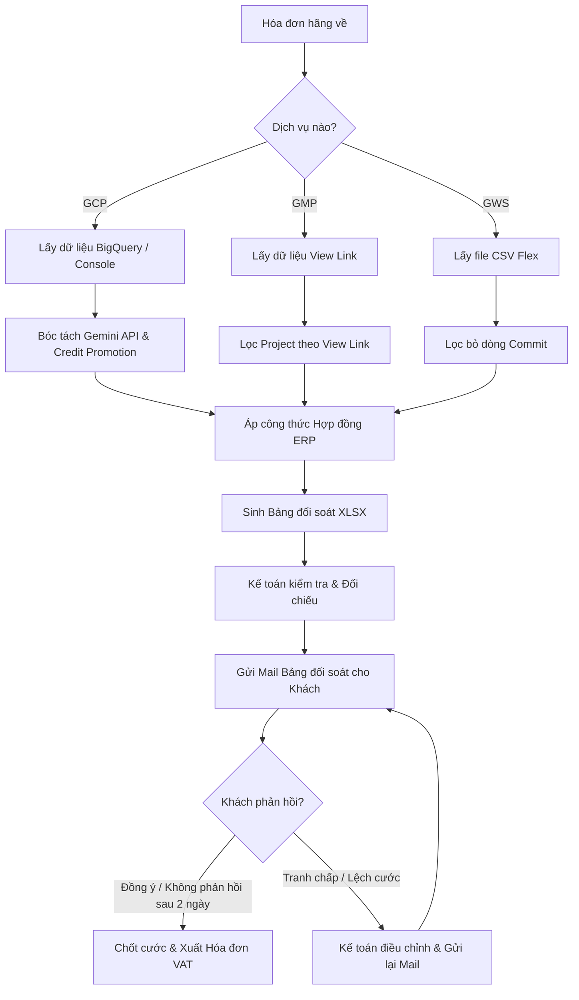

# TÀI LIỆU YÊU CẦU NGHIỆP VỤ — BRD MASTER

**Business Requirements Document (BRD)**

## Phân luồng 1: Tính Cước & Đối Soát (Billing & Dispute Flow)

| Thông tin | Giá trị |
|---|---|
| **Dự án** | ERP CloudAZ — Module Tính Cước & Đối Soát (Billing & Dispute) |
| **Khách hàng** | CloudAZ / Cloudino |
| **Ngày cập nhật** | 2026-08-20 (Tổng hợp v3.0) |
| **Tác giả** | BA Team (AI-assisted) |

---

## 1. Vấn đề Hiện tại (AS-IS)

CloudAZ/Cloudino là đối tác (reseller) của các hãng Cloud lớn (Google Cloud Platform – GCP, Google Marketing Platform – GMP, Google Workspace – GWS, AWS, DigitalOcean). Hàng tháng, Kế toán doanh thu phải thực hiện quy trình tính cước (billing) cho khoảng 70–80 khách hàng GCP, ~40 khách GMP và hàng chục khách GWS, sau đó gửi bảng đối soát chi phí cho khách xác nhận trước khi xuất hóa đơn.

Hiện tại, toàn bộ quy trình này được thực hiện thủ công trên nhiều công cụ rời rạc: Console các hãng, bảng tính Excel, hệ thống nội bộ CM (chỉ hỗ trợ Google, không hỗ trợ AWS/DO), và email. Các điểm đau chính bao gồm:

- **Thao tác thủ công quá nhiều:** Copy-paste từng khách (~70-80 khách GCP × 5-6 bước), mất 1–1,5 ngày/tháng. Quy trình chi tiết: vào từng console khách → lọc tháng → check credit (bật/tắt tích) → check Gemini (group by Service) → bỏ Reseller Margin → chụp màn hình → copy số vào Excel → upload lên CM → gen bảng → đối soát → sửa lỗi rounding → gửi mail.
- **Hệ thống CM cũ không đáp ứng:** Không hỗ trợ Gemini API (dịch vụ AI mới, ngày càng nhiều khách sử dụng), lỗi làm tròn (rounding) thường xuyên lệch 1-2 đồng, không hỗ trợ AWS & DigitalOcean, đôi khi thiếu dữ liệu dòng trên Console.
- **Không có cảnh báo tự động** khi: Hợp đồng thay đổi, credit promotion mới xuất hiện, khách thêm project mới — kế toán phải tự phát hiện thủ công.
- **Phụ thuộc "trực giác kế toán":** Không có validation tự động, rủi ro cao khi kế toán nghỉ/thay người. GWS: kế toán chỉ check khi thấy bất thường.
- **Dữ liệu lưu trữ phân tán** trên PC cá nhân, email, Drive — khó tra cứu lịch sử bill.
- **Chưa có SLA xử lý tranh chấp cước**, chưa có audit trail khi sửa tay bill trước khi gửi khách.
- **Khách chia nhiều pháp nhân** (VD: 1 HĐ → 9 công ty): Phải tính riêng, gửi riêng, xuất hóa đơn riêng. Số không nằm trong tổng đối chiếu với invoice tổng.
- **Thay đổi pháp nhân xảy ra thường xuyên**, kế toán biết qua CC mail, không có thông báo chính thức từ hệ thống.

---

## 2. Giải pháp Đề xuất (TO-BE)

Xây dựng module **Tính Cước & Đối Soát (Billing & Dispute)** trong hệ thống ERP CloudAZ mới nhằm tự động hóa toàn bộ quy trình từ khi nhận invoice hãng đến khi xuất hóa đơn cho khách. Hệ thống sẽ:

- Tự động kết nối và lấy dữ liệu cước từ Console/API các hãng (GCP, GMP, GWS, mở rộng sang AWS, DO).
- Tự động tách và nhận diện Gemini API usage, Credit Promotion theo từng khách.
- Áp dụng công thức tính cước theo hợp đồng (discount, thuế nhà thầu, phí dịch vụ) tự động — cấu hình riêng cho từng khách/hợp đồng.
- Sinh bảng đối soát chi phí tự động dạng XLSX (template-based), hỗ trợ đối soát với bảng tính tay của kế toán.
- Gửi email bảng đối soát cho khách, theo dõi xác nhận, tự động nhắc nhở khi quá hạn.
- Lưu trữ tập trung toàn bộ lịch sử bill trên S3, hỗ trợ tra cứu theo khách/tháng/dịch vụ.
- Rút ngắn thời gian tính bill từ 1,5 ngày xuống mục tiêu 1 ngày hoặc ít hơn.
- Cảnh báo tự động: Credit chưa xử lý, Gemini API phát sinh, thay đổi hợp đồng, invoice về chậm.

---

## 3. Hệ thống bị Ảnh hưởng & Giả định

### 3.1 Hệ thống bị ảnh hưởng
- Hệ thống CM (phần mềm nội bộ hiện tại) — cần đánh giá tích hợp hoặc thay thế.
- Google Cloud Console & Billing Export / BigQuery — nguồn lấy dữ liệu cước chính.
- AWS Billing & DigitalOcean API (mở rộng tương lai).
- Hệ thống mail & SMS/Lark — gửi bảng đối soát và đôn đốc.
- Hệ thống kế toán / MISA meInvoice — nhận đầu ra từ Billing để xuất HĐ.
- Hệ thống quản lý hợp đồng — nguồn thông tin công thức tính, discount, phụ lục.

### 3.2 Giả định & Phụ thuộc
- Giai đoạn 1 tập trung vào 3 dịch vụ Google (GCP, GMP, GWS Flex). AWS và DigitalOcean sẽ mở rộng ở các giai đoạn sau.
- ERP sẽ thay thế hoặc tích hợp với hệ thống CM hiện tại.
- Kế toán doanh thu chấp nhận quy trình đối soát mới: ERP gen số → Kế toán đối chiếu → Nếu khớp thì dùng.
- Tỷ giá mặc định: Tỷ giá bán chuyển khoản Techcombank, ngày cuối tháng chi phí. Hợp đồng đặc biệt có thể cấu hình ngân hàng và thời điểm lấy tỷ giá riêng.
- GWS Committed (license trả trước theo năm) không nằm trong scope billing hàng tháng của giai đoạn này.

---

## 4. Yêu cầu Nghiệp vụ Chi tiết

### 4.1 Lấy dữ liệu cước từ hãng (Data Ingestion)
- **4.1.1** Tự động kết nối và lấy dữ liệu cước hàng tháng từ Google Cloud Console cho tất cả khách hàng GCP (~70-80 khách, ~94 billing ID, ~600+ project).
- **4.1.2** Tự động tải và xử lý file CSV tổng từ Google Workspace Console cho tất cả domain GWS Flex (Domain name, Subscription, Quantity, Amount, SKU ID).
- **4.1.3** Tự động lấy dữ liệu cước GMP từ các billing link (1 link có thể chứa tới 23 project/khách hàng khác nhau).
- **4.1.4** Tự động lọc bỏ dòng GWS Committed khỏi dữ liệu Flex khi domain có cả 2 gói.
- **4.1.5** GCP/GMP: Parse 2 sheets (Sheet 0: Project Number, Sheet 1: Billing ID).

### 4.2 Tách & Nhận diện Gemini API và Credit Promotion
- **4.2.1** Tự động phát hiện và tách riêng lượng dùng Gemini API cho từng khách GCP (`service.description`).
- **4.2.2** Tự động phát hiện Credit Promotion trên Console từng khách GCP.
- **4.2.3** Xuất danh sách khách hàng có credit trong tháng gửi Ban Giám Đốc/Sale xác nhận phân bổ (3 trạng thái: Khách hàng / CloudAZ / Chia sẻ).
- **4.2.4** GMP: Xác nhận KHÔNG áp dụng Credit và Gemini API cho dịch vụ GMP.

### 4.3 Công thức Tính Cước
- **4.3.1** Cấu hình công thức tính cước riêng cho từng khách hàng, từng hợp đồng (discount, VAT nhà thầu, phí dịch vụ PDV).
- **4.3.2** **Công thức GCP**:
  $$\text{Thu khách (USD)} = (\text{Usage\_total} - \text{Gemini}) \times (1 - \text{Discount}\%) + \text{Gemini} + \text{VAT GG} + \text{PDV} - \text{Credit}$$
- **4.3.3** **Công thức GMP**:
  $$\text{Thu khách (USD)} = \text{Lượng dùng USD} \times (1 - \text{Discount}\%) + \text{PDV}$$
- **4.3.4** **Công thức GWS Flex**:
  $$\text{dailyPrice} = \frac{\text{unitPrice}}{\text{daysInMonth}}$$
  $$\text{amount} = \text{dailyPrice} \times \text{usageDays} \times \text{quantity}$$
  $$\text{priceBeforeVAT} = \text{amount} + \text{fct} - \text{discount}$$
  $$\text{priceVND} = \lfloor \text{priceBeforeVAT} \times \text{exchangeRateUSD} \rfloor$$
- **4.3.5** Quy đổi VND: Thu khách (VND) = Thu khách (USD) × Tỷ giá. Làm tròn đến hàng đơn vị (đồng).

### 4.4 Sinh Bảng Đối soát & Gửi Bill
- **4.4.1** Tự động sinh bảng đối soát chi phí XLSX cho từng khách hàng theo dịch vụ.
- **4.4.2** Tự động cộng tổng tất cả project/billing ID của cùng 1 khách hàng.
- **4.4.3** Gửi email bảng đối soát kèm screenshot lượng dùng cho khách.
- **4.4.4** Khách có **02 ngày làm việc** để xác nhận chi phí. Sau 02 ngày không phản hồi, gửi email nhắc nhở. Sau 1 ngày nhắc không phản hồi → tự động chốt số và cho phép xuất HĐ.

### 4.5 Xử lý Tranh chấp Cước (Dispute)
- **4.5.1** Khi khách phản hồi lệch cước, kế toán mở bảng đối soát, điều chỉnh và gửi lại bản cập nhật.
- **4.5.2** Dịch vụ nào có tranh chấp thì xử lý riêng, dịch vụ khác chốt bình thường.
- **4.5.3** Khi phát hiện lệch sau khi xuất HĐ VAT: Phát hành hóa đơn điều chỉnh tăng/giảm hoặc lập biên bản điều chỉnh.

---

## 5. Sơ đồ Luồng Nghiệp vụ (Billing & Dispute Flow)

