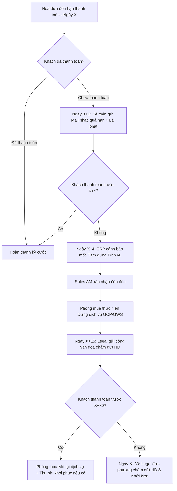

# TÀI LIỆU YÊU CẦU NGHIỆP VỤ — BRD MASTER

**Business Requirements Document (BRD)**

## Phân luồng 2: Thu Hồi Công Nợ & Tạm Dừng Dịch Vụ (Debt Collection & Suspension)

| Thông tin | Giá trị |
|---|---|
| **Dự án** | ERP CloudAZ — Module Thu Hồi Công Nợ (Debt Collection) |
| **Khách hàng** | CloudAZ / Cloudino |
| **Ngày cập nhật** | 2026-08-20 (Tổng hợp v3.0) |
| **Tác giả** | BA Team (AI-assisted) |

---

## 1. Vấn đề Hiện tại & Mục tiêu

### Vấn đề hiện tại
- Việc theo dõi công nợ quá hạn và gửi mail nhắc nợ phụ thuộc hoàn toàn vào việc kế toán check tay từng hóa đơn.
- Phối hợp giữa Kế toán, Sales AM, Phòng mua, Legal và HCNS còn rời rạc qua chat/mail, dễ bỏ sót deadline tạm dừng dịch vụ hoặc gửi sai công văn.
- Không tự động tính lãi phạt chậm thanh toán theo hợp đồng.
- Không có cảnh báo tập trung khi khách hàng chạm mốc dừng dịch vụ (xóa dữ liệu vĩnh viễn trên GCP/GWS).

### Mục tiêu hệ thống TO-BE
- Tự động hóa quy trình đôn đốc nợ 4 giai đoạn theo lịch trình cấu hình.
- Tự động tính lãi phạt chậm trả và gộp vào mail nhắc nợ.
- Phân định rõ trách nhiệm 5 phòng ban trên Dashboard hệ thống.
- Cảnh báo tập trung trước khi thực hiện tạm dừng dịch vụ/chấm dứt HĐ.

---

## 2. Bảng Quy Trình Phối Hợp Liên Phòng Ban (5 Bộ Phận)

| Bộ phận thực hiện | Giai đoạn 0 *(Gửi thông báo chi phí)* | Giai đoạn 1: Ngày 0 – 0+1 *(Xác nhận phát ĐNTT)* | Giai đoạn 1: Ngày X - 2 *(Cảnh báo trước hạn)* | Giai đoạn 2: Ngày X+1 đến X+3 *(Công nợ quá hạn)* | Giai đoạn 3: Ngày X+4 đến X+30 *(Tạm dừng dịch vụ & Nợ xấu)* | Giai đoạn 4: Ngày X+30 *(Đơn phương chấm dứt HĐ)* |
| :--- | :--- | :--- | :--- | :--- | :--- | :--- |
| **Kế toán** | - Gửi email thông báo chi phí, đối soát. - Xuất hóa đơn & ĐNTT. - Đảm bảo Ngày 0 đến Ngày X $\ge$ thời hạn HĐ. | - Báo đã phát ĐNTT bản cứng thành công. - Nhắc nhở thanh toán lần 1. | - Gửi email cảnh báo sắp đến hạn (CC Sales AM). - Tiêu đề: `[ Alert! ] CloudAZ // [Tên KH] // Đề nghị thanh toán...` | - Ngày X+1, gửi email nhắc nợ quá hạn (tối đa 1 mail/ngày, gộp tất cả HĐ vào 1 mail). - Tự động cộng dồn lãi chậm trả. - Thông báo ngày dừng dịch vụ (X+4) và chấm dứt HĐ (X+30). | - Ngày X+4, gửi email cảnh báo dừng dịch vụ đến KH và gửi yêu cầu tạm dừng cho Phòng mua (có xác nhận từ Sales AM). - Tiếp tục gửi email đòi nợ kèm lãi phạt hàng ngày. | |
| **Sales AM** | - Theo dõi tình trạng. | - Theo dõi tình trạng. | - Gọi điện/chat nhắc KH chuẩn bị thanh toán. | - Phối hợp thu hồi nợ qua điện thoại/chat (không gửi email tránh trùng Kế toán). - Giải thích rủi ro: Dừng GCP/GWS sẽ **bị Google xóa dữ liệu & mất chính sách giá cũ vĩnh viễn**. - Nếu bị tạm dừng lần 2 → Yêu cầu **đặt cọc**. | - Đôn đốc thu hồi nợ gắt gao qua phone/chat. - Sau khi Phòng mua dừng dịch vụ → Gọi thông báo trực tiếp cho KH yêu cầu thanh toán & lãi phạt. | |
| **Phòng mua** | | | | - Chuẩn bị kỹ thuật sẵn sàng tạm dừng dịch vụ. | - **Thực hiện tạm dừng dịch vụ** sau khi nhận yêu cầu từ Kế toán (có xác nhận của Sales AM). - Email thông báo kết quả cho Kế toán, Sales và Legal. | |
| **Legal** | | | | - Chuẩn bị công văn thu hồi nợ. | - Ngày X+15: Soạn thảo văn bản chấm dứt HĐ. - Gửi song song bản cứng và email đến KH. | **Chấm dứt Hợp đồng** - Thực hiện thủ tục đơn phương chấm dứt HĐ. - Tiến hành biện pháp đòi nợ/khởi kiện theo HĐ. |
| **HCNS** | - Cập nhật tình trạng phát thư bản cứng hàng ngày (trước 10:00 và 14:00). | | | | | |

---

## 3. Yêu cầu Chi tiết Module Thu Hồi Công Nợ

### 3.1 Theo dõi Công nợ & Lịch nhắc nợ
- ERP theo dõi thời hạn thanh toán (Ngày X) riêng biệt theo từng hóa đơn/hợp đồng.
- Tự động quét hóa đơn sắp đến hạn (X-2 ngày) và quá hạn (X+1 đến X+30 ngày) qua Background Jobs.
- Gộp toàn bộ hóa đơn quá hạn của cùng 1 khách hàng vào 1 email duy nhất (tối đa 1 email/ngày) để tránh spam.

### 3.2 Tự động tính Lãi phạt Chậm thanh toán
- Công thức tính lãi phạt:
  $$\text{Lãi phạt} = \text{Số tiền nợ quá hạn} \times \text{Lãi suất HĐ (\%/ngày)} \times \text{Số ngày quá hạn}$$
- Số tiền lãi phạt được cộng dồn hàng ngày và hiển thị trực tiếp trong email nhắc nợ.

### 3.3 Quy trình Tạm dừng Dịch vụ (Service Suspension)
- Ngày X+4: ERP phát tín hiệu cảnh báo mốc Tạm dừng dịch vụ.
- Yêu cầu xác nhận phối hợp từ Sales AM trên ERP trước khi chuyển lệnh sang Phòng mua.
- Kỹ thuật/Phòng mua thực hiện lệnh tạm dừng trên Console (ngắt project GCP, khóa domain GWS).
- Cập nhật trạng thái `SUSPENDED` trên ERP và gửi notification tự động cho Kế toán, Sales, Legal.

---

## 4. Sơ đồ Luồng Thu Hồi Nợ (Debt Collection Flow)

