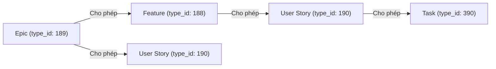
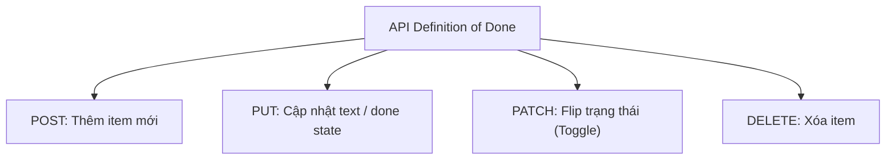

# HƯỚNG DẪN CHI TIẾT TẠO PRODUCT BACKLOG QUA REST API (ERP CLOUDAZ)

> **Hệ thống:** ERP CloudAZ — Module Project Management (WBS)  
> **Base URL:** `https://erp.cloudaz.io/api/v1`  
> **Phiên bản tài liệu:** 1.0  
> **Ngày cập nhật:** 2026-08-25  
> **Đối tượng sử dụng:** Business Analyst (BA), Project Manager (PM), Software Engineer, Data/Automation Engineer.

---

## 1. TỔNG QUAN & KIẾN TRÚC HỆ THỐNG

### 1.1. Mục đích
Tài liệu này hướng dẫn chi tiết phương pháp tạo và quản lý **Product Backlog** (bao gồm Epic, Feature, User Story, Task, Mô tả chi tiết và tiêu chuẩn hoàn thành Definition of Done - DoD) trên hệ thống **ERP CloudAZ** bằng cách sử dụng tập hợp các RESTful API.

Tài liệu cung cấp đầy đủ:
1. Thông số kỹ thuật chi tiết của các API (Endpoints, Headers, Request/Response Payload).
2. Quy tắc Materialized Path và phân cấp WBS Node.
3. Bộ API riêng biệt quản lý Definition of Done (DoD).
4. Quy trình tự động hóa 3 bước và bộ mã nguồn Python mẫu sẵn sàng chạy thực tế.

---

### 1.2. Thông tin xác thực & Kết nối

| Thông số | Giá trị mẫu / Mô tả | Ghi chú |
|---|---|---|
| **Base URL** | `https://erp.cloudaz.io/api/v1` | URL gốc của ERP API |
| **Project ID** | `9` *(Ví dụ: Module Thu Hồi Công Nợ)* | ID của dự án trên ERP |
| **Authentication** | Bearer Token (JWT) | Đưa vào Header: `Authorization: Bearer <JWT_TOKEN>` |
| **Content-Type** | `application/json` | Áp dụng cho tất cả request POST / PUT / PATCH |

> ⚠️ **Lưu ý Security:** Token JWT cần có các quyền truy cập dự án (`project:wbs:create`, `project:wbs:update`, `project:wbs:dod:*`). Token hết hạn sẽ trả về HTTP Status `401 Unauthorized`.

---

## 2. CẤU TRÚC PHÂN CẤP WBS & MATERIALIZED PATH

### 2.1. Cơ chế Materialized Path
ERP CloudAZ định danh vị trí của từng Task/WBS Node trong cây phân cấp bằng chuỗi **Materialized Path**.
- Mỗi cấp (level) trong cây được định dạng bằng chuỗi **6 chữ số điền 0 đằng trước** (zero-padded 6 digits).
- Các cấp nối với nhau bởi dấu chấm `.`.

**Ví dụ cấu trúc cây:**
```text
000002                           [Root - Project / Module ID: 463]
├── 000002.000001                [Epic 1 ID: 464]
│   ├── 000002.000001.000001     [Feature 1.1 ID: 788]
│   │   └── 000002.000001.000001.000001 [User Story 1.1.1 ID: 789]
│   └── 000002.000001.000002     [Feature 1.2 ID: 790]
└── 000002.000002                [Epic 2 ID: 465]
```

---

### 2.2. Danh mục loại Node (`type_id` vs `type`)

> 🚨 **QUY TẮC QUAN TRỌNG:**  
> Trong Request Body gửi lên API tạo mới (`POST /wbs`), trường `"type"` **LUÔN LUÔN LÀ `"Task"`**.  
> Hệ thống phân biệt loại node (Epic/Feature/User Story/Task) hoàn toàn dựa vào trường **`type_id`**.

| UI hiển thị | `type_id` | Field `type` gửi đi | Cấp bậc cây (Level) | Ghi chú & Màu sắc trên UI |
|---|---:|---|---|---|
| **Epic** | **`189`** | `"Task"` | Level 1 (dưới Root) | Quản lý Epic tổng thể (Màu Amber) |
| **Feature** | **`188`** | `"Task"` | Level 2 (dưới Epic) | Tính năng lớn (Màu Green/Teal) |
| **User Story** | **`190`** | `"Task"` | Level 3 (dưới Feature) | Yêu cầu người dùng (Màu Blue) |
| **Task** | **`390`** | `"Task"` | Level 4 (dưới Story) | Công việc kĩ thuật nhỏ |

---

### 2.3. Quy tắc phân cấp hợp lệ (Hierarchy Validation)

Hệ thống ERP bắt buộc phân cấp tuân theo ma trận sau:



| Node cha (`parent_path`) | Node con được phép tạo (`type_id`) | Trạng thái |
|---|---|---|
| Epic (`189`) | Feature (`188`) hoặc User Story (`190`) | ✅ Hợp lệ |
| Epic (`189`) | Epic (`189`) | ❌ Lỗi `WBS_0019` (Không cho phép Epic lồng Epic) |
| Feature (`188`) | User Story (`190`) | ✅ Hợp lệ |
| User Story (`190`) | Task (`390`) | ✅ Hợp lệ |

---

## 3. CHI TIẾT CÁC ENDPOINT REST API

### 3.1. API Tạo Task / WBS Node Mới

#### Endpoint
```http
POST /projects/{project_id}/wbs
```

#### Request Headers
```http
Content-Type: application/json
Authorization: Bearer <JWT_TOKEN>
```

#### Request Body Schema
```json
{
  "title":              "string",          // [Bắt buộc] Tên Task / Story / Feature / Epic
  "type":               "Task",            // [Bắt buộc] Luôn gửi là "Task"
  "type_id":            "integer",         // [Bắt buộc] 189=Epic, 188=Feature, 190=User Story, 390=Task
  "parent_path":        "string",          // [Bắt buộc] Materialized path của node cha (VD: "000002")
  "assigned_to":        "integer | null",  // Member ID người phụ trách (Lưu ý: member_id, KHÔNG PHẢI user_id)
  "description":        "string | null",   // Mô tả chi tiết (HTML / Markdown text)
  "planned_start_date": "string | null",   // Ngày bắt đầu dự kiến (YYYY-MM-DD hoặc ISO8601)
  "planned_end_date":   "string | null",   // Ngày kết thúc dự kiến
  "estimated_effort":   "number | null",   // Effort ước tính (số giờ)
  "priority_id":        "integer | null",  // ID mức độ ưu tiên
  "status_id":          "integer | null",  // ID trạng thái (Mặc định: 21 - Open/Backlog)
  "sprint_point":       "number | null"    // Story Point (1, 2, 3, 5, 8, 13...)
}
```

#### Minimal Payload Example (Request tối giản)
Để tạo một node thành công, chỉ cần truyền 4 trường tối thiểu:
```json
{
  "title": "BD-01: Tự động kết nối, lấy & lưu trữ dữ liệu cước GCP",
  "type": "Task",
  "type_id": 190,
  "parent_path": "000002.000001.000001"
}
```

#### HTTP Response (201 Created)
```json
{
  "data": {
    "id": 789,
    "project_id": 9,
    "title": "BD-01: Tự động kết nối, lấy & lưu trữ dữ liệu cước GCP",
    "type": "Task",
    "type_id": 190,
    "path": "000002.000001.000001.000001",
    "order_index": 1,
    "planned_start_date": null,
    "planned_end_date": null,
    "actual_start_date": null,
    "actual_end_date": null,
    "progress": 0,
    "planned_value": 0,
    "actual_cost": 0,
    "estimated_effort": 0,
    "actual_effort": 0,
    "assigned_to": null,
    "is_rnd": false,
    "description": null,
    "definition_of_done": null,
    "created_at": "2026-08-25T04:25:53.899Z",
    "updated_at": "2026-08-25T04:25:53.899Z",
    "created_by": 84,
    "status_id": 21,
    "priority_id": null,
    "sprint_id": null,
    "sprint_point": null,
    "release_id": null,
    "labels": null,
    "tags": null,
    "has_children": false
  }
}
```

> 📌 **Lưu ý:** Cần lưu lại giá trị `data.id` và `data.path` từ Response để sử dụng làm `parent_path` cho các node con cấp dưới hoặc gọi API update sau này.

---

### 3.2. API Cập Nhật Node / Description

#### Endpoint
```http
PUT /projects/{project_id}/wbs/{node_id}
```

#### Đặc điểm kỹ thuật
- Sử dụng cơ chế **JSON-Key-Aware Merge**: Chỉ cập nhật những trường được truyền trong Request Body. Những trường không truyền sẽ giữ nguyên giá trị cũ.
- **Trường bị chặn (BLOCKED):** `sprint_id` (chỉ set qua action Add to Sprint), `definition_of_done` (bị ignore, bắt buộc dùng API riêng ở §3.3).

#### Request Body Example (Cập nhật Description & Story Point)
```json
{
  "description": "Là một Kế toán doanh thu, tôi muốn hệ thống tự động kết nối trang quản trị cước Google Cloud để lấy, đọc và lưu trữ dữ liệu cước theo tháng.",
  "sprint_point": 5,
  "estimated_effort": 16
}
```

#### HTTP Response (200 OK)
Trả về thông tin chi tiết node đã được cập nhật thành công.

---

### 3.3. Bộ API Quản Lý Definition of Done (DoD / Acceptance Criteria)

DoD trong ERP CloudAZ là danh sách tiêu chí nghiệm thu dạng checklist cho từng node. Trường `definition_of_done` **không thể gửi trực tiếp qua API POST/PUT chung** mà bắt buộc phải qua 4 endpoints chuyên biệt:



#### 3.3.1. Thêm DoD Item mới (`POST`)
- **Endpoint:** `POST /projects/{project_id}/wbs/{node_id}/definition-of-done`
- **Permission required:** `project:wbs:dod:create`
- **Request Body:**
  ```json
  {
    "text": "AC1: Hệ thống tự động kết nối trang cước Google Cloud cho từng khách GCP."
  }
  ```
- **Response (201 Created):**
  ```json
  {
    "data": {
      "id": "c8a1b2c3-948f-4a1d-8451-123456789abc",
      "text": "AC1: Hệ thống tự động kết nối trang cước Google Cloud cho từng khách GCP.",
      "done": false
    }
  }
  ```
  *(Server tự sinh chuỗi UUID cho `id` và mặc định `done` = `false`).*

#### 3.3.2. Cập nhật DoD Item (`PUT`)
- **Endpoint:** `PUT /projects/{project_id}/wbs/{node_id}/definition-of-done/{item_id}`
- **Permission required:** `project:wbs:dod:update`
- **Request Body:** *(Cho phép partial update)*
  ```json
  {
    "text": "AC1: Nội dung đã được chỉnh sửa",
    "done": true
  }
  ```
- **Response (200 OK):** `{"message": "Definition of Done item updated"}`

#### 3.3.3. Switch trạng thái Hoàn thành (`PATCH Toggle`)
- **Endpoint:** `PATCH /projects/{project_id}/wbs/{node_id}/definition-of-done/{item_id}/toggle`
- **Permission required:** `project:wbs:dod:toggle`
- **Request Body:** *(Không cần body)*
- **Response (200 OK):** `{"message": "Definition of Done item toggled"}`

#### 3.3.4. Xóa DoD Item (`DELETE`)
- **Endpoint:** `DELETE /projects/{project_id}/wbs/{node_id}/definition-of-done/{item_id}`
- **Permission required:** `project:wbs:dod:delete`
- **Response (200 OK):** `{"message": "Definition of Done item deleted"}`

---

### 3.4. API Tra Cứu Cây WBS

#### Endpoint
```http
GET /projects/{project_id}/wbs
GET /projects/{project_id}/wbs?parent_path=000002.000001
```

#### Request Query Parameters
- `parent_path` *(string, optional)*: Lọc tất cả các node con trực thuộc một node cha.

---

## 4. QUY TRÌNH TỰ ĐỘNG HÓA TẠO BACKLOG 3 BƯỚC

Để tạo một Product Backlog hoàn chỉnh (gồm Epic, Feature, User Story, Description và DoD) mà không bị lỗi vi phạm ràng buộc dữ liệu, ta triển khai quy trình 3 bước theo cơ chế **Duyệt theo chiều sâu (Depth-First Order)**.

```mermaid
flowchart TD
    Start([Bắt đầu Quy Trình]) --> Step1[BƯỚC 1: Tạo Cây WBS Node]
    
    subgraph Step1_Loop [Tạo Phân Cấp Tuần Tự]
        Epic[1. POST Tạo Epic<br/>type_id=189, parent=root] -->|Lấy epic.path| Feature[2. POST Tạo Feature<br/>type_id=188, parent=epic.path]
        Feature -->|Lấy feature.path| Story[3. POST Tạo User Story<br/>type_id=190, parent=feature.path]
        Story -->|Lấy story.id & story.path| SaveMap[(Lưu ID Map & import_result.json)]
    end

    Step1 --> Step1_Loop
    Step1_Loop --> Step2[BƯỚC 2: Cập Nhật Description]
    
    subgraph Step2_Loop [Update Detail Description]
        PUT_Desc[PUT /projects/9/wbs/{node_id}<br/>gửi description text]
    end
    
    Step2 --> Step2_Loop
    Step2_Loop --> Step3[BƯỚC 3: Nhập DoD / Acceptance Criteria]
    
    subgraph Step3_Loop [Import DoD Items]
        POST_DoD[POST /projects/9/wbs/{node_id}/definition-of-done<br/>gửi từng AC item text]
    end

    Step3 --> Step3_Loop
    Step3_Loop --> End([✅ Hoàn Tất Tạo Backlog])
```

---

## 5. BỘ SCRIPT AUTOMATION PYTHON HOÀN CHỈNH

Thư mục lưu trữ tài liệu & scripts: `docs/erp-api/`

### 5.1. File Cấu Hình Dữ Liệu Input Mẫu (`import_backlog_plan.json`)

```json
[
  {
    "feature": {
      "title": "FEATURE 01: Quản lý & Tính cước Google Cloud (GCP)",
      "type": "Task",
      "type_id": 188,
      "parent_path": "000002"
    },
    "user_stories": [
      {
        "id_code": "BD-01",
        "title": "BD-01: Tự động kết nối, lấy & lưu trữ dữ liệu cước GCP",
        "description": "Là một Kế toán doanh thu, tôi muốn hệ thống tự động kết nối trang cước GCP...",
        "type": "Task",
        "type_id": 190
      }
    ]
  }
]
```

---

### 5.2. Script 1: Tạo Cây WBS Backlog (`import_backlog.py`)

```python
import requests
import json
import time
import sys
from datetime import datetime

if sys.version_info >= (3, 7):
    sys.stdout.reconfigure(encoding='utf-8')

# === CONFIGURATION ===
API_URL = "https://erp.cloudaz.io/api/v1/projects/9/wbs"
TOKEN = "Bearer <YOUR_JWT_TOKEN_HERE>"
HEADERS = {
    "Authorization": TOKEN,
    "Content-Type": "application/json"
}
MAX_RETRIES = 3
DELAY_BETWEEN_REQUESTS = 0.3  # Giảm tải cho Server

# Kiểm tra chế độ Dry-run (Chạy thử không gọi API)
DRY_RUN = "--execute" not in sys.argv
if DRY_RUN:
    print("⚠️ DRY RUN MODE: Chỉ kiểm tra logic, KHÔNG gọi API thực tế. Thêm '--execute' để chạy thật.\n")

# Đọc file cấu hình backlog plan
PLAN_PATH = "import_backlog_plan.json"
with open(PLAN_PATH, "r", encoding="utf-8") as f:
    plan = json.load(f)

stats = {"feature": 0, "story": 0, "errors": 0}
results = []

def create_task(payload, label, indent=0):
    prefix = "  " * indent
    body = {
        "title": payload["title"],
        "type": "Task",
        "type_id": payload["type_id"],
        "parent_path": payload["parent_path"]
    }

    if DRY_RUN:
        fake_id = 9999
        fake_path = f"{payload['parent_path']}.9999"
        print(f"{prefix}📝 [DRY-RUN] {label}: {body['title']} (parent={body['parent_path']})")
        return {"id": fake_id, "path": fake_path, "title": body["title"]}

    for attempt in range(1, MAX_RETRIES + 1):
        try:
            resp = requests.post(API_URL, headers=HEADERS, json=body, timeout=15)
            if resp.status_code == 201:
                data = resp.json()["data"]
                print(f"{prefix}✅ {label}: {body['title']} → id={data['id']}, path={data['path']}")
                time.sleep(DELAY_BETWEEN_REQUESTS)
                return data
            else:
                print(f"{prefix}❌ {label}: {body['title']} → Status {resp.status_code}: {resp.text}")
                if attempt < MAX_RETRIES:
                    time.sleep(1)
        except Exception as e:
            print(f"{prefix}❌ {label}: {body['title']} → Exception: {e}")
            if attempt < MAX_RETRIES:
                time.sleep(1)

    stats["errors"] += 1
    return None

# === MAIN RUN LOOP ===
start_time = datetime.now()
for i, feat_entry in enumerate(plan, 1):
    feat_payload = feat_entry["feature"].copy()
    print(f"\n📂 FEATURE {i}/{len(plan)}: {feat_payload['title']}")

    # 1. Tạo Feature Node (type_id=188) dưới Root
    feat_result = create_task(feat_payload, "FEATURE", indent=0)
    if not feat_result:
        print(f"⛔ Bỏ qua toàn bộ User Story thuộc Feature này do lỗi tạo Feature.")
        continue

    stats["feature"] += 1
    results.append({"type": "feature", "id": feat_result["id"], "path": feat_result["path"], "title": feat_result["title"]})
    feat_path = feat_result["path"]

    # 2. Tạo User Stories (type_id=190) trực thuộc Feature
    for k, story_payload in enumerate(feat_entry["user_stories"], 1):
        story_body = story_payload.copy()
        story_body["parent_path"] = feat_path  # Set parent là path của Feature mới tạo

        story_result = create_task(story_body, f"US {k}/{len(feat_entry['user_stories'])}", indent=1)
        if story_result:
            stats["story"] += 1
            results.append({
                "type": "user_story",
                "id": story_result["id"],
                "path": story_result["path"],
                "title": story_result["title"],
                "id_code": story_payload.get("id_code")
            })

# Save kết quả Map ID để phục vụ các bước tiếp theo
if not DRY_RUN:
    with open("import_result.json", "w", encoding="utf-8") as f:
        json.dump({"tasks": results}, f, ensure_ascii=False, indent=2)
    print(f"\n💾 Đã lưu Map kết quả ID vào file: import_result.json")
```

---

### 5.3. Script 2: Cập Nhật Description Chi Tiết (`update_description.py`)

```python
import json, sys, time, requests

API_BASE = "https://erp.cloudaz.io/api/v1/projects/9/wbs"
TOKEN = "Bearer <YOUR_JWT_TOKEN_HERE>"
HEADERS = {"Authorization": TOKEN, "Content-Type": "application/json"}

# Đọc kế hoạch update description & kết quả Map ID từ Bước 1
with open("update_description_plan.json", "r", encoding="utf-8") as f:
    update_plan = json.load(f)

for entry in update_plan:
    nid = entry["node_id"]      # ID lấy từ import_result.json
    desc = entry["description"]

    url = f"{API_BASE}/{nid}"
    resp = requests.put(url, headers=HEADERS, json={"description": desc}, timeout=15)
    
    if resp.status_code == 200:
        print(f"✅ Updated Description cho Node {nid} thành công.")
    else:
        print(f"❌ Lỗi update Node {nid}: HTTP {resp.status_code}")
    time.sleep(0.2)
```

---

### 5.4. Script 3: Nhập Tiêu Chí DoD (`import_dod.py`)

```python
import json, sys, time, requests

API_BASE = "https://erp.cloudaz.io/api/v1/projects/9/wbs"
TOKEN = "Bearer <YOUR_JWT_TOKEN_HERE>"
HEADERS = {"Authorization": TOKEN, "Content-Type": "application/json"}

# Đọc DoD plan
with open("import_dod_plan.json", "r", encoding="utf-8") as f:
    dod_plan = json.load(f)

for entry in dod_plan:
    nid = entry["node_id"]  # ID của User Story
    items = entry["dod_items"]

    print(f"📋 Đang đẩy {len(items)} DoD items cho Node ID: {nid}")
    for item in items:
        url = f"{API_BASE}/{nid}/definition-of-done"
        resp = requests.post(url, headers=HEADERS, json={"text": item["text"]}, timeout=15)
        if resp.status_code == 201:
            print(f"  ✅ DoD Added: {item['text'][:50]}...")
        else:
            print(f"  ❌ Lỗi: HTTP {resp.status_code}")
        time.sleep(0.2)
```

---

## 6. XỬ LÝ LỖI, TRA CỨU ERROR CODES & ROLLBACK

### 6.1. Bảng tra cứu mã lỗi thường gặp

| HTTP Code | Error Code / Message | Nguyên nhân gây lỗi | Giải pháp khắc phục |
|---|---|---|---|
| **`400 Bad Request`** | `WBS_0019` | Tạo sai phân cấp (VD: Tạo Epic dưới Epic, hoặc truyền `type_id` không cho phép) | Kiểm tra lại bảng ma trận phân cấp ở §2.3. |
| **`400 Bad Request`** | `Invalid parent path` | `parent_path` không tồn tại trên DB hoặc sai định dạng Materialized Path | Lấy đúng `path` trả về từ API response của node cha. |
| **`401 Unauthorized`** | `Token expired / Invalid signature` | JWT Token hết hạn hoặc sai Token | Đăng nhập lại trên Web ERP CloudAZ và copy Bearer Token mới. |
| **`403 Forbidden`** | `Permission denied` | Tài khoản không có quyền thao tác trên Project 9 | Phân quyền cho User trong ERP System Administrator. |
| **`422 Unprocessable`** | `Field validation failed` | Thiếu trường bắt buộc (`title`, `type_id`, `parent_path`) | Kiểm tra lại JSON Request Body. |

---

### 6.2. Cơ chế Rollback / Dọn dẹp dữ liệu thử nghiệm

Nếu trong quá trình chạy script xảy ra sự cố hoặc muốn xóa toàn bộ Backlog vừa import để làm lại:
1. Mở file `import_result.json` được sinh ra ở Bước 1.
2. Viết script đọc danh sách `id` trong file và gửi lệnh HTTP `DELETE`:
```http
DELETE /projects/9/wbs/{node_id}
```
*(Lưu ý: Xóa node cha sẽ tự động xoá cascade các node con trực thuộc).*

---

## 7. CHECKLIST TRƯỚC KHI CHẠY TỰ ĐỘNG HÓA

- [ ] **Bước 1:** Xác nhận JWT Token hợp lệ và có quyền ghi trên Project Target.
- [ ] **Bước 2:** Kiểm tra ID node Root (`parent_path` ban đầu, ví dụ: `"000002"`).
- [ ] **Bước 3:** Chạy thử script ở chế độ **Dry-Run** (`python import_backlog.py`) để kiểm tra toàn bộ cấu trúc cây dữ liệu.
- [ ] **Bước 4:** Xóa toàn bộ task thử nghiệm cũ trên UI ERP CloudAZ.
- [ ] **Bước 5:** Thực thi thật bằng lệnh `--execute` (`python import_backlog.py --execute`).
- [ ] **Bước 6:** Chạy script `update_description.py` và `import_dod.py` để hoàn thiện nội dung.
- [ ] **Bước 7:** Đối soát số lượng Epic, Feature, User Story và DoD items hiển thị trên UI ERP Board.
