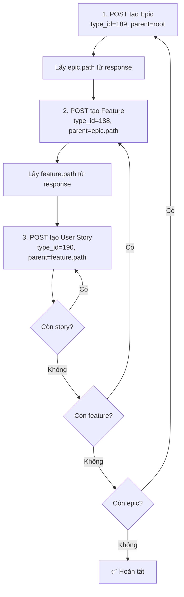

# ERP CloudAZ — API Tạo Task (WBS)

> **Base URL:** `https://erp.cloudaz.io/api/v1`  
> **Ngày cập nhật:** 2026-08-21  
> **Project ID:** `9`  
> **Nguồn:** Reverse-engineer từ giao diện ERP CloudAZ + test API thực tế

---

## 1. Tạo Task / WBS Item

### Endpoint

```
POST /projects/{project_id}/wbs
```

### Headers

```
Content-Type: application/json
Authorization: Bearer <JWT_TOKEN>
```

### Request Body

> Source: `wbs_handler.go:311-328` — request struct bind JSON

```json
{
  "parent_path":        "string",          // Bắt buộc — Materialized path của node cha
  "title":              "string",          // Bắt buộc — Tên task
  "type":               "Task",            // Bắt buộc — "Task" / "Phase" / "Milestone" / "Sub-task"
  "type_id":            "uint | null",     // ID loại (189=Epic, 188=Feature, 190=User Story, 390=Task)
  "assigned_to":        "int | null",      // Member ID người phụ trách (không phải user_id)
  "description":        "string | null",   // Mô tả chi tiết
  "planned_start_date": "string | null",   // Ngày bắt đầu DK (ISO 8601 / RFC3339 / yyyy-MM-dd)
  "planned_end_date":   "string | null",   // Ngày kết thúc DK
  "planned_value":      0,                 // float — Giá trị KH, default 0
  "actual_cost":        0,                 // float — Chi phí thực tế, default 0
  "progress":           0,                 // float 0-100 — % tiến độ
  "estimated_effort":   0,                 // float — Effort ước tính (giờ)
  "actual_effort":      0,                 // float — Effort thực tế (giờ)
  "priority_id":        "int | null",      // ID mức ưu tiên (xem bảng Priority ID)
  "status_id":          "int | null",      // ID trạng thái, default 21
  "sprint_point":       "float | null"     // Story Point (Fibonacci)
}
```

> **Lưu ý:** `assigned_to` maps tới `member_id`, không phải `user_id`.  
> **Không hỗ trợ create:** `definition_of_done`, `labels`, `tags`, `sprint_id`, `release_id`, `is_rnd` — chỉ set qua API riêng hoặc update (xem §7).

### Response (201 Created)

```json
{
  "data": {
    "id": 788,
    "project_id": 9,
    "title": "[TEST] Feature thu nghiem",
    "type": "Task",
    "type_id": 188,
    "path": "000002.000002",
    "order_index": 2,
    "planned_start_date": null,
    "planned_end_date": null,
    "actual_start_date": null,
    "actual_end_date": null,
    "progress": 0,
    "planned_value": 0,
    "actual_cost": 0,
    "estimated_effort": 0,
    "actual_effort": 0,
    "assigned_to": null,
    "is_rnd": false,
    "description": null,
    "definition_of_done": null,
    "created_at": "2026-08-21T04:25:53.899914Z",
    "updated_at": "2026-08-21T04:25:53.899914Z",
    "created_by": 84,
    "status_id": 21,
    "priority_id": null,
    "sprint_id": null,
    "sprint_point": null,
    "release_id": null,
    "labels": null,
    "tags": null,
    "has_children": false
  }
}
```

### Lấy danh sách tasks

```
GET /projects/{project_id}/wbs
GET /projects/{project_id}/wbs?parent_path=000002   # Lọc theo parent
```

---

## 2. Response (201 Created) — Full fields

> Source: `entity/wbs.go:29-86` — WBSNode struct + response JSON

```json
{
  "data": {
    "id": 788,
    "project_id": 9,
    "title": "[TEST] Feature thu nghiem",
    "type": "Task",
    "type_id": 188,
    "path": "000002.000002",
    "order_index": 2,
    "planned_start_date": null,
    "planned_end_date": null,
    "actual_start_date": null,
    "actual_end_date": null,
    "progress": 0,
    "planned_value": 0,
    "actual_cost": 0,
    "estimated_effort": 0,
    "actual_effort": 0,
    "assigned_to": null,
    "is_rnd": false,
    "description": null,
    "definition_of_done": null,
    "created_at": "2026-08-21T04:25:53.899914Z",
    "updated_at": "2026-08-21T04:25:53.899914Z",
    "created_by": 84,
    "status_id": 21,
    "priority_id": null,
    "sprint_id": null,
    "sprint_point": null,
    "release_id": null,
    "labels": null,
    "tags": null,
    "has_children": false
  }
}
```

> **Server-set fields:** `id`, `path`, `order_index`, `actual_start_date`, `actual_end_date`, `created_at`, `updated_at`, `created_by`, `has_children` — client không gửi được.

---

## 3. Bảng Type ID ✅ Đã xác nhận

| UI hiển thị | type_id | Field `type` gửi đi | Ghi chú |
|---|---:|---|---|
| **Epic** | `189` | `"Task"` | Confirmed — type_cat.name = "Epic", color = amber |
| **Feature** | `188` | `"Task"` | Confirmed — DB lưu "Task" nhưng UI hiện "Feature" |
| **User Story** | `190` | `"Task"` | Confirmed — type_cat.name = "User Story", color = blue |
| **Task** | `390` | `"Task"` | Confirmed — tạo được dưới User Story |
| Defect | `???` | `"Task"` | Chưa test |

### Phân cấp hợp lệ (đã test)

```
Epic (189) → Feature (188) → User Story (190) → Task (390)
```

| Parent type | Cho phép child types |
|---|---|
| Epic (189) | Feature (188), User Story (190) ✅ |
| Epic (189) | Epic (189) ❌ `WBS_0019` |
| Feature (188) | User Story (190) ✅ |
| User Story (190) | Task (390) ✅ |

> **Lưu ý:** Field `type` trong request body luôn là `"Task"`. Hệ thống phân biệt loại task dựa trên `type_id`, không phải `type`.

---

## 4. Bảng Priority ID

> ⚠️ **Chưa đầy đủ** — Cần test thêm từ UI

| Priority | priority_id | Ghi chú |
|---|---|---|
| (unknown) | `72` | Thấy trong response đầu tiên |
| (unknown) | `73` | Thấy khi tạo task có priority |

---

## 5. Cấu trúc phân cấp WBS (Materialized Path) ✅ Đã xác nhận

Hệ thống sử dụng **Materialized Path** — mỗi segment = 6 chữ số zero-padded.

### Cây hiện tại của Project 9

```
000001  → Xây dựng module tính giá vốn (id=412, Epic)
000002  → Xây dựng module Tính toán và Thu hồi công nợ (id=463, Epic)
├── 000002.000001  → Hoàn thiện BRD (id=464, User Story, sprint_point=8)
├── 000002.000002  → [TEST] Feature thu nghiem (id=788, Feature)
│   └── 000002.000002.000001  → [TEST] User Story thu nghiem (id=789, User Story)
```

### Quy tắc tạo cây

| Tạo | parent_path gửi đi | Path nhận về |
|---|---|---|
| Epic dưới root | `"000002"` | `"000002.000003"` |
| Feature dưới Epic | `"000002.000003"` | `"000002.000003.000001"` |
| User Story dưới Feature | `"000002.000003.000001"` | `"000002.000003.000001.000001"` |

- `order_index` tự tăng trong cùng cấp cha
- Để tạo child → gửi `parent_path` = path của node cha (lấy từ response)

---

## 6. Minimal Request (chỉ cần 4 field)

Từ kết quả test, request tối giản chỉ cần:

```json
{
  "title": "Tên task",
  "type": "Task",
  "type_id": 189,
  "parent_path": "000002"
}
```

Tất cả field khác sẽ nhận giá trị mặc định (`null`, `0`, `21`).

### Ví dụ tạo cây Epic → Feature → User Story

**Bước 1: Tạo Epic**
```json
POST /projects/9/wbs
{
  "title": "EP-01 Data Ingestion",
  "type": "Task",
  "type_id": 189,
  "parent_path": "000002"
}
// Response: path = "000002.000003"
```

**Bước 2: Tạo Feature dưới Epic**
```json
POST /projects/9/wbs
{
  "title": "Kết nối & tự động lấy dữ liệu cước",
  "type": "Task",
  "type_id": 188,
  "parent_path": "000002.000003"
}
// Response: path = "000002.000003.000001"
```

**Bước 3: Tạo User Story dưới Feature**
```json
POST /projects/9/wbs
{
  "title": "BD-01: Kết nối & lấy dữ liệu cước GCP từ Google Cloud Console",
  "type": "Task",
  "type_id": 190,
  "parent_path": "000002.000003.000001"
}
// Response: path = "000002.000003.000001.000001"
```

---

## 7. Luồng tạo toàn bộ Product Backlog



**Thống kê:**
- 12 Epic + 33 Feature + 109 User Story = **154 API calls**
- Ước tính thời gian: ~2-3 phút (tuần tự, không rate limit)

---

## 8. Checklist trước khi chạy script tự động

- [x] Xác nhận `type_id`: Epic=189, Feature=188, User Story=190
- [x] Xác nhận `parent_path` root: `"000002"`
- [x] Test tạo Feature → thành công (id=788)
- [x] Test tạo User Story dưới Feature → thành công (id=789)
- [x] Cấu trúc phân cấp hiển thị đúng trên UI
- [x] Dry-run 154 tasks thành công (12 Epic, 33 Feature, 109 User Story)
- [ ] Xóa tasks test trước khi chạy script thật
- [ ] Chạy `--execute` tạo toàn bộ backlog

---

## 9. Script Import Tự Động

### File

| File | Mô tả |
|---|---|
| `docs/erp-api/import_backlog_plan.json` | JSON chứa 154 tasks (12 Epic → 33 Feature → 109 User Story) |
| `docs/erp-api/import_backlog.py` | Script Python gọi API tuần tự |
| `docs/erp-api/import_result.json` | Log kết quả sau khi chạy (tự sinh) |

### Cách chạy

```bash
# Dry-run — chỉ in ra, KHÔNG gọi API
python docs/erp-api/import_backlog.py

# Chạy thật — gọi API tạo 154 tasks lên ERP
python docs/erp-api/import_backlog.py --execute
```

### Logic thực thi (Depth-first)

```
Với mỗi Epic (tuần tự 1→12):
│
├── POST tạo Epic → lấy epic_path
│
└── Với mỗi Feature trong Epic (tuần tự):
    │
    ├── POST tạo Feature (parent = epic_path) → lấy feature_path
    │
    └── Với mỗi User Story trong Feature (tuần tự):
        │
        └── POST tạo User Story (parent = feature_path)
        └── ⏳ Chờ xong hết rồi mới sang Feature kế tiếp
```

**Đảm bảo:** Feature N+1 chỉ được tạo SAU KHI toàn bộ User Story của Feature N đã tạo xong.

---

## 10. Dry-run vs Execute

| | Dry-run | Execute |
|---|---|---|
| **Lệnh** | `python import_backlog.py` | `python import_backlog.py --execute` |
| **Gọi API** | ❌ Không | ✅ Có |
| **Tạo task trên ERP** | ❌ Không | ✅ Có |
| **Kiểm tra logic/data** | ✅ | ✅ |
| **Kiểm tra API thật** | ❌ | ✅ |
| **Kiểm tra token** | ❌ | ✅ |
| **Kiểm tra rate limit** | ❌ | ✅ |
| **Rủi ro** | Không | Tạo task thật, cần xóa nếu sai |

### Khuyến nghị chạy thật

1. Xóa tasks test trên ERP (epic 1, epic 12, [TEST] Feature, [TEST] User Story)
2. Chạy `--execute` cho **EP-01** trước (13 tasks) → kiểm tra UI
3. Nếu OK → chạy lại toàn bộ (script sẽ tạo thêm EP-02→12, EP-01 sẽ bị trùng)
4. Hoặc sửa script chỉ chạy từ EP-02 trở đi

---

## 11. Definition of Done (DoD) — API riêng

> Source: `wbs_dod_handler.go:1-87`, `wbs_node_patch.go:111-117`

DoD là per-node acceptance checklist, **không support qua POST create hay PUT general patch**. Chỉ 4 endpoint granular sau mới modify được:

### 11a. POST — Thêm item

```
POST /projects/{id}/wbs/{nodeId}/definition-of-done
Authorization: Bearer <JWT>
Permission: project:wbs:dod:create
```

**Request body:**
```json
{
  "text": "Write integration tests"
}
```

**Response (201 Created):**
```json
{
  "data": {
    "id": "a1b2c3d4-uuid",
    "text": "Write integration tests",
    "done": false
  }
}
```

> Server tự gen UUID cho `id`. `done` luôn `false` khi tạo mới.

### 11b. PUT — Sửa text / toggle done

```
PUT /projects/{id}/wbs/{nodeId}/definition-of-done/{itemId}
Authorization: Bearer <JWT>
Permission: project:wbs:dod:update
```

**Request body** (cả 2 field optional — partial update):
```json
{
  "text": "Updated description",
  "done": true
}
```

Chỉ gửi field cần thay đổi:
- `{"text": "new name"}` — chỉ đổi text
- `{"done": true}` — chỉ check done
- `{"text": "", "done": false}` — đổi cả 2

**Response (200 OK):**
```json
{
  "message": "Definition of Done item updated"
}
```

### 11c. PATCH — Toggle done (lighter permission)

```
PATCH /projects/{id}/wbs/{nodeId}/definition-of-done/{itemId}/toggle
Authorization: Bearer <JWT>
Permission: project:wbs:dod:toggle
```

**Body:** không cần body

**Response (200 OK):**
```json
{
  "message": "Definition of Done item toggled"
}
```

> Khác với PUT: permission nhẹ hơn (`dod:toggle` vs `dod:update`), chỉ flip done flag, không đụng text.

### 11d. DELETE — Xóa item

```
DELETE /projects/{id}/wbs/{nodeId}/definition-of-done/{itemId}
Authorization: Bearer <JWT>
Permission: project:wbs:dod:delete
```

**Body:** không cần body

**Response (200 OK):**
```json
{
  "message": "Definition of Done item deleted"
}
```

### Thiết kế

**DoDItem struct** (`entity/wbs.go:90`):
```json
{
  "id":   "uuid-string",
  "text": "Write integration tests",
  "done": false
}
```

**General PUT** (`wbs_node_patch.go:111`) cố tình **ignore** key `definition_of_done` — nếu client gửi full node (VD từ scrum board), DoD cũ không bị wipe. Chỉ 4 API granular trên mới chạm tới cột `definition_of_done` trong DB.

---

## 12. Update Node — PUT /projects/{id}/wbs/{nodeId}

> Source: `wbs_node_patch.go:27-162`

General PUT dùng **JSON-key-aware merge** — chỉ update field có trong body, field vắng mặt giữ nguyên.

**Fields supported:** title, type, type_id, order_index, progress, planned_value, actual_cost, estimated_effort, sprint_point, actual_effort, assigned_to, is_rnd, description, priority_id, status_id, planned_start_date, planned_end_date.

**Fields BLOCKED:**
- `sprint_id` — chỉ set qua 2 audited actions (Add to Sprint / Return to Backlog), reject nếu có trong body
- `definition_of_done` — bị ignore (chỉ qua 4 API riêng §11)

**Fields NOT supported on PUT:** labels, tags, release_id (chưa có handler tương ứng).

---

## 13. Xử lý lỗi

| Tình huống | Script xử lý |
|---|---|
| API trả lỗi (4xx, 5xx) | Retry tối đa 3 lần, delay 1s giữa retry |
| Tạo Epic fail | Skip toàn bộ Epic đó (không tạo Feature/Story) |
| Tạo Feature fail | Skip Feature đó và các Story bên trong |
| Tạo User Story fail | Ghi log, tiếp tục Story kế tiếp |
| Token hết hạn | Script fail → cần lấy token mới |
| Network timeout | Retry 3 lần (timeout 15s/request) |

### Rollback

Nếu cần xóa toàn bộ tasks đã tạo, sử dụng file `import_result.json` (chứa id của mọi task đã tạo):

```bash
# Đọc import_result.json → gọi DELETE cho từng task
```
