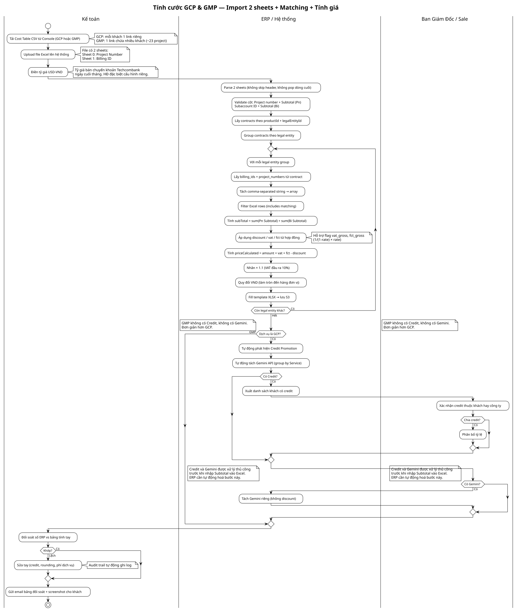
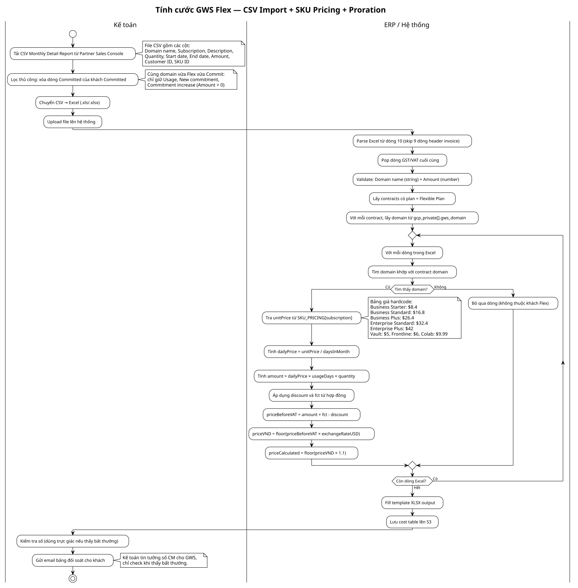

# Flows — Tính cước & Đối soát

## Flow: GCP & GMP — Import 2 sheets + Matching + Tính giá (Swimlane)

**Trigger**: Invoice hãng về (GCP mùng 2-3, GMP mùng 5-8)
**Related**: [[TaiLieuĐacTaLuong_01/BRD_Billing_Dispute_2026-08-20.md]]

> Nguồn PlantUML: `gcp-gmp-swimlane.puml`. Sửa .puml → chạy `python plantuml_encode.py <file> | curl` regen .svg.

### Lane map

| Lane | Vai trò |
|---|---|
| **Kế toán** | Tải CSV, upload Excel, điền tỷ giá, đối soát, sửa tay, gửi bill |
| **ERP / Hệ thống** | Parse 2 sheets, validate, match contract, loop legal entities, tính giá, fill template |
| **Ban Giám Đốc / Sale** | Xác nhận credit (GCP only), phân bổ tỷ lệ |

### Điểm khác GCP vs GMP

| | GCP | GMP |
|---|---|---|
| Credit | Có (phải xác nhận) | Không |
| Gemini API | Có (tách riêng, không discount) | Không |
| Console link | Mỗi khách 1 link riêng | 1 link chứa nhiều khách |

---

## Flow: GWS Flex — CSV Import + SKU Pricing + Proration (Swimlane)

**Trigger**: Invoice hãng về ngày mùng 1
**Related**: [[TaiLieuĐacTaLuong_01/BRD_Billing_Dispute_2026-08-20.md]]

> Nguồn PlantUML: `gws-flex-swimlane.puml`. Sửa .puml → chạy `python plantuml_encode.py <file> | curl` regen .svg.

### Lane map

| Lane | Vai trò |
|---|---|
| **Kế toán** | Tải CSV, lọc Commit, upload, kiểm tra, gửi bill |
| **ERP / Hệ thống** | Parse skip header, pop VAT, match domain, SKU pricing, proration, tính giá |

### Đặc thù GWS Flex

- File CSV 1 sheet flat (không phải 2 sheets như GCP/GMP)
- Skip 9 dòng header invoice
- Pop dòng GST/VAT cuối
- Key matching bằng domain name (`gcp_private[].gws_domain`)
- Dùng SKU_PRICING hardcode + proration theo ngày
- Công thức cũ (trước 02/2024): `amount = Excel.Amount × 100 / 80`
