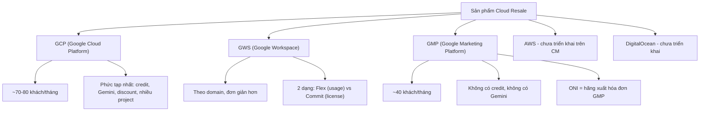
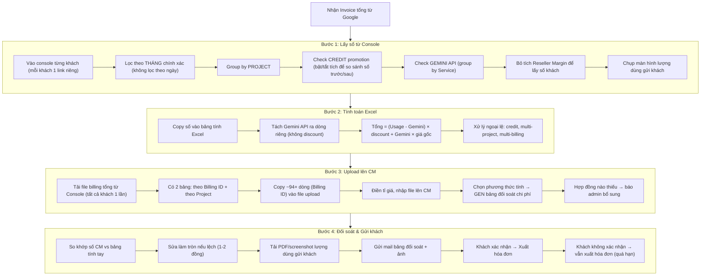
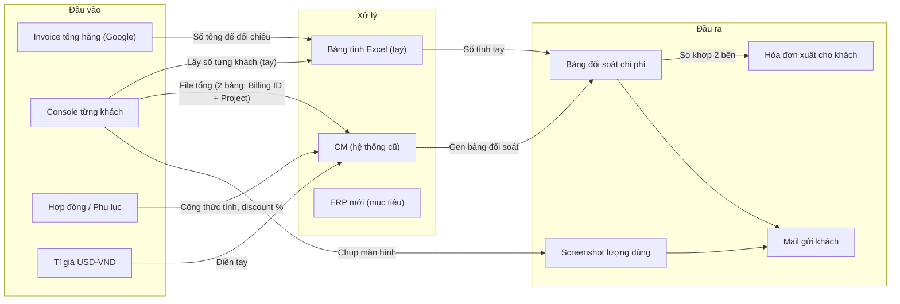

# Phân Tích Hội Thoại — Quy Trình Tính Billing & Đối Soát Chi Phí

> [!NOTE]
> Phân tích từ 5 file ghi âm cuộc họp giữa **Kế toán (Diễn giả 00 / Người nói 1)** và **Dev team (Diễn giả 01, 02, 03 / Người nói 2, 3)** về quy trình tính billing hàng tháng cho khách hàng reseller cloud.

---

## 1. Nhân Vật & Vai Trò

| Vai trò | Mô tả |
|---|---|
| **Kế toán (Chị)** | Người thực hiện toàn bộ quy trình tính bill, đối soát, xuất hóa đơn. Dùng Console (Google Cloud Console) + CM (hệ thống nội bộ cũ) + Excel |
| **Dev team (Em)** | Đội phát triển ERP mới, đang tìm hiểu nghiệp vụ để tự động hóa |
| **Sale / Sale Admin** | Xác nhận credit thuộc về khách hay công ty. Mỗi sale chỉ xem được khách của mình trên console |
| **Ban Giám Đốc / Admin** | Quyết định việc phân bổ credit promotion (của khách hay của mình) |
| **Admin / Tech** | Quản lý hợp đồng, công thức tính trên CM. Cập nhật thay đổi phụ lục |
| **Kế toán Admin** | Người phân quyền console. Có quyền xem tất cả khách |

> **Quan trọng:** Kế toán dùng **tài khoản công ty** để vào Console, không phải mail cá nhân. Có thể dùng mail cá nhân nhưng thường dùng mail công ty (b1:26-35).

---

## 2. Các Sản Phẩm Cần Tính Bill



---

## 3. Quy Trình Tính Bill Hàng Tháng (GCP — phức tạp nhất)

### 3.1. Timeline hàng tháng

| Ngày | Sự kiện | Ghi chú |
|---|---|---|
| **Mùng 1** | GWS (Flex) có invoice | |
| **Mùng 2** | GCP có invoice hãng | Có thể muộn hơn, thường gửi chiều muộn |
| **Mùng 3** | Bắt đầu tính chi tiết GCP | Chờ data ổn định ~3-4 tiếng sau invoice. Sáng mùng 3 bắt đầu |
| **Mùng 4-5** | Gửi mail đối soát cho khách | |
| **Mùng 5-8** | GMP có invoice | Có tháng muộn đến mùng 9 |
| **Mùng 7** | Deadline cho 2 khách đặc biệt | **BitVN** (GCP tổng thống) và **Phạm Max City**. Làm tay trước, gửi trước |
| Sau xác nhận | Xuất hóa đơn | |

> **Lưu ý timeline:** Kế toán làm ưu tiên GCP trước (vì invoice sớm hơn), không làm lần lượt theo thứ tự sản phẩm. GWS Flex đơn giản nhất, làm sau (b5:192-198).

### 3.2. Quy trình chi tiết



> **Ghi chú quan trọng:** Bước gửi GWS và GCP là riêng rẽ — invoice GWS về trước, kế toán gửi GWS trước, không chờ gộp (b3:2-8, b5:8). Nếu khách dùng cả GWS + GCP, gửi lần lượt từng cái.

---

## 4. Quy Tắc Nghiệp Vụ Quan Trọng

### 4.1. Discount & Margin

| Quy tắc | Chi tiết |
|---|---|
| **Reseller discount** | Hãng đã trừ ~10% margin cho partner. Số trên console = số đã trừ margin |
| **Bỏ tích Reseller Margin** | Khi lấy số cho khách, phải bỏ tích để lấy số TRƯỚC discount. Khi tích Reseller Margin → số khớp với invoice tổng hãng |
| **Mỗi khách discount riêng** | Theo hợp đồng, không có chuẩn chung |
| **Gemini API không discount** | Phải tách riêng, tính giá gốc |
| **Gemini quá nhỏ (<~$0.07)** | Tính gộp vào tổng, không tách riêng. Ngưỡng linh hoạt, không cố định |
| **Thay đổi thuế phí tháng 7** | Tháng 7/2024 có thay đổi công thức tính thuế phí. Kế toán làm tay tháng 7, sau đó báo admin cập nhật CM từ tháng 8 |

### 4.2. Credit Promotion

| Quy tắc | Chi tiết |
|---|---|
| **Nguồn credit** | Hãng cho khách HOẶC hãng cho mình (partner) |
| **Phân loại** | Ban Giám Đốc/Sale xác nhận: của khách hay của mình |
| **Chia credit** | Có trường hợp: 4.000 credit → cho khách 2.500, giữ 1.500 |
| **Cách check** | Bật/tắt tích credit trên console, so sánh số trước và sau |
| **Free tier (F2)** | Năm thứ 2 được giảm 20% — phải check mới biết |
| **Không có lịch trình cố định** | Credit chạy bất kỳ lúc nào, không báo trước. Kế toán không biết trước khi nào có credit mới |

### 4.3. GWS (Google Workspace)

| Quy tắc | Chi tiết |
|---|---|
| **Invoice theo domain** | Không theo khách cá nhân. 1 invoice tổng ghi từng domain + số tiền |
| **2 dạng** | **Flex** (usage, tính hàng tháng) vs **Commit** (license, trả trước 1 năm) |
| **Cùng domain vừa Flex vừa Commit** | Phải sửa tay: bỏ phần Commit, chỉ lấy Flex. Trên file CSV có cả 2 dòng, kế toán xóa dòng Commit |
| **CM đã hỗ trợ tốt** | Upload CSV → CM gen bảng đối soát. Kế toán **tin tưởng số CM cho Workspace** (b5:26-38) |
| **Check khi có bất thường** | Kế toán dùng trực giác: nếu số bất thường mới check lại (b5:38-50) |
| **File CSV tải từ Console** | Console chỉ có 2 format: PDF và CSV. Tải CSV → chuyển sang Excel/Google Sheets → upload CM (b5:4-6) |
| **Thời điểm check** | Kế toán kiểm tra end date, số dòng trên CSV có đủ không. Nếu dùng giữa tháng → check kỹ hơn (b5:32) |

### 4.4. GMP (Google Marketing Platform)

| Quy tắc | Chi tiết |
|---|---|
| **Không có credit** | Đơn giản hơn GCP |
| **Không có Gemini** | Không cần tách |
| **1 billing link có thể chứa 23 project/khách** | Phải lọc từng khách ra. Kế toán tích chọn từng project |
| **ONI** | Là hãng xuất hóa đơn cho GMP. Invoice ONI trả số theo từng khách |
| **CM hỗ trợ tốt** | Ít công thức, chỉ có phí dịch vụ |
| **GMP vs GCP khác nhau** | GMP: 1 view link chứa nhiều khách. GCP: mỗi khách 1 view link riêng |
| **Khách có 2 project trên GMP** | Kế toán tích cả 2 project. Nếu không thấy project mới → kiểm tra mail/Approve/Drive xem có order thêm không (b5:176) |
| **GMP không có khách lớn** | Hiện tại không có khách nào được discount trên GMP (b2:126-127) |

### 4.5. Ngoại Lệ

| Trường hợp | Xử lý |
|---|---|
| **Khách có nhiều project** | Cộng tay tất cả project |
| **Khách có nhiều billing** | Mở nhiều lần (mỗi billing 1 link), cộng tay các số lại |
| **Khách chia nhiều pháp nhân** (VD: 1 HĐ → 9 công ty) | File tính riêng, gửi riêng cho khách phân bổ. Số trên console không dùng để check tổng invoice |
| **Thay đổi pháp nhân** | Con A → Con B nhận hóa đơn. Ký HĐ mới (không phải ủy quyền). Xảy ra **thường xuyên** (b1:10-12) |
| **Thay đổi phụ lục/công thức** | Kế toán biết qua CC mail hoặc khách phản hồi. Không có thông báo chính thức. Luồng ký HĐ qua SSCC → kế toán thấy khi được CC |
| **Khách dùng GWS + GCP cùng lúc** | Gửi lần lượt: GWS trước (invoice sớm hơn), GCP sau. Không gửi gộp |
| **Hợp đồng mới chưa kịp lên CM** | CM không gen được → báo admin. Kế toán làm tay cho tháng đó |

---

## 5. Pain Points — Vấn Đề Hiện Tại

> [!WARNING]
> Các vấn đề chính mà ERP cần giải quyết

### 5.1. Thao tác thủ công quá nhiều

- **Copy-paste từng khách**: ~70-80 khách GCP × thao tác 5-6 bước = **1 đến 1.5 ngày**
- **Lấy data Gemini API**: Phải group by Service, copy riêng, không có cách tự động
- **Sửa làm tròn**: CM hay bị lệch 1-2 đồng do rounding sai (kế toán nhắc nhiều lần)
- **Multi-project/billing**: Cộng tay, không có tổng hợp tự động
- **Chụp màn hình từng khách**: Phải vào từng console, chụp ảnh lượng dùng gửi khách (không tự động được)
- **GMP 1 link nhiều khách**: Phải lọc từng khách từ 1 view link, không có filter sẵn

### 5.2. CM (hệ thống cũ) không đủ

- ❌ Không hỗ trợ Gemini API → làm tay
- ❌ Không đọc được lượng Gemini → phải lấy trên Console riêng
- ❌ Rounding sai (kế toán nhắc nhiều lần "round đến hàng nghìn mà không đúng")
- ❌ Không hỗ trợ AWS, DigitalOcean
- ❌ Đôi khi thiếu data (không nhận 1 số dòng trên Console)
- ❌ Không có filter/view cho Gemini → phải group by Service thủ công

### 5.3. Không có alert/thông báo

- Thay đổi hợp đồng: không ai thông báo kế toán
- Credit mới: phải tự check từng khách
- Khách thêm project mới: phải tự phát hiện
- Không có cơ chế biết khi nào có credit promotion mới

### 5.4. Phụ thuộc "trực giác kế toán"

- Kế toán nhìn quen → phát hiện lệch
- Không có validation tự động
- Rủi ro khi kế toán nghỉ/thay người
- GWS: kế toán chỉ check khi thấy bất thường, không check tất cả

---

## 6. Mong Muốn Từ Kế Toán Cho ERP

> [!IMPORTANT]
> Những yêu cầu chị Kế toán nêu rõ trong cuộc họp

### 6.1. Ưu tiên cao

| # | Yêu cầu | Trích dẫn |
|---|---|---|
| 1 | **Tự động lấy Gemini API usage** từng khách — không cần vào console | "Chị muốn nhìn phát là biết được từng khách có lượng dùng Gemini API như nào" |
| 2 | **Tự động detect credit promotion** — ra danh sách khách có credit | "ERP ra danh sách 10 khách dùng credit → gửi cho Ban Giám Đốc/sale xác nhận" |
| 3 | **Rút ngắn thời gian tính bill** từ 1.5 ngày xuống 1 ngày | "Thời gian lý tưởng 1 ngày" |
| 4 | **Số phải chuẩn** — liên quan đến hóa đơn xuất cho khách | "Phải đảm bảo số chuẩn. Nó liên quan đến hóa đơn, đánh cho khách" |

### 6.2. Ưu tiên trung bình

| # | Yêu cầu | Trích dẫn |
|---|---|---|
| 5 | **Đối soát tự động**: ERP gen bảng → so với bảng tính tay kế toán | "IRB gen ra bảng giống của chị, chị up lên, nó so 2 cái" |
| 6 | **Xuất file Excel số cuối** toàn bộ khách hàng | "Xuất được cái file Excel số cuối của toàn bộ khách hàng" |
| 7 | **Nhắc nợ tự động** | "Dễ nhất chắc chỉ có việc nhắc nợ" |

### 6.3. Thái độ với ERP

- **Cởi mở**: "Chị bỏ qua hết xung quanh, chỉ muốn tự động chỗ này chỗ kia"
- **Thận trọng**: "Số không chuẩn thì không ổn đâu, liên quan hóa đơn"
- **Thực tế**: "Bọn em thay CM thôi, chị check trên ERP thay vì CM"
- **Chấp nhận đối soát**: "Nếu ERP gen số → chị đối chiếu với bảng tính → nếu khớp thì OK"
- **Không quan tâm công nghệ**: "Chị bỏ qua hết xung quanh" — chỉ quan tâm đầu vào đúng, đầu ra chuẩn
- **Sẵn sàng thay đổi quy trình**: Nếu ERP làm được, kế toán sẵn sàng bỏ CM

---

## 7. Data Flow — Luồng Dữ Liệu



> **Lưu ý:** Screenshot lượng dùng là output riêng, lấy từ Console (không phải từ CM), gửi kèm mail cho khách để khách check số (b1:53-56, b4:46-50).

---

## 8. Hai Bảng Upload Quan Trọng (Đầu Vào CM)

| Bảng | Nội dung | Số dòng | Ghi chú |
|---|---|---|---|
| **Bảng theo Billing ID** | Mỗi billing = 1 dòng, số tổng | ~94 dòng | Lấy nhanh hơn, mỗi khách 1 dòng |
| **Bảng theo Project** | Mỗi project = 1 dòng, chi tiết | ~600+ dòng | 1 khách có thể có nhiều project |

> Kế toán copy-paste thủ công cả 2 bảng từ Console vào file Excel rồi upload lên CM.
>
> **Quan trọng:** Khi copy bảng Billing ID tổng, phải **bỏ tích Reseller Margin** để lấy số trước discount. Khi tích Reseller Margin → số khớp với invoice tổng hãng (b4:137-142).

---

## 9. Chi Tiết Từng Bước Trên Console

### 9.1. Bộ lọc Console cho GCP

1. **Chọn tháng** (bắt buộc — không chọn theo ngày, phải chọn đúng tháng)
2. **Group by Project** (mặc định)
3. **Check Credit Promotion**: bật/tắt tích credit, so sánh số trước/sau
4. **Check Gemini API**: group by Service để thấy Gemini API usage
5. **Bỏ tích Reseller Margin**: để lấy số tính cho khách
6. **Chụp màn hình**: screenshot lượng dùng gửi khách

### 9.2. Bộ lọc Console cho GMP

1. Tương tự GCP nhưng **không check credit, không check Gemini**
2. 1 view link chứa nhiều khách → phải chọn từng project
3. Nếu khách có 2 project → tích cả 2

### 9.3. Bộ lọc Console cho GWS

1. Tải file CSV từ Console (không phải PDF)
2. Chuyển sang Excel/Google Sheets
3. Upload lên CM
4. Nếu có cả Flex + Commit → sửa tay bỏ Commit

---

## 10. Công Thức Tính

### 10.1. GCP

```
Tổng khách = (Usage - Gemini) × discount_rate + Gemini × 1
```

Trong đó:
- **Usage**: tổng số trên console (đã bỏ tích Reseller Margin)
- **Gemini**: lượng Gemini API (group by Service, copy riêng)
- **discount_rate**: theo hợp đồng từng khách (admin/config trên CM)

### 10.2. GMP

```
Tổng khách = Usage × discount_rate (nếu có)
```

- Không có credit, không có Gemini
- Hiện tại không có khách nào được discount

### 10.3. GWS Flex

```
Tổng khách = Usage (từ file CSV)
```

- Upload CSV → CM gen bảng → tin tưởng số CM
- Không cần công thức phức tạp

---

## 11. Phân Quyền Console

| Vai trò | Quyền |
|---|---|
| **Kế toán** | Xem tất cả khách (tài khoản công ty) |
| **Admin** | Xem tất cả khách, phân quyền |
| **Sale** | Chỉ xem được khách của mình |
| **Dev team** | Hiện tại không có quyền vào Console. Cần hỏi Tech/Admin để được cấp quyền |

---

## 12. Tóm Tắt Theo Từng File Audio

| File | Nội dung chính |
|---|---|
| [b1.md](file:///c:/Users/thanh/Desktop/ERP_Cloudaz/audio/b1.md) | Thay đổi pháp nhân (thường xuyên), lấy số từ console (mỗi khách 1 link riêng), hóa đơn tổng hãng (~70-80 khách), credit promotion (cách check bật/tắt tích), phân quyền console, khách chia nhiều pháp nhân (1 HĐ → 9 công ty) |
| [b2.md](file:///c:/Users/thanh/Desktop/ERP_Cloudaz/audio/b2.md) | Gemini API (tách riêng, không discount, group by Service để lấy), file upload CM (2 bảng: Billing ID ~94 dòng + Project ~621 dòng), CM gen bảng đối soát, tỉ giá nhập tay, công thức tính (GCP/GMP mỗi loại 1 công thức), thay đổi thuế phí tháng 7 (làm tay tháng 7, cập nhật CM từ tháng 8), GWS Commit là trả trước 1 năm |
| [b3.md](file:///c:/Users/thanh/Desktop/ERP_Cloudaz/audio/b3.md) | Khách dùng cả GWS + GCP (gửi lần lượt), khách nhiều billing (phải mở 2 link, cộng tay), đối chiếu CM vs bảng tính tay, CM đôi khi thiếu data, rounding lệch, "nhắc nợ" là dễ nhất, kế toán mong muốn tự động hóa |
| [b4.md](file:///c:/Users/thanh/Desktop/ERP_Cloudaz/audio/b4.md) | Mong muốn ERP: auto Gemini + credit detection, mô phỏng luồng tính bill GCP (từ console → Excel → CM → đối soát), bộ lọc console (tháng, group by project, credit, Gemini, Reseller Margin), GWS Flex đơn giản hơn, kế toán không quan tâm công nghệ chỉ muốn số chuẩn |
| [b5.md](file:///c:/Users/thanh/Desktop/ERP_Cloudaz/audio/b5.md) | GWS Flex workflow (tải CSV → chuyển Excel → upload CM → gen), GMP workflow (1 link nhiều khách, không credit/Gemini, ONI là hãng GMP), timeline hàng tháng (mùng 1 GWS, mùng 2 GCP, mùng 5-8 GMP), 2 khách đặc biệt (BitVN mùng 7), đối soát ERP vs bảng tính tay, kế toán tin CM cho Workspace, trực giác kế toán, thời gian lý tưởng 1 ngày |

---

## 13. Các Lưu Ý Quan Trọng Bổ Sung

### 13.1. Invoice hãng

- **GCP**: Google gửi 1 invoice tổng cho tất cả khách (~70-80 khách). Không gửi riêng từng khách.
- **GWS**: Invoice theo domain, không theo khách.
- **GMP**: ONI là hãng xuất hóa đơn, invoice trả số theo từng khách.
- **Không dùng invoice tổng để check**: Kế toán không tổng số tiền các khách để so với invoice tổng. Chỉ dùng invoice tổng để tham khảo. Lý do: có khách đặc biệt (chia nhiều pháp nhân) không nằm trong số tổng.

### 13.2. Thay đổi pháp nhân

- Xảy ra **thường xuyên**
- Khách ký **hợp đồng mới** (không phải ủy quyền)
- Số liệu vẫn giữ nguyên, chỉ thay đổi pháp nhân xuất hóa đơn

### 13.3. Thay đổi hợp đồng/công thức

- Kế toán biết qua **CC mail** hoặc **khách phản hồi**
- Luồng ký SSCC → kế toán thấy khi được CC
- Không có thông báo chính thức từ system

### 13.4. Trường hợp đặc biệt: khách chia nhiều pháp nhân

- Ví dụ: 1 hợp đồng nhưng xuất hóa đơn cho 9 công ty khác nhau
- Kế toán lấy số riêng, file tính riêng
- Gửi cho khách tự phân bổ
- Nhận lại thông tin → check → xuất hóa đơn riêng cho từng pháp nhân
- **Số của khách này không nằm trong tổng số để check với invoice tổng**

### 13.5. Quy trình xuất hóa đơn

- Khách xác nhận bảng đối soát → xuất hóa đơn
- Khách không xác nhận (quá hạn) → vẫn xuất hóa đơn (b2:135)
- Gửi GWS trước (invoice sớm), GCP sau

### 13.6. Gemini API

- Xuất hiện từ đầu năm (2024), trước đó không có
- **Chỉ có trên GCP**, không có trên GMP
- Cần group by Service trên Console mới thấy Gemini usage
- Không thể lấy Gemini từ CM (CM không hỗ trợ)
- Kế toán kỳ vọng ERP giải quyết được việc lấy Gemini tự động
- Khách đang dùng Gemini nhiều (AI trend), không còn là trường hợp hiếm
- Ngưỡng không tách: linh hoạt, ~dưới $0.07, kế toán tự quyết

### 13.7. CM chỉ hỗ trợ Google

- CM hiện tại chỉ hỗ trợ GCP, GMP, GWS (b2:86)
- AWS, DigitalOcean chưa có trên CM
- Mỗi sản phẩm (GCP/GMP/GWS) có 1 phương thức tính riêng trên CM

### 13.8. Tỉ giá

- Kế toán nhập tỉ giá thủ công khi upload file lên CM
- ERP cần có cơ chế lấy tỉ giá tự động hoặc nhập 1 lần

### 13.9. GWS Commit (license)

- Trả trước 1 năm
- Không tính vào billing hàng tháng
- Khi 1 domain vừa có Flex vừa có Commit → kế toán xóa dòng Commit, chỉ lấy Flex
- Commit không phải resale thông thường, cần tìm hiểu sau (b2:90-92)

### 13.10. Kế toán không quan tâm công nghệ

- "Chị bỏ qua hết xung quanh" — chỉ quan tâm đầu vào đúng, đầu ra chuẩn
- Sẵn sàng bỏ CM nếu ERP làm được
- Chấp nhận quy trình đối soát (ERP gen → kế toán check → nếu OK thì dùng)
- Yêu cầu quan trọng nhất: **số phải chuẩn**, liên quan đến hóa đơn xuất cho khách

---

## 14. GMP: 1 View Link Nhiều Khách — Chi Tiết

- GMP khác GCP: GCP mỗi khách 1 view link riêng, GMP 1 view link chứa nhiều khách (b5:68-92)
- Có view link chứa **23 project** (có thể là 23 khách khác nhau) (b5:146-158)
- Kế toán phải chọn từng project trong 1 view link
- Nếu khách có 2 project → tích cả 2. Nếu không thấy project mới → kiểm tra mail/Approve/Drive xem có order thêm không
- Không có credit, không có Gemini → đơn giản hơn GCP
- ONI là hãng xuất hóa đơn GMP

---

## 15. Thời Gian Xử Lý Thực Tế

| Giai đoạn | Thời gian |
|---|---|
| Lấy số từ console + tính Excel | ~0.5-1 ngày |
| Upload CM + gen bảng | ~1-2 giờ |
| Đối soát + sửa lệch | ~1-2 giờ |
| Gửi mail cho khách | ~2-3 giờ |
| **Tổng (lý tưởng)** | **1 ngày** |
| **Tổng (hiện tại, có Gemini + credit)** | **1.5 ngày** |

> **Ghi chú:** Kế toán làm ưu tiên GCP trước (vì invoice sớm hơn). 2 khách đặc biệt (BitVN, Phạm Max City) được ưu tiên làm trước, deadline mùng 7.
