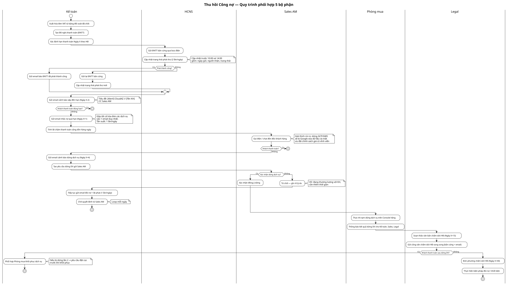

# Flows — Thu hồi Công nợ

## Flow: Thu hồi Công nợ (Swimlane)

**Trigger**: Bảng đối soát chi phí đã chốt → tự động kích hoạt luồng xuất hóa đơn
**Related**: [[BRD_Debt_Collection_2026-08-20.md]]

> Nguồn PlantUML: `debt-collection-swimlane.puml`. Sửa .puml → chạy `python plantuml_encode.py <file> | curl` regen .svg.

### Các giai đoạn

| Giai đoạn | Mô tả | Bộ phận chính |
|---|---|---|
| GĐ0 — Gửi ĐNTT | Xuất hóa đơn, tạo ĐNTT, gửi bản cứng | Kế toán, HCNS |
| GĐ1 — Cảnh báo trước hạn | Gửi email cảnh báo Ngày X-2 | Kế toán |
| GĐ2 — Nhắc nợ quá hạn | Gửi email nhắc nợ, tính lãi phạt (Ngày X+1→X+3) | Kế toán, Sales AM |
| GĐ3 — Dừng dịch vụ | Cảnh báo dừng, phê duyệt 3 bên, thực thi (Ngày X+4→X+30) | Kế toán, Sales AM, Phòng mua |
| GĐ4 — Chấm dứt HĐ | Công văn pháp lý, khởi kiện (Ngày X+30) | Legal |

### Lane map

- **Kế toán**: xuất HĐ, tạo ĐNTT, gửi email (cảnh báo/nhắc nợ/dừng DV), tính lãi phạt, phối hợp khôi phục
- **HCNS**: gửi ĐNTT bản cứng, cập nhật trạng thái phát thư
- **Sales AM**: gọi điện đôn đốc, xác nhận/từ chối dừng DV
- **Phòng mua**: thực thi dừng DV trên Console hãng
- **Legal**: soạn công văn, gửi song song, chấm dứt HĐ, khởi kiện
