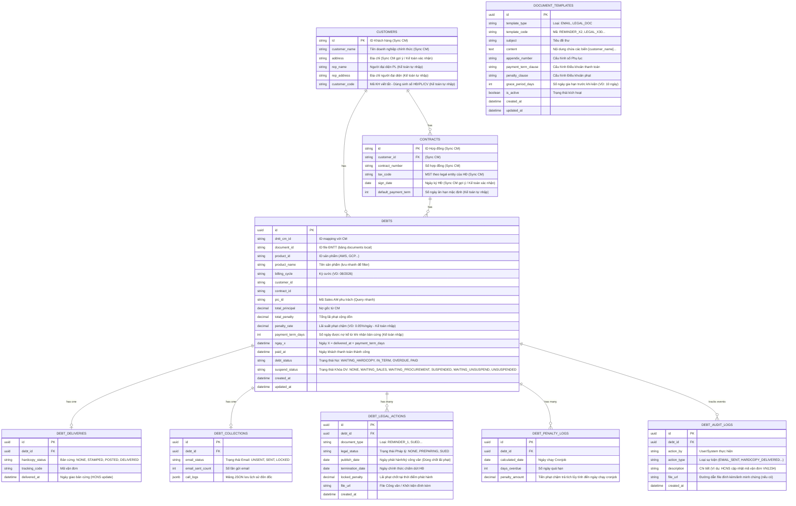

# Database Schema & ERD (Thu hồi công nợ)

> **Architectural Decision:** Quá trình tính cước và sinh file ĐNTT được thực hiện bên hệ thống CM. ERP **KHÔNG** lưu lại các log tính toán rác đó. Lifecycle dữ liệu trên ERP chỉ thực sự bắt đầu lưu Database từ thời điểm **kế toán click đồng bộ danh sách ĐNTT đã hoàn thành từ CM về**. 

## Sơ đồ Thực thể (ERD)

## 1. Bảng `DEBTS` (Hồ sơ Công nợ gốc)
Đây là bảng **xương sống**, lưu trữ toàn bộ định danh, dòng tiền và trạng thái tổng quát.

* **Nhóm Định danh (Identification):**
  - `id`: Mã định danh duy nhất của khoản nợ trên ERP.
  - `dntt_cm_id`: ID gốc link với hệ thống CM (dùng để đối chiếu xem ĐNTT này sinh ra từ file cước nào bên CM).
  - `product_id` & `product_name`: ID và Tên sản phẩm (Ví dụ: AWS, GCP, GWS) dùng để lọc nhanh danh sách công nợ theo sản phẩm trên màn hình ERP.
  - `billing_cycle`: Kỳ cước (VD: 08/2026). Phục vụ Kế toán/Sales filter nhanh danh sách công nợ theo tháng mà không cần gọi API CM.
  - `customer_id` & `contract_id`: ID của khách hàng và hợp đồng, dùng để tra cứu thông tin liên hệ, tra cứu số ngày ân hạn (để tính Ngày X).
  - `pic_id`: ID của Sales AM phụ trách. Lưu sẵn để load nhanh màn hình cho Sales mà không cần gọi API chéo sang CM.

* **Nhóm Tiền nong (Financials):**
  - `total_principal`: Nợ gốc (Số tiền chốt cước ban đầu kéo từ CM về).
  - `total_penalty`: Tiền phạt cộng dồn. Bằng 0 trong hạn, bắt đầu tăng dần mỗi ngày khi quá hạn.

* **Nhóm Thời gian & Trạng thái chính:**
  - `payment_term_days` & `penalty_rate`: Số ngày được thanh toán và % lãi chậm trả. Cả hai trường này **bắt buộc do Kế toán nhập thủ công ở lần đầu dùng hệ thống** (Có thể gợi ý sẵn từ `CONTRACTS.default_payment_term`).
  - `ngay_x`: Ngày hạn chót thanh toán (Tự động tính: `ngay_x = delivered_at + payment_term_days`).
  - `paid_at`: Ngày Kế toán xác nhận tiền đã nổi tài khoản (Dùng để chốt sổ, dừng tính lãi phạt).
  - `debt_status`: Trạng thái tổng quát (`Trong hạn`, `Quá hạn`, `Đã tất toán`...). Khoản nợ dù bị khởi kiện hay nợ xấu vẫn giữ trạng thái `OVERDUE`.
  - `suspend_status`: Sales AM duyệt ➔ Phòng Mua thao tác. Quản lý luồng khóa dịch vụ (SUSPEND) và luồng nhắc mở khóa khi khách trả tiền (WAITING_UNSUSPEND ➔ UNSUSPENDED).

---

## 2. Các Bảng Master Data (Dữ liệu nền)
Đây là các bảng đóng vai trò "Gương soi" (Mirror Tables), lưu trữ bản sao dữ liệu tĩnh được đồng bộ từ hệ thống CM sang ERP để phục vụ việc truy vấn nhanh mà không cần gọi API. Tuy nhiên, do hệ thống CM ở Phase 1 chưa quản lý đủ sâu các thông tin pháp lý, dữ liệu trên ERP sẽ là sự kết hợp giữa **Sync tự động** và **Nhập thủ công**.

* **Bảng `CUSTOMERS` (Khách hàng):** Phục vụ việc tự động điền (auto-fill) vào mẫu Công văn.
  - **Đồng bộ từ CM:** `id`, `customer_name` (Tên công ty), `address` (gợi ý từ `legalEntity.address`).
  - **Kế toán tự nhập bổ sung trên ERP:** `rep_name` (Người đại diện PL), `rep_address` (Địa chỉ người đại diện), `customer_code` (Mã KH viết tắt — dùng sinh số HĐ/PL/Công văn).

* **Bảng `CONTRACTS` (Hợp đồng):** Hỗ trợ tra cứu nhanh khi tạo thông báo Pháp lý.
  - **Đồng bộ từ CM:** `id`, `customer_id`, `contract_number` (từ `legal[].contract_code`), `tax_code` (từ `legalEntity.taxNumber` của legal entity gắn với HĐ đó), `sign_date` (từ `legal[].sign_date`, gợi ý).
  - **Kế toán tự nhập bổ sung trên ERP:** `default_payment_term` (Số ngày ân hạn mặc định).

---

## 2. Các Bảng Nghiệp Vụ (Domains)
Để tránh `DEBTS` bị phình to (God Object), các nghiệp vụ đặc thù được tách ra các bảng con.

* **Bảng `DEBT_DELIVERIES` (Giao nhận Bản cứng):** 
  - `hardcopy_status` & `tracking_code`: HCNS thao tác. Quản lý việc HCNS đã gửi bưu điện chưa, mã vận đơn là gì (Bằng chứng pháp lý trước tòa).
  - `delivered_at`: Ngày Hành chính nhân sự (HCNS) xác nhận khách đã nhận bản cứng. Đây là mốc thời gian cực kỳ quan trọng để "kích hoạt" đồng hồ đếm ngược Ngày X.

* **Bảng `DEBT_COLLECTIONS` (Đôn đốc nhắc nợ):**
  - `email_status` & `email_sent_count`: Kế toán thao tác. Quản lý việc duyệt gửi email nhắc nợ chưa, và đã gửi mấy lần.
  - `call_logs`: Sales AM thao tác. Lưu dưới dạng mảng JSON chứa lịch sử chi tiết tất cả các cuộc gọi đôn đốc. Giúp Frontend dễ dàng render lịch sử đôn đốc nhanh.

* **Bảng `DEBT_LEGAL_ACTIONS` (Lịch sử Pháp lý & Công văn):**
  - Một khoản nợ có thể xuất nhiều Công văn (Lần 1, Lần 2, Tối hậu thư). Bảng này lưu vết mỗi lần xuất.
  - `legal_status` & `file_url`: Pháp lý thao tác. Quản lý luồng kiện tụng và link tải file công văn đã đóng dấu.
  - `publish_date`, `termination_date`, `locked_penalty`: Các biến số pháp lý chốt tại thời điểm xuất văn bản. Số tiền phạt được "snapshot" chính xác đến ngày ký.

---

## 2. Bảng `DEBT_PENALTY_LOGS` (Nhật ký Phạt Lãi chậm)
Vai trò: Bảng này sinh ra để **chứng minh số tiền phạt**, giải trình minh bạch cho khách hàng thay vì chỉ báo một con số tổng khống.

- `debt_id`: Khóa ngoại trỏ về khoản nợ gốc.
- `calculated_date`: Ngày hệ thống (Cronjob) chạy tính toán.
- `days_overdue`: Đếm số ngày đã trễ hạn tính đến thời điểm đó.
- `penalty_amount`: Số tiền phạt chậm trả tích lũy tính đến ngày chạy cronjob. (Công thức tính: `penalty_amount = % lãi trả chậm quy định theo hợp đồng × days_overdue × nợ gốc phải trả kỳ đó`).

---

## 3. Bảng `DEBT_AUDIT_LOGS` (Nhật ký Thao tác / Timeline)
Vai trò: Phục vụ trực tiếp cho tính năng UI **Expandable Row (Bấm vào 1 dòng sổ ra lịch sử)** trên màn hình kế toán, và giải quyết triệt để nạn "đổ lỗi" giữa các phòng ban.

- `debt_id`: Khóa ngoại trỏ về khoản nợ gốc.
- `action_by`: Ai là người làm? (Kế toán A, Sales B, HCNS C, hoặc System).
- `action_type`: Mã hành động chuẩn hóa (`EMAIL_SENT`, `SALES_APPROVED_SUSPEND`, `DAY_X_CALCULATED`). Giúp Frontend dễ dàng render ra các Icon tương ứng cho đẹp mắt.
- `file_url`: Lưu trữ link tải file/ảnh chụp màn hình minh chứng do từng bộ phận tải lên (Ảnh hóa đơn chuyển phát, ảnh Console Google đã khóa, ảnh UNC nợ...).
- `description`: Diễn giải chi tiết. Ví dụ: *"Sales AM Nguyễn Văn A đã bấm duyệt khóa dịch vụ với lý do: Khách hàng chây ỳ"*.
- `created_at`: Thời gian chính xác (Timestamp).

---

## 4. Bảng `DOCUMENT_TEMPLATES` (Quản lý Biểu mẫu động)
Vai trò: Vì doanh nghiệp có rất nhiều loại biểu mẫu khác nhau (Email nhắc nợ X-2 cường độ nhẹ, Email nhắc nợ X+1 cường độ mạnh, Công văn X+15, Quyết định khởi kiện X+30...), hệ thống cần một bảng cấu hình chung để Admin tự vào sửa nội dung mà không cần nhờ Dev fix code.

- `template_type`: Phân loại biểu mẫu là `EMAIL` hay `LEGAL_DOC` (Công văn bản cứng).
- `template_code`: Mã tra cứu cứng trong logic code (VD: `REMINDER_X_MINUS_2`, `LEGAL_X_30`).
- `appendix_number`, `payment_term_clause`, `penalty_clause`, `grace_period_days`: Các trường cấu hình cứng cho riêng template đó (VD: Điều 3, Điều 5, 10 ngày). Tách riêng ra khỏi content để Admin dễ cấu hình.
- `content`: Nội dung thô (HTML/Markdown) chứa các "biến số" (Placeholder) như `[customer_name]`, `[total_penalty]`. Khi Kế toán/Pháp lý bấm "Soạn công văn", backend sẽ móc template này ra và `replace()` các biến bằng số liệu thật ở bảng `DEBTS` (và các trường điều khoản).

---

## 3. Tổng hợp Phân luồng Nguồn Dữ Liệu (Sync vs Manual)

Để đảm bảo tính khả thi trong Phase 1 (khi hệ thống CM chưa chứa đủ dữ liệu pháp lý), dưới đây là bảng tổng hợp rõ ràng ranh giới giữa việc lấy dữ liệu tự động từ API CM và việc người dùng (Kế toán/Pháp lý) phải tự nhập liệu thủ công trên ERP:

### 3.1. Lưu ý về mapping dữ liệu CM

- `address` trong CM lưu ở `legalEntity.address`. Mỗi hợp đồng gắn với 1 legal entity → lấy address từ legal entity của HĐ đó.
- `contract_number` và `sign_date` trong CM nằm trong mảng `legal[]` subdoc của contract (mỗi contract có thể có nhiều legal document). Lấy legal đầu tiên.
- `tax_code` gắn với từng hợp đồng — mỗi HĐ ký với 1 legal entity có MST riêng. Sync từ `legalEntity.taxNumber` qua `contract.legalEntityId`.
- CM **không có** các field: `rep_name`, `rep_address`, `customer_code`.

### 3.2. Bảng tổng hợp nguồn dữ liệu

| Bảng | Trường dữ liệu | Nguồn | Ghi chú |
|---|---|---|---|
| **CUSTOMERS** | `id`, `customer_name` | 🔄 **Sync CM** | Từ `customer.name` |
| **CUSTOMERS** | `address` | ⚠️ **Gợi ý từ CM, xác nhận** | Từ `legalEntity.address` gắn với HĐ |
| **CUSTOMERS** | `rep_name`, `rep_address`, `customer_code` | ✍️ **Nhập tay ERP** | `customer_code` là mã KH viết tắt, dùng sinh số HĐ/PL/CV |
| **CONTRACTS** | `id`, `customer_id`, `contract_number`, `tax_code` | 🔄 **Sync CM** | `contract_number` từ `legal[].contract_code`, `tax_code` từ `legalEntity.taxNumber` |
| **CONTRACTS** | `sign_date` | ⚠️ **Gợi ý từ CM, xác nhận** | Từ `legal[].sign_date` |
| **CONTRACTS** | `default_payment_term` | ✍️ **Nhập tay ERP** | Số ngày ân hạn mặc định |
| **DEBTS** | `total_principal`, `billing_cycle`, `product_name` | 🔄 **Sync CM** | Data cốt lõi của kỳ cước |
| **DEBTS** | `payment_term_days`, `penalty_rate` | ✍️ **Nhập tay ERP** | Kế toán tự nhập lần đầu |
