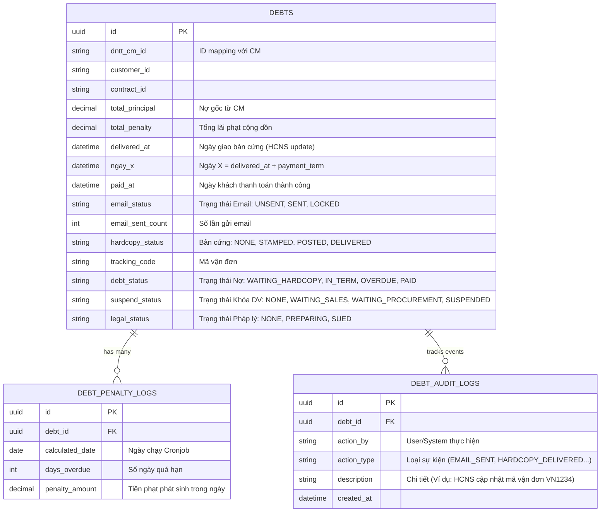

# Database Schema & ERD (Thu hồi công nợ)

> **Architectural Decision:** Quá trình tính cước và sinh file ĐNTT được thực hiện bên hệ thống CM. ERP **KHÔNG** lưu lại các log tính toán rác đó. Lifecycle dữ liệu trên ERP chỉ thực sự bắt đầu lưu Database từ thời điểm **kế toán click đồng bộ danh sách ĐNTT đã hoàn thành từ CM về**. 

## Sơ đồ Thực thể (ERD)

## 1. Bảng `DEBTS` (Hồ sơ Công nợ gốc)
Đây là bảng **xương sống**, lưu trữ toàn bộ trạng thái và vòng đời của 1 khoản nợ (từ lúc tạo ĐNTT cho đến khi khách trả tiền hoặc bị kiện). Được thiết kế theo dạng State Machine phân chia rạch ròi trách nhiệm của từng phòng ban.

* **Nhóm Định danh (Identification):**
  - `id`: Mã định danh duy nhất của khoản nợ trên ERP.
  - `dntt_cm_id`: ID gốc link với hệ thống CM (dùng để đối chiếu xem ĐNTT này sinh ra từ file cước nào bên CM).
  - `customer_id` & `contract_id`: ID của khách hàng và hợp đồng, dùng để tra cứu thông tin liên hệ, tra cứu số ngày ân hạn (để tính Ngày X).

* **Nhóm Tiền nong (Financials):**
  - `total_principal`: Nợ gốc (Số tiền chốt cước ban đầu kéo từ CM về).
  - `total_penalty`: Tiền phạt cộng dồn. Bằng 0 trong hạn, bắt đầu tăng dần mỗi ngày khi quá hạn.

* **Nhóm Thời gian (Timing Triggers):**
  - `delivered_at`: Ngày Hành chính nhân sự (HCNS) xác nhận khách đã nhận bản cứng. Đây là mốc thời gian cực kỳ quan trọng để "kích hoạt" đồng hồ đếm ngược.
  - `ngay_x`: Ngày hạn chót thanh toán (Tự động tính: `ngay_x = delivered_at + số ngày hợp đồng cho nợ`).
  - `paid_at`: Ngày Kế toán xác nhận tiền đã nổi tài khoản (Dùng để chốt sổ, dừng tính lãi phạt).

* **Nhóm Trạng thái (Phân mảnh theo Phòng ban):**
  - `debt_status`: Trạng thái tổng quát của khoản nợ (`Trong hạn`, `Quá hạn`, `Đã tất toán`...).
  - `email_status` & `email_sent_count`: Kế toán thao tác. Quản lý việc Kế toán đã duyệt gửi email nhắc nợ chưa, và đã gửi mấy lần.
  - `hardcopy_status` & `tracking_code`: HCNS thao tác. Quản lý việc HCNS đã gửi bưu điện chưa, mã vận đơn là gì (Bằng chứng pháp lý trước tòa).
  - `suspend_status`: Sales AM duyệt ➔ Phòng Mua thao tác. Quản lý luồng khóa dịch vụ.
  - `legal_status`: Pháp lý thao tác. Quản lý luồng kiện tụng.

---

## 2. Bảng `DEBT_PENALTY_LOGS` (Nhật ký Phạt Lãi chậm)
Vai trò: Bảng này sinh ra để **chứng minh số tiền phạt**, giải trình minh bạch cho khách hàng thay vì chỉ báo một con số tổng khống.

- `debt_id`: Khóa ngoại trỏ về khoản nợ gốc.
- `calculated_date`: Ngày hệ thống (Cronjob) chạy tính toán.
- `days_overdue`: Đếm số ngày đã trễ hạn tính đến thời điểm đó.
- `penalty_amount`: Số tiền phạt **chỉ sinh ra trong riêng ngày hôm đó**. (Công thức: `penalty_amount = total_principal * penalty_rate_applied / 365`).

---

## 3. Bảng `DEBT_AUDIT_LOGS` (Nhật ký Thao tác / Timeline)
Vai trò: Phục vụ trực tiếp cho tính năng UI **Expandable Row (Bấm vào 1 dòng sổ ra lịch sử)** trên màn hình kế toán, và giải quyết triệt để nạn "đổ lỗi" giữa các phòng ban.

- `debt_id`: Khóa ngoại trỏ về khoản nợ gốc.
- `action_by`: Ai là người làm? (Kế toán A, Sales B, HCNS C, hoặc System).
- `action_type`: Mã hành động chuẩn hóa (`EMAIL_SENT`, `SALES_APPROVED_SUSPEND`, `DAY_X_CALCULATED`). Giúp Frontend dễ dàng render ra các Icon tương ứng cho đẹp mắt.
- `description`: Diễn giải chi tiết. Ví dụ: *"Sales AM Nguyễn Văn A đã bấm duyệt khóa dịch vụ với lý do: Khách hàng chây ỳ"*.
- `created_at`: Thời gian chính xác (Timestamp).