# Database Schema — Module Thu hồi Công nợ

**Ngày:** 2026-08-27 · **PostgreSQL** · **golang-migrate**

> **File này thay thế `Database_ERD.md` và `Database_Schema_DDL.md`.** Trước đây hai file cùng mô tả một bộ bảng nên liên tục lệch nhau (`uuid` vs `BIGSERIAL`, `debt_audit_logs` vs `debt_events`, ERD thiếu 3 bảng mới). Gộp làm một: mỗi bảng xuất hiện **đúng một lần**, có cả vai trò nghiệp vụ lẫn DDL thi công nằm cạnh nhau.

**Quyết định kiến trúc:** Việc tính cước và sinh file ĐNTT do hệ thống CM làm. ERP **không** lưu log tính toán của CM. Vòng đời dữ liệu trên ERP bắt đầu từ lúc **Kế toán bấm đồng bộ danh sách ĐNTT từ CM về**.

**Các bảng nền tảng** (`users`, `roles`, `permissions`, `departments`, `members`, `notifications`, `activity_logs`, `background_jobs`) **đã có sẵn trong ERP**, không khai báo lại — xem [`ERP_Platform_Integration.md`](./ERP_Platform_Integration.md).

---

## 0. Quy ước — bám theo codebase ERP

| Quy ước | Giá trị | Bằng chứng |
|---|---|---|
| Kiểu thời gian | `TIMESTAMPTZ` | `000022_create_notifications_table.up.sql:10` |
| Khóa chính | `SERIAL` / `BIGSERIAL` — **không dùng UUID** | `000001_init_schema.up.sql:5,23` |
| Mặc định thời gian | `DEFAULT NOW()` | `000022:10` |
| Đặt tên | `snake_case`, bảng số nhiều | toàn bộ migration |
| Đặt tên index | `idx_<bảng>_<cột>` | `000001:58` |
| Idempotent | `CREATE TABLE IF NOT EXISTS`, `ON CONFLICT DO NOTHING` | `000063:15`, `000001:19` |
| Enum | `VARCHAR` + `CHECK`, **không** `CREATE TYPE` | dễ rollback hơn |

> **Vì sao `BIGSERIAL` chứ không phải UUID:** bảng `notifications` của nền tảng khai `ref_id INTEGER`. Dùng UUID cho `debts.id` sẽ không gắn được thông báo vào khoản nợ. Khóa đối chiếu sang CM vẫn là `dntt_cm_id` nên không mất khả năng truy vết.

---

## 1. Sơ đồ tổng quan

```mermaid
erDiagram
    CUSTOMERS ||--o{ CONTRACTS : "has"
    CUSTOMERS ||--o{ CUSTOMER_CONTACTS : "has"
    CUSTOMERS ||--o{ DEBTS : "has"
    CONTRACTS ||--o{ DEBTS : "has"
    DOCUMENTS ||--o{ DEBTS : "attached to"
    DEBT_PRODUCT_CONFIGS ||--o{ DEBTS : "configures"

    DEBTS ||--o| DEBT_DELIVERIES : "has one"
    DEBTS ||--o| DEBT_COLLECTIONS : "has one"
    DEBTS ||--o{ DEBT_LEGAL_ACTIONS : "has many"
    DEBTS ||--o{ DEBT_PENALTY_LOGS : "has many"
    DEBTS ||--o{ DEBT_EMAIL_LOGS : "has many"
    DEBTS ||--o{ DEBT_REMINDER_OUTBOX : "has many"
    DEBTS ||--o{ DEBT_EVENTS : "tracks"

    CUSTOMERS {
        string id PK "ObjectId từ CM"
        string customer_name "Sync CM"
        string address "Sync CM gợi ý, Kế toán xác nhận"
        string rep_name "Nhập tay"
        string rep_address "Nhập tay"
        string customer_code UK "Nhập tay - sinh số công văn"
    }

    CUSTOMER_CONTACTS {
        bigint id PK
        string customer_id FK
        string contact_name "Nhập tay"
        string email "BẮT BUỘC, unique theo customer"
        string phone
        string position
        string recipient_role "TO | CC"
        boolean is_primary "Đúng 1 true mỗi khách"
        boolean is_active "Tắt thay vì xóa - giữ vết pháp lý"
    }

    CONTRACTS {
        string id PK "ObjectId từ CM"
        string customer_id FK
        string contract_number "Sync CM"
        string tax_code "Sync CM"
        date sign_date "Sync CM gợi ý"
        int payment_term_days "Nhập tay - NƠI DUY NHẤT lưu trường này"
    }

    DOCUMENTS {
        string id PK "document._id bên CM"
        string name "Tên file ĐNTT gốc"
        string extension ".docx"
        string s3_key "Sinh presigned URL"
        string user_created
    }

    DEBT_PRODUCT_CONFIGS {
        bigint id PK
        string product_name UK "GWS Standard, GWS Flex, AWS..."
        decimal default_penalty_rate
        int default_payment_term_days
        int suspend_milestone_days "Mặc định 4"
        int legal_notice_milestone_days "Mặc định 15"
        int legal_sue_milestone_days "Mặc định 30"
        int reminder_before_due_days "Mảng [2,1,0]"
        boolean reminder_daily_after_delivered "Mặc định true"
        int max_email_per_day "Mặc định 1"
        jsonb template_set "Bộ template theo mốc"
        string sales_lead_email_override "Ghi đè email trưởng phòng"
        boolean is_active
        datetime created_at
        datetime updated_at
    }

    DEBTS {
        bigint id PK
        string dntt_cm_id UK "Chống đồng bộ trùng"
        string document_id FK
        string product_id "Chỉ đối chiếu ngược"
        string product_name "KHÓA LỌC CHÍNH"
        string billing_cycle "MM/YYYY"
        string customer_id FK
        string contract_id FK
        string sale_owner "Email Sales AM - identity phân quyền"
        decimal total_principal "Nợ gốc từ CM"
        decimal total_penalty "Lãi cộng dồn"
        decimal penalty_rate "Tỉ lệ thập phân/ngày"
        decimal paid_amount "Nhập khi tất toán"
        date ngay_x "delivered_at + payment_term_days"
        date paid_at
        date promised_payment_date "Ngày khách hứa trả - Sales AM nhập"
        string sync_status "PENDING_REVIEW | CONFIRMED | EXCLUDED"
        string debt_status "WAITING_HARDCOPY | IN_TERM | OVERDUE | PAID"
        string suspend_status "NONE | WAITING_SALES | WAITING_PROCUREMENT | SUSPENDED | WAITING_UNSUSPEND | UNSUSPENDED"
        int lock_version "Khóa lạc quan"
    }

    DEBT_DELIVERIES {
        bigint id PK
        bigint debt_id FK
        string hardcopy_status "NONE | STAMPED | POSTED | DELIVERED"
        string tracking_code "Mã vận đơn"
        date posted_at
        date delivered_at "Kích hoạt đồng hồ Ngày X"
        string receiver_name "Người ký nhận"
        string proof_file_url
    }

    DEBT_COLLECTIONS {
        bigint id PK
        bigint debt_id FK
        int email_sent_count "CHỈ đếm làn REMINDER"
        date last_email_sent_date "Ép luật 1 mail/ngày - CHỈ làn REMINDER"
        string last_template_code "Suy ra giai đoạn nhắc nợ - CHỈ làn REMINDER"
        string thread_subject "Tiêu đề chung cả luồng - sinh 1 lần rồi khóa"
        string first_email_message_id "Message-ID thư gốc"
        string gmail_thread_id "threadId Gmail"
        jsonb call_logs "Lịch sử đôn đốc"
    }

    DEBT_PENALTY_LOGS {
        bigint id PK
        bigint debt_id FK
        date calculated_date "UNIQUE cùng debt_id"
        int days_overdue
        decimal daily_amount "Phát sinh riêng trong ngày"
        decimal accumulated_amount "Tích lũy = DEBTS.total_penalty"
    }

    DEBT_LEGAL_ACTIONS {
        bigint id PK
        bigint debt_id FK
        string document_type
        string document_number UK
        string legal_status "PREPARING | SENT | SUED"
        date publish_date "Chốt lãi phạt"
        date sent_at "Mốc đếm grace_period_days - sớm hơn giữa bưu điện và email"
        string delivery_method "POST | EMAIL | BOTH"
        string tracking_code "Bắt buộc khi POST/BOTH"
        date termination_date
        decimal locked_penalty "Ảnh chụp - KHÔNG dừng tính lãi"
        string file_url
    }

    DEBT_EMAIL_LOGS {
        bigint id PK
        bigint debt_id FK
        string template_code
        string mail_track "REMINDER | LEGAL - mọi luật tra theo cột này"
        bigint attachment_legal_action_id FK "PDF công văn đính kèm"
        string from_email "Hòm thư đã gửi - bằng chứng tự đủ"
        text to_emails "Bằng chứng pháp lý"
        text cc_emails
        int sequence_step "Vị trí trong luồng - gán LÚC GỬI"
        string message_id "Đọc lại từ Gmail, không tự sinh"
        string parent_message_id "In-Reply-To"
        text references_chain "Lưu vết chuỗi đã dùng"
        string send_status "draft | queued | sent | failed | skipped | expired | cancelled"
        date prepared_for
        string approved_by "Bắt buộc khi queued/sent"
        int attempt_count
        text last_error
    }

    DEBT_REMINDER_OUTBOX {
        bigint id PK
        bigint debt_id FK
        string recipient_email
        text title
        text body
        text debt_url
        string status "pending | sent | failed"
        int attempt_count
        text last_error
        datetime last_attempt_at
    }

    DEBT_EVENTS {
        bigint id PK
        bigint debt_id FK
        string action_by "User hoặc System"
        string action_type "Giá trị chuẩn hóa - xem 13a"
        string description "Diễn giải tiếng Việt cho người dùng đọc"
        string file_url "Ảnh minh chứng"
    }

    DOCUMENT_TEMPLATES {
        bigint id PK
        string template_type "EMAIL | LEGAL_DOC"
        string template_code UK
        string approval_mode "AUTO | MANUAL"
        string subject
        string stage_label "Nhãn giai đoạn hiển thị trên grid"
        text content "Chứa biến {{.customer_name}}"
        string appendix_number
        string payment_term_clause
        string penalty_clause
        int grace_period_days
        boolean is_active
        boolean is_customized "Admin đã sửa - sync bỏ qua"
    }
```



---

## 2. `customers` — Khách hàng

Phục vụ auto-fill vào mẫu công văn. Đồng bộ `id`, `customer_name` từ CM; `address` CM gợi ý và Kế toán xác nhận; `rep_name` / `rep_address` / `customer_code` CM không có nên nhập tay.

> **Về `address` — đơn giản hóa có chủ đích.** Bên CM, địa chỉ thuộc **legal entity của từng hợp đồng**, nên một khách hàng ký nhiều pháp nhân sẽ có nhiều địa chỉ. ERP **cố ý** chỉ giữ **một địa chỉ chung cho mỗi khách hàng** — PO đã chốt chỉ quan tâm `tax_code` gắn đúng theo hợp đồng (đã đặt ở `contracts`, xem §3).
> **Hệ quả cần biết:** biến `[customer_address]` trong công văn pháp lý dùng địa chỉ chung này, không đổi theo pháp nhân ký hợp đồng. Với khách nhiều pháp nhân, Pháp lý phải tự sửa lại địa chỉ trong bản nháp công văn trước khi xuất PDF (popup đã cho sửa tay). Nếu sau này thành vấn đề thì chuyển `address` xuống `contracts` như `tax_code`.

```sql
CREATE TABLE IF NOT EXISTS customers (
    id              VARCHAR(64)  PRIMARY KEY,          -- ObjectId từ CM
    customer_name   VARCHAR(255) NOT NULL,
    address         TEXT,
    rep_name        VARCHAR(255),
    rep_address     TEXT,
    customer_code   VARCHAR(50),
    created_at      TIMESTAMPTZ NOT NULL DEFAULT NOW(),
    updated_at      TIMESTAMPTZ NOT NULL DEFAULT NOW(),
    CONSTRAINT uq_customers_code UNIQUE (customer_code)
);

CREATE INDEX IF NOT EXISTS idx_customers_name ON customers (customer_name);
```
`customer_code` để `NULL` được (chưa nhập), nhưng đã nhập thì phải duy nhất — PostgreSQL cho phép nhiều `NULL` trong `UNIQUE` nên đúng ý đồ.

---

## 3. `contracts` — Hợp đồng

Hỗ trợ tra cứu nhanh khi lập công văn pháp lý. `payment_term_days` là **nguồn duy nhất** để tính Ngày X — `debts` không giữ bản sao, đọc qua `contract_id`.

```sql
CREATE TABLE IF NOT EXISTS contracts (
    id                 VARCHAR(64)  PRIMARY KEY,
    customer_id        VARCHAR(64)  NOT NULL REFERENCES customers(id) ON DELETE RESTRICT,
    contract_number    VARCHAR(100),                   -- legal[].contract_code
    tax_code           VARCHAR(20),                    -- legalEntity.taxNumber
    sign_date          DATE,
    payment_term_days  SMALLINT,
    created_at         TIMESTAMPTZ NOT NULL DEFAULT NOW(),
    updated_at         TIMESTAMPTZ NOT NULL DEFAULT NOW(),
    CONSTRAINT ck_contracts_payment_term CHECK (payment_term_days IS NULL
                                             OR (payment_term_days > 0 AND payment_term_days <= 90))
);

CREATE INDEX IF NOT EXISTS idx_contracts_customer ON contracts (customer_id);
CREATE INDEX IF NOT EXISTS idx_contracts_number   ON contracts (contract_number);
```

---

## 4. `customer_contacts` — Người liên hệ nhận thư

Nguồn địa chỉ email cho **toàn bộ** luồng gửi mail. CM không lưu email liên hệ nên bảng này **100% nhập tay**, làm cùng lúc với `rep_name` / `customer_code`.

- `recipient_role`: `TO` (người nhận chính, thường là Kế toán của khách) và `CC` (nhận bản sao).
- `is_primary`: mỗi khách đúng **1** đầu mối chính, dùng hiển thị nhanh trên grid.
- `is_active`: nhân sự bên khách nghỉ việc thì tắt cờ, **không xóa** — giữ nguyên vết đã từng gửi thư cho ai (bằng chứng trước tòa).

**Quy tắc dựng người nhận, áp dụng cho mọi email gửi khách:**
```
To = customer_contacts WHERE customer_id = ? AND recipient_role = 'TO' AND is_active
CC = customer_contacts WHERE customer_id = ? AND recipient_role = 'CC' AND is_active
     + email Sales AM (debts.sale_owner)
     + (riêng SUSPEND_WARNING_X_PLUS_4) email Trưởng phòng Sales
```
**Ràng buộc cứng:** `To` rỗng → **chặn gửi**, trả `422 FIN_DEBT_NO_RECIPIENT`. Grid Kế toán hiện cảnh báo đỏ *"Chưa cấu hình email liên hệ"*.

```sql
CREATE TABLE IF NOT EXISTS customer_contacts (
    id              BIGSERIAL    PRIMARY KEY,
    customer_id     VARCHAR(64)  NOT NULL REFERENCES customers(id) ON DELETE CASCADE,
    contact_name    VARCHAR(255) NOT NULL,
    email           VARCHAR(255) NOT NULL,
    phone           VARCHAR(50),
    position        VARCHAR(150),
    recipient_role  VARCHAR(10)  NOT NULL DEFAULT 'CC',
    is_primary      BOOLEAN      NOT NULL DEFAULT FALSE,
    is_active       BOOLEAN      NOT NULL DEFAULT TRUE,
    created_at      TIMESTAMPTZ  NOT NULL DEFAULT NOW(),
    updated_at      TIMESTAMPTZ  NOT NULL DEFAULT NOW(),
    CONSTRAINT ck_contacts_role  CHECK (recipient_role IN ('TO','CC')),
    CONSTRAINT ck_contacts_email CHECK (email ~* '^[^@\s]+@[^@\s]+\.[^@\s]+$'),
    CONSTRAINT uq_contacts_email UNIQUE (customer_id, email)
);

-- Mỗi khách đúng 1 đầu mối chính — ép ở tầng DB, không phó mặc ứng dụng
CREATE UNIQUE INDEX IF NOT EXISTS uq_contacts_one_primary
    ON customer_contacts (customer_id) WHERE is_primary;

CREATE INDEX IF NOT EXISTS idx_contacts_lookup
    ON customer_contacts (customer_id, recipient_role) WHERE is_active;
```

---

## 5. `documents` — File ĐNTT đồng bộ từ CM

```sql
CREATE TABLE IF NOT EXISTS documents (
    id            VARCHAR(64)  PRIMARY KEY,            -- document._id bên CM
    name          VARCHAR(500) NOT NULL,
    extension     VARCHAR(20)  NOT NULL DEFAULT '.docx',
    s3_key        TEXT         NOT NULL,
    user_created  VARCHAR(255),
    created_at    TIMESTAMPTZ  NOT NULL DEFAULT NOW()
);
```

---

## 6. `debt_product_configs` — Cấu hình theo sản phẩm ⭐

Sprint 1 chỉ có GWS Standard, nhưng roadmap còn GWS Flex, AWS, GCP, GMP. Các mốc X+4 / X+15 / X+30, bộ template và lãi mặc định **không hardcode** — Sprint sau thêm sản phẩm chỉ cần insert một dòng.

```sql
CREATE TABLE IF NOT EXISTS debt_product_configs (
    id                            BIGSERIAL     PRIMARY KEY,
    product_name                  VARCHAR(150)  NOT NULL,
    is_active                     BOOLEAN       NOT NULL DEFAULT TRUE,
    default_penalty_rate          NUMERIC(10,6),
    default_payment_term_days     SMALLINT,
    suspend_milestone_days        SMALLINT      NOT NULL DEFAULT 4,
    legal_notice_milestone_days   SMALLINT      NOT NULL DEFAULT 15,
    legal_sue_milestone_days      SMALLINT      NOT NULL DEFAULT 30,
    reminder_before_due_days      SMALLINT[]    NOT NULL DEFAULT '{2,1,0}',
    reminder_daily_after_delivered BOOLEAN      NOT NULL DEFAULT TRUE,
    max_email_per_day             SMALLINT      NOT NULL DEFAULT 1,
    template_set                  JSONB         NOT NULL,
    sales_lead_email_override     VARCHAR(255),
    created_at                    TIMESTAMPTZ   NOT NULL DEFAULT NOW(),
    updated_at                    TIMESTAMPTZ   NOT NULL DEFAULT NOW(),
    CONSTRAINT uq_product_config UNIQUE (product_name),
    CONSTRAINT ck_config_order   CHECK (suspend_milestone_days < legal_notice_milestone_days
                                    AND legal_notice_milestone_days < legal_sue_milestone_days)
);

INSERT INTO debt_product_configs
    (product_name, default_penalty_rate, default_payment_term_days,
     reminder_before_due_days, reminder_daily_after_delivered, template_set)
VALUES ('GWS Standard', 0.000500, 7,
        '{2,1,0}'::smallint[], TRUE, '{
    "delivered":       "REMINDER_DELIVERED",
    "before_due":      ["REMINDER_X_MINUS_2","REMINDER_X_MINUS_1","REMINDER_X"],
    "overdue":         "REMINDER_X_PLUS_1",
    "suspend_warning": "SUSPEND_WARNING_X_PLUS_4",
    "legal_notice":    "LEGAL_NOTIFY_X_PLUS_15",
    "sue_notify":      "SUE_NOTIFY_X_PLUS_30"
}'::jsonb)
ON CONFLICT (product_name) DO NOTHING;
```

> **`template_set` chỉ chứa template do JOB gửi tự động — toàn bộ là `template_type = EMAIL`.**
> Key `legal_notice` trỏ **`LEGAL_NOTIFY_X_PLUS_15`** (email nội bộ báo Phòng Pháp lý ở mốc X+15), **không phải** `LEGAL_X_15`. `LEGAL_X_15` là **công văn giấy** (`template_type = LEGAL_DOC`) do Pháp lý tự bấm "Soạn Công văn" rồi xuất PDF — job không bao giờ gửi nó. Đặt nhầm key này thì `DebtLegalNotifyJob` sẽ gửi nguyên văn bản công văn dưới dạng email, sai cả người nhận lẫn định dạng.

`CHECK` ép thứ tự mốc hợp lý (khóa DV trước công văn, công văn trước khởi kiện) — chặn cấu hình sai ngay ở tầng DB. Mọi job đọc mốc từ bảng này, **cấm dùng hằng số 4/15/30 trong code**.

---

## 7. `debts` — Bảng xương sống

Lưu định danh, dòng tiền và trạng thái tổng quát.

**Nhóm định danh**

- `dntt_cm_id` — ID gốc bên CM, dùng đối chiếu và chống đồng bộ trùng.
- `product_id` & `product_name` — `product_name` là **khóa lọc chính**; `product_id` chỉ để đối chiếu ngược (CM không expose endpoint tra `productId`).
- `billing_cycle` — kỳ cước `MM/YYYY`, filter nhanh theo tháng không cần gọi CM.
- `sale_owner` — **email** Sales AM, dùng làm identity phân quyền: service ép `WHERE sale_owner = <email actor>` trong SQL.
- `sync_status` — **cột do ERP tự quản** vì CM không có trường trạng thái để lọc. Sync kéo về toàn bộ payment-request của kỳ cước, có thể lẫn bản nháp/trùng/sai, nên Kế toán phải rà:
  - `PENDING_REVIEW` — vừa đồng bộ, **chưa** vào luồng. Trạng thái khởi tạo.
  - `CONFIRMED` — **chỉ trạng thái này** mới được đóng dấu ĐNTT, tính Ngày X, gửi email, tính lãi, sinh yêu cầu khóa.
  - `EXCLUDED` — loại khỏi luồng, giữ lại đối chiếu, không job nào đụng tới.

**Nhóm tiền**

- `total_principal` — nợ gốc chốt từ CM.
- `total_penalty` — lãi cộng dồn. Bằng 0 khi trong hạn, tăng mỗi ngày khi quá hạn.
- `penalty_rate` — **tỉ lệ thập phân/ngày**: 0.05%/ngày lưu là `0.000500`. **Không giới hạn trần** — Kế toán nhập theo điều khoản hợp đồng đã ký, DB chỉ chặn `> 0`. Phòng nhập nhầm đơn vị bằng **cảnh báo mềm** trên giao diện khi vượt 1%/ngày (hỏi lại, không chặn lưu). Không dùng `FLOAT` cho tiền và lãi suất.
- `payment_term_days` **không có ở bảng này** — chỉ tồn tại ở `contracts`, đọc qua `contract_id`.

**Nhóm thời gian & trạng thái**

- `ngay_x` — hạn chót, tự tính `delivered_at + payment_term_days` (ngày lịch).
- `paid_at` — ngày Kế toán xác nhận tiền về, dùng chốt sổ và **dừng tính lãi**.
- `promised_payment_date` — **ngày khách hứa trả**, Sales AM nhập khi từ chối yêu cầu khóa dịch vụ (DC-07 AC2).
  **Đây không phải `ngay_x`.** `ngay_x` là hạn theo hợp đồng, hệ thống tự tính, cố định. `promised_payment_date` là lời hứa miệng của khách qua điện thoại, luôn **sau** `ngay_x` (khách đã quá hạn rồi mới hứa), và có thể bị ghi đè nếu khách hứa lại lần nữa.
  Tách cột riêng thay vì nhét vào `debt_events.description` để Sales AM lọc được *"khách nào hứa trả tuần này mà chưa trả"* và hệ thống nhắc lại được khi quá ngày hứa.
- `debt_status` — khoản nợ dù bị khởi kiện vẫn giữ `OVERDUE`.
  **Ranh giới `IN_TERM → OVERDUE`: điều kiện là `today > ngay_x`, KHÔNG phải `>=`.** Ngày X là hạn chót nên khách có trọn ngày đó để trả — vẫn `IN_TERM`, lãi bằng 0. Sang **00:05 ngày X+1** job `DebtPenaltyJob` mới lật sang `OVERDUE` với `days_overdue = 1`. Dùng nhầm `>=` là tính phạt khách ngay trong ngày họ còn quyền trả.
- `suspend_status` — Sales AM duyệt ➔ Phòng Mua thao tác, và luồng mở khóa khi khách trả tiền.
- `lock_version` — khóa lạc quan, mọi `PATCH` phải gửi kèm. Kế toán và Sales cùng mở một khoản nợ là chuyện hằng ngày.

```sql
CREATE TABLE IF NOT EXISTS debts (
    id               BIGSERIAL     PRIMARY KEY,
    dntt_cm_id       VARCHAR(64)   NOT NULL,
    document_id      VARCHAR(64)   REFERENCES documents(id) ON DELETE SET NULL,
    product_id       VARCHAR(64),
    product_name     VARCHAR(150)  NOT NULL,
    billing_cycle    CHAR(7)       NOT NULL,           -- 'MM/YYYY'
    customer_id      VARCHAR(64)   NOT NULL REFERENCES customers(id) ON DELETE RESTRICT,
    contract_id      VARCHAR(64)   NOT NULL REFERENCES contracts(id) ON DELETE RESTRICT,
    sale_owner       VARCHAR(255),

    total_principal  NUMERIC(18,2) NOT NULL DEFAULT 0,
    total_penalty    NUMERIC(18,2) NOT NULL DEFAULT 0,
    penalty_rate     NUMERIC(10,6),
    paid_amount      NUMERIC(18,2),

    ngay_x                 DATE,
    paid_at                DATE,
    promised_payment_date  DATE,                       -- ngày khách hứa trả, Sales AM nhập

    sync_status      VARCHAR(20)   NOT NULL DEFAULT 'PENDING_REVIEW',
    debt_status      VARCHAR(20)   NOT NULL DEFAULT 'WAITING_HARDCOPY',
    suspend_status   VARCHAR(25)   NOT NULL DEFAULT 'NONE',

    lock_version     INT           NOT NULL DEFAULT 1,
    created_at       TIMESTAMPTZ   NOT NULL DEFAULT NOW(),
    updated_at       TIMESTAMPTZ   NOT NULL DEFAULT NOW(),

    CONSTRAINT uq_debts_cm_id   UNIQUE (dntt_cm_id),
    CONSTRAINT ck_debts_cycle   CHECK (billing_cycle ~ '^(0[1-9]|1[0-2])/[0-9]{4}$'),
    CONSTRAINT ck_debts_sync    CHECK (sync_status IN ('PENDING_REVIEW','CONFIRMED','EXCLUDED')),
    CONSTRAINT ck_debts_status  CHECK (debt_status IN ('WAITING_HARDCOPY','IN_TERM','OVERDUE','PAID')),
    CONSTRAINT ck_debts_suspend CHECK (suspend_status IN ('NONE','WAITING_SALES','WAITING_PROCUREMENT',
                                                          'SUSPENDED','WAITING_UNSUSPEND','UNSUSPENDED')),
    CONSTRAINT ck_debts_rate    CHECK (penalty_rate IS NULL OR penalty_rate > 0),
    CONSTRAINT ck_debts_amounts CHECK (total_principal >= 0 AND total_penalty >= 0),
    CONSTRAINT ck_debts_paid    CHECK (debt_status <> 'PAID' OR (paid_at IS NOT NULL AND paid_amount IS NOT NULL))
);

CREATE INDEX IF NOT EXISTS idx_debts_sync_status  ON debts (sync_status);
CREATE INDEX IF NOT EXISTS idx_debts_status_ngayx ON debts (debt_status, ngay_x);
CREATE INDEX IF NOT EXISTS idx_debts_suspend      ON debts (suspend_status)
    WHERE suspend_status <> 'NONE';
CREATE INDEX IF NOT EXISTS idx_debts_sale_owner   ON debts (sale_owner, debt_status);
CREATE INDEX IF NOT EXISTS idx_debts_customer     ON debts (customer_id);
CREATE INDEX IF NOT EXISTS idx_debts_cycle        ON debts (billing_cycle);
-- Đường nóng của job 00:05 — chỉ đụng bản ghi còn "sống"
CREATE INDEX IF NOT EXISTS idx_debts_cron_open    ON debts (ngay_x)
    WHERE sync_status = 'CONFIRMED' AND paid_at IS NULL;
```

---

## 8. `debt_deliveries` — Giao nhận bản cứng (1-1)

`hardcopy_status` & `tracking_code` do HCNS thao tác — mã vận đơn là **bằng chứng pháp lý trước tòa**. `delivered_at` là mốc kích hoạt đồng hồ đếm ngược Ngày X.

```sql
CREATE TABLE IF NOT EXISTS debt_deliveries (
    id              BIGSERIAL   PRIMARY KEY,
    debt_id         BIGINT      NOT NULL REFERENCES debts(id) ON DELETE CASCADE,
    hardcopy_status VARCHAR(20) NOT NULL DEFAULT 'NONE',
    tracking_code   VARCHAR(100),
    posted_at       DATE,
    delivered_at    DATE,
    receiver_name   VARCHAR(255),
    proof_file_url  TEXT,
    created_at      TIMESTAMPTZ NOT NULL DEFAULT NOW(),
    updated_at      TIMESTAMPTZ NOT NULL DEFAULT NOW(),
    CONSTRAINT uq_deliveries_debt  UNIQUE (debt_id),          -- ép quan hệ 1-1
    CONSTRAINT ck_deliveries_state CHECK (hardcopy_status IN ('NONE','STAMPED','POSTED','DELIVERED')),
    CONSTRAINT ck_deliveries_post  CHECK (hardcopy_status <> 'POSTED'    OR tracking_code IS NOT NULL),
    CONSTRAINT ck_deliveries_deliv CHECK (hardcopy_status <> 'DELIVERED' OR delivered_at  IS NOT NULL)
);
```

---

## 9. `debt_collections` — Đôn đốc & email (1-1)

`call_logs` là mảng JSON lịch sử đôn đốc của Sales AM.

### Ba cột neo luồng thư — Gmail đòi đủ cả ba

Google quy định để nối một thư vào luồng có sẵn phải thỏa **đồng thời**: truyền đúng `threadId`, header `References`/`In-Reply-To` đúng RFC 2822, và **`Subject` khớp**. Ba cột dưới đây phục vụ đúng ba điều kiện đó.

| Cột | Vai trò |
|---|---|
| `thread_subject` | **Tiêu đề chung cho cả luồng.** Sinh **một lần** khi tạo nháp đầu tiên, sau đó **khóa** |
| `first_email_message_id` | `Message-ID` thư gốc — **mốc neo luồng**, luôn đứng đầu chuỗi `References` kể cả khi chuỗi bị cắt bớt. `In-Reply-To` dùng `debt_email_logs.parent_message_id` (thư liền trước), không dùng cột này |
| `gmail_thread_id` | `threadId` Gmail trả về sau khi gửi thư đầu → truyền lại ở các thư sau |

**Quy tắc dựng tiêu đề:**
```
Thư đầu tiên  → subject = thread_subject            (render 1 lần từ template, lưu lại)
Các thư sau   → subject = "Re: " + thread_subject   (LẤY TỪ CỘT, không render lại)
```

> **Vì sao phải lấy từ cột chứ không render lại từ template:** Admin có quyền sửa nội dung `document_templates` bất cứ lúc nào. Sửa xong thì tiêu đề render ra sẽ khác tiêu đề cũ — Gmail thấy Subject không khớp và **tách luồng**, mà không ai biết nguyên nhân vì thao tác sửa template diễn ra ở màn hình khác, thời điểm khác.
>
> **Mỗi template có `subject` riêng, nhưng chỉ dùng cho email nội bộ.** Email gửi khách luôn dùng `thread_subject`. Nếu để mỗi thư dùng tiêu đề của template mình thì luồng vỡ ngay từ thư thứ hai, vì `REMINDER_DELIVERED` và `REMINDER_X_PLUS_1` có tiêu đề khác hẳn nhau.

**Không sửa được sau khi gửi:** `thread_subject` chỉ ghi khi `first_email_message_id IS NULL`. Đã gửi thư đầu là khóa vĩnh viễn.

```sql
CREATE TABLE IF NOT EXISTS debt_collections (
    id                     BIGSERIAL   PRIMARY KEY,
    debt_id                BIGINT      NOT NULL REFERENCES debts(id) ON DELETE CASCADE,
    email_sent_count       INT         NOT NULL DEFAULT 0,   -- CHỈ đếm làn REMINDER
    last_email_sent_date   DATE,                              -- CHỈ làn REMINDER
    last_template_code     VARCHAR(50),                       -- CHỈ làn REMINDER → suy ra giai đoạn
    thread_subject         VARCHAR(500),                 -- tiêu đề CHUNG cho cả luồng, sinh 1 lần rồi khóa
    first_email_message_id VARCHAR(255),                 -- Message-ID thư gốc, mốc neo đầu chuỗi References
    gmail_thread_id        VARCHAR(255),                 -- threadId Gmail trả về, neo luồng tường minh
    call_logs              JSONB       NOT NULL DEFAULT '[]'::jsonb,
    created_at             TIMESTAMPTZ NOT NULL DEFAULT NOW(),
    updated_at             TIMESTAMPTZ NOT NULL DEFAULT NOW(),
    CONSTRAINT uq_collections_debt  UNIQUE (debt_id),
    CONSTRAINT ck_collections_count CHECK (email_sent_count >= 0)
);

CREATE INDEX IF NOT EXISTS idx_collections_calls ON debt_collections USING GIN (call_logs);
```
`last_email_sent_date` là cách rẻ nhất để kiểm tra luật "tối đa 1 email/ngày" mà không phải quét bảng lịch sử.

⚠️ **Ba cột đầu chỉ đếm làn `REMINDER`.** Thư làn `LEGAL` (`mail_track = 'LEGAL'`) **không** cập nhật chúng. Nếu để thư công văn ghi vào `last_email_sent_date` thì hôm sau `DebtReminderSweepJob` nhìn vào tưởng đã nhắc rồi và bỏ soạn nháp — hai làn vốn độc lập lại dính vào nhau bằng đường vòng. Xem mục *Hai làn thư*.

**Cấu trúc JSON của `call_logs`** — mảng object, mới nhất ở cuối:

```json
[
  {
    "call_index": 1,
    "type":       "CALL",
    "note":       "Gặp KTT, hứa thứ 2 tuần sau trả",
    "created_by": "am.a@cloudaz.io",
    "created_at": "2026-09-15T10:00:00+07:00"
  },
  {
    "call_index": 2,
    "type":       "ZALO",
    "note":       "Khách báo sếp chưa duyệt chi, hẹn thêm 2 ngày",
    "created_by": "am.a@cloudaz.io",
    "created_at": "2026-09-18T14:20:00+07:00"
  }
]
```

| Khóa | Kiểu | Ghi chú |
|---|---|---|
| `call_index` | int | `= len(call_logs) + 1`. **Backend tự gán**, không nhận từ client |
| `type` | string | `CALL` · `ZALO` · `MEETING` · `EMAIL` |
| `note` | string | Tóm tắt nội dung, bắt buộc |
| `created_by` | string | Email người ghi — cần cho tooltip *"Lần 1 (15/09/2026 — Sales A)"* |
| `created_at` | RFC3339 | Backend tự gán, không nhận từ client |

**Append-only.** Không sửa, không xóa phần tử đã ghi. Đây là bằng chứng đôn đốc dùng để đối chất giữa Kế toán và Sales khi nợ xấu — sửa được thì mất hết giá trị. Mỗi lần append đồng thời ghi 1 dòng `debt_events` với `action_type = 'CALL_LOGGED'`.

### 9a. Vì sao bỏ `email_status` — và cách hiển thị giai đoạn thay thế

Cột `email_status` cũ có 3 giá trị `UNSENT` / `SENT` / `LOCKED` và **trộn hai khái niệm không liên quan**: `LOCKED` nghĩa là "đã chốt cước" (nghiệp vụ đối soát, đã bị cắt khỏi Sprint 1), còn `UNSENT`/`SENT` là trạng thái gửi thư. Tệ hơn, một chữ `SENT` không cho biết khoản nợ đang ở **giai đoạn nhắc nợ nào** — nhắc trước hạn hay đã cảnh báo khóa dịch vụ, nhìn cột đó không phân biệt được.

**Thay bằng giá trị suy ra, không lưu enum.** Cột "Trạng thái Mail" trên grid tính tại chỗ theo thứ tự ưu tiên:

| Điều kiện | Hiển thị |
|---|---|
| Có dòng `debt_email_logs` `send_status = 'failed'` đã hết lượt thử | ⚠️ **Gửi lỗi** *(kèm tooltip `last_error`, có nút gửi lại)* |
| `email_sent_count = 0` | Chưa gửi |
| Còn lại | **`<nhãn giai đoạn>`** + `(Lần N)` — nhãn lấy từ `document_templates.stage_label` của `last_template_code` |

Ví dụ hiển thị: *"Cảnh báo khóa DV (Lần 7)"*, *"Nhắc quá hạn (Lần 5)"*, *"Nhắc trước hạn (Lần 2)"*.

**Vì sao cách này phục vụ được nhiều giai đoạn:** số giai đoạn = số template, không phải số giá trị enum. Sprint sau thêm template `FINAL_WARNING_X_PLUS_20` chỉ cần insert một dòng kèm `stage_label = 'Tối hậu thư'` — **không migration, không sửa enum, không sửa Frontend**. Cùng triết lý với `debt_product_configs`: giai đoạn là **dữ liệu**, không phải hằng số.

Thêm cột `stage_label` vào `document_templates`:
```sql
ALTER TABLE document_templates ADD COLUMN IF NOT EXISTS stage_label VARCHAR(100);
```
Seed: `REMINDER_DELIVERED` → *"Đã giao hồ sơ"*; `REMINDER_X_MINUS_2` / `_X_MINUS_1` / `_X` → *"Nhắc trước hạn"*; `REMINDER_X_PLUS_1` → *"Nhắc quá hạn"*; `SUSPEND_WARNING_X_PLUS_4` → *"Cảnh báo khóa DV"*.

---

## 10. `debt_penalty_logs` — Nhật ký lãi phạt

Sinh ra để **chứng minh số tiền phạt**, giải trình minh bạch cho khách thay vì báo một con số tổng khống.

```sql
CREATE TABLE IF NOT EXISTS debt_penalty_logs (
    id                 BIGSERIAL     PRIMARY KEY,
    debt_id            BIGINT        NOT NULL REFERENCES debts(id) ON DELETE CASCADE,
    calculated_date    DATE          NOT NULL,
    days_overdue       INT           NOT NULL,
    daily_amount       NUMERIC(18,2) NOT NULL,
    accumulated_amount NUMERIC(18,2) NOT NULL,
    created_at         TIMESTAMPTZ   NOT NULL DEFAULT NOW(),
    CONSTRAINT ck_penalty_days     CHECK (days_overdue >= 0),
    CONSTRAINT uq_penalty_debt_day UNIQUE (debt_id, calculated_date)
);

CREATE INDEX IF NOT EXISTS idx_penalty_debt ON debt_penalty_logs (debt_id, calculated_date DESC);
```

Công thức: `accumulated_amount = penalty_rate × days_overdue × total_principal`, `daily_amount = penalty_rate × total_principal`.

`UNIQUE (debt_id, calculated_date)` là chốt chặn tầng DB cho yêu cầu idempotent — job chạy lại 10 lần trong ngày cũng không nhân đôi tiền phạt.

---

## 11. `debt_legal_actions` — Công văn & khởi kiện

Một khoản nợ có thể xuất nhiều công văn (Lần 1, Lần 2, Tối hậu thư) — mỗi lần một bản ghi.

Vòng đời `legal_status`: `PREPARING` (đã lập, **chưa gửi**) → `SENT` (đã gửi, có `sent_at` + bằng chứng) → `SUED`. **Chỉ chuyển sang `SUED` khi đang ở `SENT`** — chưa gửi công văn thì không đủ căn cứ khởi kiện.

**Về `locked_penalty`:** đây **chỉ là ảnh chụp** để in con số cố định vào công văn (văn bản đã ghi *"tính đến ngày `[legal_publish_date]`"*). Nó **không** làm dừng tính lãi — `debts.total_penalty` vẫn cộng dồn hàng ngày cho tới khi `debt_status = PAID`. Nên số dư thực tế sẽ **lớn hơn** con số in trong công văn theo từng ngày. Đúng bản chất nghiệp vụ.

```sql
CREATE TABLE IF NOT EXISTS debt_legal_actions (
    id               BIGSERIAL     PRIMARY KEY,
    debt_id          BIGINT        NOT NULL REFERENCES debts(id) ON DELETE CASCADE,
    document_type    VARCHAR(30)   NOT NULL DEFAULT 'REMINDER_1',
    document_number  VARCHAR(100),
    legal_status     VARCHAR(20)   NOT NULL DEFAULT 'PREPARING',
    publish_date     DATE          NOT NULL,
    sent_at          DATE,
    delivery_method  VARCHAR(10),                  -- POST | EMAIL | BOTH — chọn khi bấm gửi
    tracking_code    VARCHAR(100),
    termination_date DATE,
    locked_penalty   NUMERIC(18,2) NOT NULL DEFAULT 0,
    file_url         TEXT,
    created_at       TIMESTAMPTZ   NOT NULL DEFAULT NOW(),
    updated_at       TIMESTAMPTZ   NOT NULL DEFAULT NOW(),
    CONSTRAINT ck_legal_status   CHECK (legal_status IN ('PREPARING','SENT','SUED')),
    CONSTRAINT ck_legal_method   CHECK (delivery_method IS NULL OR delivery_method IN ('POST','EMAIL','BOTH')),
    CONSTRAINT ck_legal_sent     CHECK (legal_status <> 'SENT' OR (sent_at IS NOT NULL AND delivery_method IS NOT NULL)),
    CONSTRAINT ck_legal_tracking CHECK (delivery_method NOT IN ('POST','BOTH') OR tracking_code IS NOT NULL),
    CONSTRAINT uq_legal_number   UNIQUE (document_number)
);

CREATE INDEX IF NOT EXISTS idx_legal_debt   ON debt_legal_actions (debt_id, created_at DESC);
CREATE INDEX IF NOT EXISTS idx_legal_status ON debt_legal_actions (legal_status);
```

Giá trị `NONE` **không tồn tại** ở đây: chưa có công văn thì đơn giản là chưa có dòng nào. Tab "Chạm mốc X+15" của màn hình Legal lọc bằng `NOT EXISTS (SELECT 1 FROM debt_legal_actions WHERE debt_id = d.id)`.

### 11a. Ba đường gửi công văn — `delivery_method`

| | Bắt buộc | `legal_status` sau khi bấm gửi | Thư điện tử |
|---|---|---|---|
| `POST` | `tracking_code` | → `SENT` ngay | — |
| `BOTH` | `tracking_code` | → `SENT` ngay | tạo nháp `LEGAL_DOC_COVER` song song |
| `EMAIL` | — | **giữ `PREPARING`** | tạo nháp; gửi xong mới → `SENT` |

**Nhánh `EMAIL` phải chờ thư đi thật.** Bản mềm là bằng chứng duy nhất trong nhánh này, mà thư còn nằm trong hộp nháp thì khách chưa nhận được gì. Lật `SENT` sớm là mở nút `[Hủy HĐ & Kiện]` trong khi khách chưa hề được thông báo — đúng loại lỗi ra tòa thì thua.

`sent_at` = mốc **sớm hơn** giữa ngày gửi bưu điện và ngày email đi. `grace_period_days` đếm từ đó.

⚠️ Ràng buộc *"nhánh `EMAIL`/`BOTH` phải có bản ghi `debt_email_logs` đã `sent`"* **không viết được thành `CHECK`** vì phải truy bảng khác. Bắt buộc chặn ở tầng service. `ck_legal_tracking` chỉ lo được nhánh bưu điện.

---

## 12. Ba kênh thông báo — dùng nguyên cơ chế đã có

**Không phát minh cơ chế mới.** Cả 3 kênh đều tồn tại sẵn trong codebase:

| Kênh | Dùng lại | Bảng |
|---|---|---|
| **Lark** | `ticket_reminder_outbox` + drain job | `debt_reminder_outbox` — **mirror 1:1** |
| **In-app** | Bảng `notifications` + 4 endpoint nền tảng | *(không thêm bảng)* |
| **Email khách** | **Gmail API** (`gmail/v1`), service account mạo danh hòm thư dùng chung | `debt_email_logs` |

### 12a. `debt_reminder_outbox` — hàng đợi thẻ Lark

Mirror 1:1 `ticket/entity/ticket_reminder_outbox.go`, chỉ đổi `ticket_id` → `debt_id`, `ticket_url` → `debt_url`. Drain job sao chép `TicketReminderDrainJob`, **không viết cơ chế mới**. Job quét chỉ **enqueue** trong vùng khóa; `DebtReminderDrainJob` với advisory lock riêng mới thực sự gửi.

```sql
CREATE TABLE IF NOT EXISTS debt_reminder_outbox (
    id              BIGSERIAL    PRIMARY KEY,
    debt_id         BIGINT       NOT NULL REFERENCES debts(id) ON DELETE CASCADE,
    recipient_email VARCHAR(255) NOT NULL,
    title           TEXT         NOT NULL,
    body            TEXT,
    debt_url        TEXT,
    status          VARCHAR(10)  NOT NULL DEFAULT 'pending',
    attempt_count   INT          NOT NULL DEFAULT 0,
    last_error      TEXT,
    last_attempt_at TIMESTAMPTZ,
    created_at      TIMESTAMPTZ  NOT NULL DEFAULT NOW(),
    CONSTRAINT ck_reminder_outbox_status CHECK (status IN ('pending','sent','failed'))
);

CREATE INDEX IF NOT EXISTS idx_reminder_outbox_drain ON debt_reminder_outbox (created_at)
    WHERE status IN ('pending','failed');
```

### 12b. `debt_email_logs` — lịch sử mail gửi khách hàng

Email gửi khách **không nhét chung được** vào outbox Lark vì cần 3 thứ shape kia không có: `message_id` (nối luồng thư), `to_emails`/`cc_emails` đầy đủ (**bằng chứng pháp lý**), và `template_code`.

```sql
CREATE TABLE IF NOT EXISTS debt_email_logs (
    id             BIGSERIAL    PRIMARY KEY,
    debt_id        BIGINT       NOT NULL REFERENCES debts(id) ON DELETE CASCADE,
    template_code  VARCHAR(50)  NOT NULL,
    from_email     VARCHAR(255) NOT NULL,        -- địa chỉ THỰC TẾ đã gửi, không suy từ config
    to_emails      TEXT         NOT NULL,
    cc_emails      TEXT,
    subject        TEXT         NOT NULL,        -- đã render, người duyệt sửa được khi còn nháp
    body           TEXT         NOT NULL,        -- đã render, người duyệt sửa được khi còn nháp
    mail_track     VARCHAR(10)  NOT NULL DEFAULT 'REMINDER',   -- LÀN THƯ — mọi luật tra theo cột này
    attachment_legal_action_id BIGINT REFERENCES debt_legal_actions(id),  -- PDF công văn đính kèm
    sequence_step     INT,                        -- vị trí trong luồng, GÁN LÚC GỬI (NULL khi còn nháp)
    message_id        VARCHAR(255),               -- ĐỌC LẠI từ Gmail sau khi gửi, không tự sinh
    parent_message_id VARCHAR(255),               -- Message-ID thư liền trước → header In-Reply-To
    references_chain  TEXT,                       -- chuỗi đã dùng thật, lưu vết để đối chiếu
    send_status    VARCHAR(10)  NOT NULL DEFAULT 'draft',
    prepared_for   DATE         NOT NULL,        -- nháp soạn cho ngày nào
    approved_by    VARCHAR(255),                 -- ai bấm gửi
    approved_at    TIMESTAMPTZ,
    attempt_count  INT          NOT NULL DEFAULT 0,
    last_error     TEXT,
    sent_at        TIMESTAMPTZ,
    created_at     TIMESTAMPTZ  NOT NULL DEFAULT NOW(),
    updated_at     TIMESTAMPTZ  NOT NULL DEFAULT NOW(),
    CONSTRAINT ck_email_status   CHECK (send_status IN ('draft','queued','sent','failed','skipped','expired','cancelled')),
    CONSTRAINT ck_email_track    CHECK (mail_track IN ('REMINDER','LEGAL')),
    CONSTRAINT ck_email_approved CHECK (send_status NOT IN ('queued','sent') OR approved_by IS NOT NULL),
    CONSTRAINT ck_email_sequence CHECK (send_status <> 'sent' OR sequence_step IS NOT NULL),
    CONSTRAINT ck_email_legal_attach CHECK (mail_track <> 'LEGAL' OR attachment_legal_action_id IS NOT NULL)
);

CREATE INDEX IF NOT EXISTS idx_email_logs_debt  ON debt_email_logs (debt_id, created_at DESC);
CREATE INDEX IF NOT EXISTS idx_email_logs_draft ON debt_email_logs (mail_track, prepared_for)
    WHERE send_status = 'draft';
CREATE INDEX IF NOT EXISTS idx_email_logs_retry ON debt_email_logs (send_status)
    WHERE send_status IN ('queued','failed');

-- Làn REMINDER: tối đa 1 thư mỗi khoản nợ mỗi ngày, tính CẢ thư đã gửi (luật max_email_per_day)
CREATE UNIQUE INDEX IF NOT EXISTS uq_email_per_debt_day
    ON debt_email_logs (debt_id, prepared_for)
    WHERE send_status IN ('draft','queued','sent')
      AND mail_track = 'REMINDER';

-- Làn LEGAL: mỗi công văn chỉ được email đúng MỘT lần
CREATE UNIQUE INDEX IF NOT EXISTS uq_email_per_legal_doc
    ON debt_email_logs (attachment_legal_action_id)
    WHERE send_status IN ('draft','queued','sent')
      AND attachment_legal_action_id IS NOT NULL;

-- Số thứ tự không trùng trong cùng luồng (chung cho cả hai làn)
CREATE UNIQUE INDEX IF NOT EXISTS uq_email_thread_step
    ON debt_email_logs (debt_id, sequence_step)
    WHERE sequence_step IS NOT NULL;
```

### 12b-bis. Hai làn thư — `mail_track`

Email gửi khách chia hai làn có luật khác hẳn nhau, nhưng **cùng nằm trong một luồng thư**. Mọi luật tra theo đúng một cột, không suy diễn từ `template_code` hay từ việc có đính kèm hay không.

| | `REMINDER` | `LEGAL` |
|---|---|---|
| Ai soạn | `DebtReminderSweepJob` 08:30 | Pháp lý, khi bấm gửi công văn |
| Ai duyệt gửi | `debt:send_email` — Kế toán | `debt:legal` — **chỉ Pháp lý** |
| Hạn mức `max_email_per_day` | ✅ áp dụng | ❌ **không liên quan** |
| Cập nhật `email_sent_count` · `last_email_sent_date` · `last_template_code` | ✅ | ❌ |
| Nằm trong luồng thư của khách | ✅ | ✅ |
| Nhận `sequence_step` | ✅ | ✅ |
| Chống trùng | `uq_email_per_debt_day` | `uq_email_per_legal_doc` |
| `DebtDraftExpireJob` dọn cuối ngày | ✅ → `expired` | ❌ **giữ nguyên** |

**Vì sao dùng cột tường minh thay vì suy từ `attachment_legal_action_id IS NOT NULL`:** Sprint sau có thư pháp lý không đính kèm gì (nhắc lại công văn, thông báo khởi kiện gửi khách) thì nó **âm thầm rơi vào làn nhắc nợ** — Kế toán duyệt được, bị hạn mức chặn, làm sai bộ đếm. Cột tường minh thì thêm loại thư mới chỉ việc chọn làn, không sửa luật nào khác.

**Vì sao nháp làn `LEGAL` không hết hạn:** nháp nhắc nợ chứa tiền lãi tính đến ngày soạn, để qua hôm sau là gửi con số thiếu một ngày lãi. Công văn thì ngược lại — `locked_penalty` là **ảnh chụp đã chốt**, in trên giấy đã ký đóng dấu, không đổi theo ngày. Cho nó `expired` là bắt Pháp lý soạn lại công văn mỗi sáng, trong khi `document_number` đã phát hành rồi.

⚠️ **Ràng buộc "`legal_status = SENT` phải có bằng chứng" không viết được thành `CHECK`** vì phải truy bảng khác. Bắt buộc chặn ở tầng service — chỗ này dev hay bỏ sót. Xem `ERP_API.md` mục *Pháp lý*.

**Ba cột đếm chỉ thuộc làn nhắc nợ.** `debt_collections.email_sent_count`, `last_email_sent_date`, `last_template_code` **không** được thư làn `LEGAL` cập nhật. Nếu để thư công văn ghi vào `last_email_sent_date` thì hôm sau `DebtReminderSweepJob` nhìn vào tưởng đã nhắc rồi và bỏ soạn nháp — hai làn dính vào nhau bằng đường vòng. Tiến độ pháp lý đã có `legal_status` hiển thị ở cột riêng trên grid, không mất thông tin gì.

### 12c. Ba cơ chế bảo đảm luồng thư đúng chuẩn RFC 5322

**① Chống gửi trùng bằng compare-and-swap, không bằng khóa tổ hợp**

```sql
UPDATE debt_email_logs
   SET send_status = 'queued', approved_by = ?, approved_at = NOW()
 WHERE id = ? AND send_status = 'draft';
```

`rowcount = 0` nghĩa là bản ghi đã bị người khác duyệt gửi → dừng, không gửi lại. Worker retry bao nhiêu lần cũng chỉ một thư đi. Chốt chặn này **mạnh hơn khóa tổ hợp** vì không phụ thuộc việc tính đúng số thứ tự.

**② `sequence_step` gán lúc GỬI, không phải lúc soạn nháp**

```sql
sequence_step = (SELECT COALESCE(MAX(sequence_step), 0) + 1
                   FROM debt_email_logs
                  WHERE debt_id = ? AND send_status = 'sent')
```

Gán trong cùng transaction với việc chuyển sang `sent`. **Không giới hạn số bước.**

> Nếu gán lúc soạn nháp thì nháp bị `expired` hoặc `cancelled` vẫn chiếm một số — chuỗi thủng lỗ, `sequence_step` không còn khớp vị trí thật trong `References`. Gán lúc gửi thì `sequence_step` **luôn bằng đúng vị trí trong chuỗi**.

**③ `References` dựng lúc gửi bằng truy vấn, cột chỉ để lưu vết**

```sql
SELECT message_id FROM debt_email_logs
 WHERE debt_id = ? AND send_status = 'sent'
 ORDER BY sequence_step
```

Nguồn sự thật là các hàng `sent`, không phải chuỗi lưu sẵn — lưu sẵn thì có hai nguồn, lệch nhau khi có thư gửi lỗi rồi gửi lại. Cột `references_chain` ghi lại chuỗi **đã dùng thật** để đối chiếu khi debug.

**Cắt chuỗi khi quá dài:** khách quá hạn 60 ngày là 60+ Message-ID trong một header, vượt giới hạn độ dài dòng của nhiều mail server. RFC 5322 cho phép cắt bớt nhưng phải giữ ID đầu. Quy tắc: **quá 20 ID thì giữ `<msg-1>` + 19 ID gần nhất** — ID đầu là mốc neo luồng, bỏ đi là mất gốc.

### 12d. ⚠️ Cái bẫy: Gmail ghi đè `Message-ID`

Thư gửi qua Gmail bị Gmail **thay `Message-ID` bằng ID của nó**, kể cả khi đã tự sinh ID trước.

Tự sinh rồi lưu luôn là sai: ID đó không tồn tại trên thực tế, `In-Reply-To` của thư sau trỏ vào hư không, **luồng vỡ mà log vẫn báo gửi thành công**.

**Bắt buộc:** gửi xong **đọc `Message-ID` từ response của Gmail API** rồi mới lưu vào `message_id`. Đây là lỗi chỉ phát hiện được khi test trên Gmail thật — không unit test nào bắt được.

**Hệ quả về hạ tầng: bắt buộc dùng Gmail API, không được dùng SMTP.** `smtp.gmail.com` chỉ trả `250 OK`, không trả ID nào — dùng SMTP là mất luôn khả năng thực hiện bước 6. Cấu hình chốt: `ERP_Platform_Integration.md` mục *Kênh 1 — Email*.

```
users.messages.send                                    → { id, threadId }
users.messages.get?format=metadata
                  &metadataHeaders=Message-ID          → Message-ID thật
```

### 12e. Trình tự gửi một thư

```
1. Đọc thread state    → thread_subject, gmail_thread_id, MAX(sequence_step)
2. CAS draft → queued  → rowcount = 0 thì dừng
3. Dựng References     → truy vấn ở ③, cắt bớt nếu > 20 ID
4. Set header          → In-Reply-To = parent_message_id
                         References  = chuỗi vừa dựng
                         Subject     = "Re: " + thread_subject
                         threadId    = gmail_thread_id
5. Gửi qua Gmail API
6. ĐỌC LẠI Message-ID từ response
7. Trong 1 transaction → sequence_step = MAX+1, message_id, references_chain,
                         sent_at, send_status = 'sent'
                         Thư đầu tiên: lưu thêm thread_subject, gmail_thread_id
```

**Vòng đời `send_status` — hệ thống KHÔNG tự gửi:**

```
draft ──(người duyệt bấm gửi)──► queued ──(drain job)──► sent
  │                                              └────► failed ──(thử lại 3 lần)──► failed
  ├──(qua ngày chưa gửi — CHỈ làn REMINDER)──► expired
  ├──(người duyệt bỏ, kèm lý do)──► cancelled
  └──(thiếu người nhận / trùng ngày)──► skipped
```

| Trạng thái | Nghĩa |
|---|---|
| `draft` | Đã soạn sẵn, **chờ người duyệt**. Sửa được `body` |
| `queued` | Người duyệt đã bấm gửi, đang chờ drain job đẩy đi. `approved_by` bắt buộc có |
| `sent` | Đã gửi thành công, có `message_id` đọc lại từ Gmail |
| `failed` | Gửi lỗi, drain job thử lại tối đa 3 lần |
| `skipped` | **Hệ thống chặn:** thiếu contact `TO`, hoặc đã có mail khác gửi trong ngày |
| `expired` | **Job 00:05 dọn:** nháp làn `REMINDER` qua ngày mà chưa ai duyệt |
| `cancelled` | **Người duyệt chủ động bỏ**, bắt buộc lý do ≥10 ký tự, ghi `EMAIL_CANCELLED` |

> **Vì sao nháp hết hạn theo ngày:** nội dung nháp đã render sẵn số tiền lãi tính đến `prepared_for`. Để sang hôm sau mới gửi thì **con số đã sai** — lãi tăng thêm một ngày. Nháp cũ chuyển `expired`, job sáng hôm sau soạn nháp mới với số liệu cập nhật.
>
> **Nháp làn `LEGAL` không hết hạn** — `locked_penalty` trong công văn là ảnh chụp đã chốt, không đổi theo ngày. Xem mục *Hai làn thư*.
>
> `approved_by` là **bằng chứng ai chịu trách nhiệm** cho email đã gửi cho khách — cần khi đối chất nội bộ hoặc trước tòa. Ràng buộc `CHECK` chặn ở tầng DB: không có người duyệt thì không thể ở trạng thái `queued`/`sent`.

**Trạng thái hai bảng khác nhau — có chủ ý.** `debt_reminder_outbox` (Lark) máy tự gửi nên chỉ cần `pending`/`sent`/`failed`. `debt_email_logs` (email khách) bắt buộc qua tay người duyệt nên có thêm `draft` (chờ duyệt), `queued` (đã duyệt, chờ đẩy), `skipped`/`expired`/`cancelled` (không gửi, ba lý do khác nhau). Từ `queued` trở đi thì hai bảng chạy chung cơ chế: thử lại 3 lần, cách 5/15/60 phút; lần thử lại **không** tăng `email_sent_count` (không phá luật 1 mail/ngày).

---

## 13. `debt_events` — Timeline nghiệp vụ

Phục vụ trực tiếp tính năng **Expandable Row** trên grid Kế toán, và giải quyết nạn "đổ lỗi" giữa các phòng ban.

- `action_by` — ai làm (Kế toán A, Sales B, HCNS C, hoặc `System`).
- `action_type` — mã chuẩn hóa, Frontend render icon theo giá trị này. **Danh mục đầy đủ tại §13a — chỉ dùng giá trị trong danh mục, không tự đặt thêm.**
- `file_url` — ảnh minh chứng từng bộ phận tải lên (biên nhận bưu điện, screenshot Console đã khóa, ảnh UNC).
- `description` — diễn giải tiếng Việt, ví dụ *"Sales AM Nguyễn Văn A duyệt khóa dịch vụ, lý do: Khách hàng chây ỳ"*.

```sql
CREATE TABLE IF NOT EXISTS debt_events (
    id          BIGSERIAL    PRIMARY KEY,
    debt_id     BIGINT       NOT NULL REFERENCES debts(id) ON DELETE CASCADE,
    action_by   VARCHAR(255) NOT NULL,
    action_type VARCHAR(50)  NOT NULL,
    description TEXT         NOT NULL,
    file_url    TEXT,
    created_at  TIMESTAMPTZ  NOT NULL DEFAULT NOW()
);

CREATE INDEX IF NOT EXISTS idx_debt_events_debt ON debt_events (debt_id, created_at);
CREATE INDEX IF NOT EXISTS idx_debt_events_time ON debt_events (created_at DESC);
CREATE INDEX IF NOT EXISTS idx_debt_events_type ON debt_events (action_type);
```

> **Phân biệt với `activity_logs` của nền tảng:** `activity_logs` do `ActivityAuditMiddleware` ghi tự động cho mọi request mutating — phục vụ kỹ thuật/bảo mật. `debt_events` là timeline **nghiệp vụ** cho người dùng cuối đọc. Không gộp, không bỏ bên nào.

### 13a. Danh mục `action_type`

**Quy tắc đặt tên: không dùng tiền tố `DEBT_`.** Bảng đã tên là `debt_events` nên thêm tiền tố là thừa. Ngược lại `notifications.type` **bắt buộc** có tiền tố `DEBT_` vì đó là bảng dùng chung toàn ERP (xem §13b).

| Nhóm | `action_type` | Icon | Khi nào ghi |
|---|---|---|---|
| **Đồng bộ** | `CM_SYNCED` | 🔄 | Sync ĐNTT từ CM về |
| | `CM_SYNC_FAILED` | ❌ | Gọi CM thất bại |
| | `CONFIRMED` | ✅ | Kế toán xác nhận đưa vào luồng |
| | `EXCLUDED` | 🚫 | Kế toán loại khỏi luồng (kèm lý do) |
| | `CONFIG_UPDATED` | ⚙️ | Nhập `payment_term_days` / `penalty_rate` |
| **Chuyển phát** | `HARDCOPY_STAMPED` | 🖨️ | Kế toán đóng dấu đỏ |
| | `HARDCOPY_POSTED` | 🚚 | HCNS giao bưu điện (kèm mã vận đơn) |
| | `HARDCOPY_DELIVERED` | 📬 | HCNS xác nhận khách ký nhận |
| | `NGAY_X_SET` | 📅 | Hệ thống chốt Ngày X |
| **Email** | `EMAIL_SENT` | ✉️ | Gửi thành công (ghi kèm `template_code` vào `description`) |
| | `EMAIL_FAILED` | ⚠️ | Hết lượt thử lại |
| | `EMAIL_CANCELLED` | 🚫 | Người duyệt chủ động bỏ nháp (kèm lý do) |
| **Công nợ** | `BECAME_OVERDUE` | ⏰ | Job 00:05 lật sang quá hạn |
| | `SETTLED` | 💲 | Tất toán |
| **Khóa DV** | `SUSPEND_REQUEST_CREATED` | 🟠 | Job X+4 sinh yêu cầu |
| | `SUSPEND_APPROVED` | 👍 | Sales AM duyệt |
| | `SUSPEND_REJECTED` | 🛡️ | Sales AM từ chối (kèm lý do bảo lãnh) |
| | `SUSPENDED` | 🔒 | Phòng Mua khóa Console |
| | `UNSUSPEND_REQUESTED` | 🔓 | Tự sinh sau tất toán |
| | `UNSUSPENDED` | ✅ | Phòng Mua mở lại dịch vụ |
| **Pháp lý** | `LEGAL_DOC_CREATED` | 📄 | Lập công văn |
| | `LEGAL_DOC_SENT` | 📮 | Xác nhận đã gửi công văn (`description` ghi rõ `delivery_method`) |
| | `SUED` | ⚖️ | Khởi kiện |
| **Đôn đốc** | `CALL_LOGGED` | 📞 | Sales AM ghi nhật ký đôn đốc |

> **Không ghi event cho việc cộng lãi hằng ngày.** Một khoản nợ quá hạn 30 ngày sẽ sinh 30 dòng rác đè hết các mốc quan trọng trên timeline. Số liệu lãi đã có `debt_penalty_logs` (§10) lo đầy đủ theo từng ngày; timeline chỉ cần đúng một dòng `BECAME_OVERDUE`.

### 13b. Phân biệt `debt_events.action_type` với `notifications.type`

Hai từ vựng **khác nhau**, dễ nhầm vì cùng mô tả sự kiện:

| | `notifications.type` | `debt_events.action_type` |
|---|---|---|
| Bảng | Nền tảng, **dùng chung toàn ERP** (ticket, project, công nợ) | Riêng module công nợ |
| Tiền tố | **Bắt buộc `DEBT_`** để phân biệt với module khác | **Không** dùng tiền tố |
| Mục đích | Đẩy thông báo cho người dùng, có `is_read`, có badge 🔔 | Dòng timeline để đọc lại lịch sử |
| Danh mục | `ERP_Platform_Integration.md` §4.4 | §13a của file này |
| Vòng đời | Đọc xong là hết việc | Lưu vĩnh viễn làm bằng chứng |

**Một sự kiện thường sinh cả hai.** Ví dụ job X+4: ghi `debt_events.action_type = 'SUSPEND_REQUEST_CREATED'` **và** tạo `notifications.type = 'DEBT_SUSPEND_REQUEST'` cho Sales AM. Hai bản ghi, hai mục đích, không thay thế nhau được.

---

## 14. `document_templates` — Biểu mẫu động

Doanh nghiệp có nhiều loại biểu mẫu (nhắc nợ X-2 cường độ nhẹ, X+1 cường độ mạnh, công văn X+15, thông báo khởi kiện X+30), nên cần bảng cấu hình để Admin tự sửa nội dung mà không nhờ dev.

```sql
CREATE TABLE IF NOT EXISTS document_templates (
    id                  BIGSERIAL    PRIMARY KEY,
    template_type       VARCHAR(20)  NOT NULL,
    template_code       VARCHAR(50)  NOT NULL,
    subject             TEXT,
    stage_label         VARCHAR(100),                    -- nhãn giai đoạn hiển thị trên grid
    content             TEXT         NOT NULL DEFAULT '',
    approval_mode       VARCHAR(10)  NOT NULL DEFAULT 'MANUAL',
    appendix_number     VARCHAR(50),
    payment_term_clause VARCHAR(50),
    penalty_clause      VARCHAR(50),
    grace_period_days   SMALLINT     DEFAULT 10,
    is_active           BOOLEAN      NOT NULL DEFAULT TRUE,
    is_customized       BOOLEAN      NOT NULL DEFAULT FALSE,
    created_at          TIMESTAMPTZ  NOT NULL DEFAULT NOW(),
    updated_at          TIMESTAMPTZ  NOT NULL DEFAULT NOW(),
    CONSTRAINT uq_templates_code  UNIQUE (template_code),
    CONSTRAINT ck_templates_type  CHECK (template_type IN ('EMAIL','LEGAL_DOC')),
    CONSTRAINT ck_templates_mode  CHECK (approval_mode IN ('AUTO','MANUAL')),
    CONSTRAINT ck_templates_grace CHECK (grace_period_days IS NULL OR grace_period_days >= 0)
);
```

**Seed template code:**

| Nhóm | `template_code` | `stage_label` |
|---|---|---|
| Gửi khách — nhắc nợ | `REMINDER_DELIVERED` **← tiêu đề mẫu này là tiêu đề của cả luồng** | Đã giao hồ sơ |
| | `REMINDER_X_MINUS_2` · `REMINDER_X_MINUS_1` · `REMINDER_X` | Nhắc trước hạn |
| | `REMINDER_X_PLUS_1` | Nhắc quá hạn |
| | `SUSPEND_WARNING_X_PLUS_4` | Cảnh báo khóa DV |
| Gửi khách — kết quả | `SUSPEND_NOTICE_CUSTOMER` | Đã khóa dịch vụ |
| | `UNSUSPEND_NOTICE_CUSTOMER` | Đã khôi phục dịch vụ |
| | `PAYMENT_CONFIRMED` | Đã xác nhận thanh toán |
| Gửi khách — pháp lý<br>`mail_track = LEGAL` | `LEGAL_DOC_COVER` — thư ngỏ kèm PDF công văn | Đã gửi công văn |
| Nội bộ | `SUSPEND_REJECTED` · `SUSPEND_RESULT` · `LEGAL_NOTIFY_X_PLUS_15` · `SUE_NOTIFY_X_PLUS_30` · `DRAFT_PENDING_DIGEST` | *(không hiện trên grid)* |
| Công văn | `LEGAL_X_15` — `template_type = LEGAL_DOC` | *(không phải email — xuất PDF)* |

Trừ dòng `LEGAL_DOC_COVER` và nhóm *Nội bộ*, toàn bộ thư gửi khách thuộc làn `REMINDER`.

> **Migration chỉ seed metadata, `content` để rỗng.** Nội dung HTML nằm trong các file `.gohtml` của repo, được `SyncStaticTemplates` nạp khi khởi động (theo tiền lệ `SyncStaticPermissions`) với `ON CONFLICT DO NOTHING`, bỏ qua mọi dòng `is_customized = true`. Cú pháp render `{{.customer_name}}`, FuncMap và cách kiểm tra biến: xem **[`Template_Rendering_Spec.md`](./Template_Rendering_Spec.md)**.

---

## 15. Seed role & permission

```sql
INSERT INTO roles (name, description) VALUES
('Accountant',       'Kế toán doanh thu — vận hành quy trình thu hồi công nợ'),
('Chief Accountant', 'Kế toán trưởng — duyệt, cấu hình và giám sát công nợ'),
('Procurement',      'Phòng Mua — thực thi khóa/mở dịch vụ trên Console hãng'),
('Legal',            'Pháp lý — công văn và khởi kiện')
ON CONFLICT (name) DO NOTHING;

INSERT INTO permissions (name, description, module) VALUES
('debt:read',            'Xem danh sách và chi tiết công nợ',        'Finance & Accounting'),
('debt:sync',            'Đồng bộ dữ liệu ĐNTT từ hệ thống CM',      'Finance & Accounting'),
('debt:confirm',         'Xác nhận / loại bản ghi đồng bộ',          'Finance & Accounting'),
('debt:config',          'Cấu hình hạn thanh toán và lãi phạt',      'Finance & Accounting'),
('debt:delivery',        'Cập nhật trạng thái chuyển phát bản cứng', 'Finance & Accounting'),
('debt:send_email',      'Gửi email nhắc nợ cho khách hàng',         'Finance & Accounting'),
('debt:settle',          'Xác nhận thanh toán và tất toán công nợ',  'Finance & Accounting'),
('debt:suspend_approve', 'Duyệt hoặc từ chối dừng dịch vụ',          'Finance & Accounting'),
('debt:suspend_execute', 'Thực thi khóa/mở dịch vụ trên Console',    'Finance & Accounting'),
('debt:legal',           'Soạn công văn và xử lý khởi kiện',         'Finance & Accounting'),
('debt:dashboard',       'Xem dashboard tổng quan công nợ',          'Finance & Accounting')
ON CONFLICT (name) DO UPDATE SET description = EXCLUDED.description, module = EXCLUDED.module;
```

Cấp quyền **join theo NAME**, không hardcode id (quy ước bắt buộc — `LESSON Backend #61`):

```sql
INSERT INTO role_permissions (role_id, permission_id)
SELECT r.id, p.id FROM roles r CROSS JOIN permissions p
WHERE r.name IN ('Accountant','Chief Accountant')
  AND p.name IN ('debt:read','debt:sync','debt:confirm','debt:config',
                 'debt:delivery','debt:send_email','debt:settle')
ON CONFLICT DO NOTHING;

INSERT INTO role_permissions (role_id, permission_id)
SELECT r.id, p.id FROM roles r CROSS JOIN permissions p
WHERE r.name IN ('Sales','Sales Leader') AND p.name IN ('debt:read','debt:suspend_approve')
ON CONFLICT DO NOTHING;

INSERT INTO role_permissions (role_id, permission_id)
SELECT r.id, p.id FROM roles r CROSS JOIN permissions p
WHERE r.name = 'Procurement' AND p.name IN ('debt:read','debt:suspend_execute')
ON CONFLICT DO NOTHING;

INSERT INTO role_permissions (role_id, permission_id)
SELECT r.id, p.id FROM roles r CROSS JOIN permissions p
WHERE r.name = 'Legal' AND p.name IN ('debt:read','debt:legal')
ON CONFLICT DO NOTHING;

INSERT INTO role_permissions (role_id, permission_id)
SELECT r.id, p.id FROM roles r CROSS JOIN permissions p
WHERE r.name = 'HRA' AND p.name IN ('debt:read','debt:delivery')
ON CONFLICT DO NOTHING;

INSERT INTO role_permissions (role_id, permission_id)
SELECT r.id, p.id FROM roles r CROSS JOIN permissions p
WHERE r.name IN ('CEO','CFO','Chief Accountant') AND p.name = 'debt:dashboard'
ON CONFLICT DO NOTHING;
```

---

## 16. Sửa bảng nền tảng

```sql
-- Trưởng phòng — cần cho DC-07 AC1 (CC email Trưởng phòng Sales).
-- departments hiện KHÔNG có cột nào trỏ tới người quản lý; department_id nằm ở members, không phải users.
ALTER TABLE departments
    ADD COLUMN IF NOT EXISTS manager_member_id INT NULL REFERENCES members(id) ON DELETE SET NULL;
```

Đường truy vấn: `debts.sale_owner` (email) → `users.email` → `members.email` (liên kết 1-1, ràng buộc tại migration `000075_strict_user_member_link`) → `members.department_id` → `departments.manager_member_id` → email trưởng phòng.

Bảng `notifications` **không cần sửa** — `debts.id` đã chọn `BIGSERIAL` để tương thích `ref_id INTEGER`.

---

## 17. Thứ tự chạy migration

```
1. customers
2. contracts            (FK → customers)
3. customer_contacts    (FK → customers)
4. documents
5. debt_product_configs (độc lập)
6. debts                (FK → customers, contracts, documents)
7. debt_deliveries · debt_collections · debt_penalty_logs
   debt_legal_actions · debt_events · debt_reminder_outbox        (FK → debts)
8. debt_email_logs      (FK → debts VÀ debt_legal_actions — phải sau bước 7)
9. document_templates
10. Seed roles + permissions + role_permissions
11. Seed document_templates (metadata, content rỗng) + debt_product_configs (GWS Standard)
12. ALTER departments — thêm manager_member_id
```

File `.down.sql` xóa theo thứ tự ngược lại.

---

## 18. Nguồn dữ liệu — Sync CM vs Nhập tay

### 18.1 Lưu ý mapping từ CM

- `address` nằm ở `legalEntity.address`. Mỗi hợp đồng gắn 1 legal entity → lấy address từ legal entity của hợp đồng đó.
- `contract_number` và `sign_date` nằm trong mảng `legal[]` của contract (một contract có thể nhiều legal document) — lấy phần tử đầu.
- `tax_code` gắn theo từng hợp đồng, sync từ `legalEntity.taxNumber` qua `contract.legalEntityId`.
- CM **không có**: `rep_name`, `rep_address`, `customer_code`.
- CM **không lưu email liên hệ khách hàng** → toàn bộ `customer_contacts` nhập tay.
- CM **không có trường trạng thái** để lọc "ĐNTT đã hoàn thành" → ERP tự quản bằng `debts.sync_status`.

### 18.2 Bảng tổng hợp

| Bảng | Trường | Nguồn | Ghi chú |
|---|---|---|---|
| `customers` | `id`, `customer_name` | 🔄 Sync CM | Từ `customer.name` |
| `customers` | `address` | ⚠️ CM gợi ý, xác nhận | Từ `legalEntity.address` |
| `customers` | `rep_name`, `rep_address`, `customer_code` | ✍️ Nhập tay | `customer_code` dùng sinh số công văn |
| `customer_contacts` | Toàn bộ | ✍️ Nhập tay | **Chặn gửi mail nếu chưa có contact `TO`** |
| `contracts` | `id`, `customer_id`, `contract_number`, `tax_code` | 🔄 Sync CM | |
| `contracts` | `sign_date` | ⚠️ CM gợi ý, xác nhận | |
| `contracts` | `payment_term_days` | ✍️ Nhập tay | Nguồn duy nhất tính `ngay_x` |
| `debts` | `total_principal`, `billing_cycle`, `product_name`, `dntt_cm_id` | 🔄 Sync CM | Dữ liệu cốt lõi kỳ cước |
| `debts` | `sync_status` | 🖥️ ERP tự quản | Khởi tạo `PENDING_REVIEW` |
| `debts` | `penalty_rate` | ✍️ Nhập tay | Tỉ lệ thập phân/ngày, không giới hạn trần |
| `debts` | `paid_at`, `paid_amount` | ✍️ Nhập tay | Khi bấm Tất toán |
| `debts` | `promised_payment_date` | ✍️ Nhập tay | Sales AM nhập khi từ chối khóa DV (DC-07 AC2) |
| `debt_deliveries` | `tracking_code`, `posted_at`, `delivered_at`, `receiver_name` | ✍️ Nhập tay | HCNS nhập (DC-03) |
| `debt_product_configs` | Toàn bộ | 🖥️ Cấu hình ERP | Seed 1 dòng GWS Standard |
