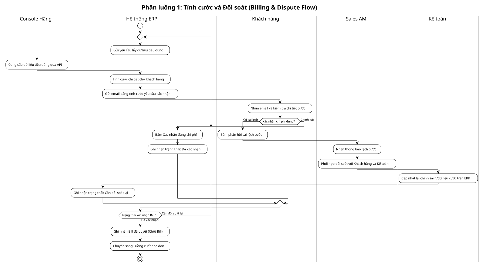
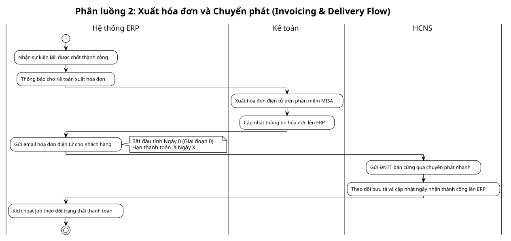
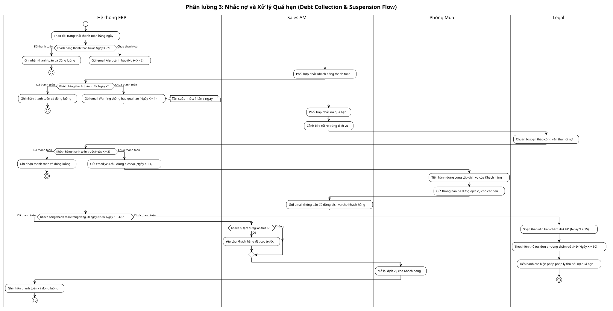

# Tài liệu các Luồng Nghiệp vụ (Process Flows)

Tài liệu này tổng hợp các sơ đồ luồng quy trình của tính năng Thu hồi công nợ và Billing dưới dạng Phân làn (Swimlane). Quy trình tổng thể được chia nhỏ thành 3 phân luồng độc lập dưới đây để giảm tải sự phức tạp và tối ưu hóa tính trực quan của tài liệu.

---

## 1. Phân luồng 1: Tính cước và Đối soát (Billing & Dispute Flow)

*   **Mục tiêu:** Quét dữ liệu sử dụng từ các hãng, tính toán cước dự kiến (Draft Bill) và xử lý vòng lặp phản hồi lệch cước từ khách hàng.
*   **Trigger**: Đến kỳ đối soát cước và tính bill hàng tháng.
*   **Các bên tham gia:** `Console Hãng`, `Hệ thống ERP`, `Khách hàng`, `Sales AM`, `Kế toán`.

> Nguồn PlantUML: `thu-hoi-cong-no-sub1-billing-dispute.puml`

---

## 2. Phân luồng 2: Xuất hóa đơn và Chuyển phát (Invoicing & Delivery Flow)

*   **Mục tiêu:** Ghi nhận cước được chốt, kế toán xuất hóa đơn điện tử trên phần mềm MISA, gửi email hóa đơn và HCNS chuyển phát thư ĐNTT bản giấy.
*   **Trigger**: Khi Khách hàng xác nhận đúng chi phí (Chốt Bill thành công ở Luồng 1).
*   **Các bên tham gia:** `Hệ thống ERP`, `Kế toán`, `HCNS`.

> Nguồn PlantUML: `thu-hoi-cong-no-sub2-invoicing-delivery.puml`

---

## 3. Phân luồng 3: Nhắc nợ và Xử lý Quá hạn (Debt Collection & Suspension Flow)

*   **Mục tiêu:** Tự động đôn đốc nhắc nợ qua email, cảnh báo nội bộ, thực thi khóa dịch vụ của khách hàng và bàn giao pháp lý đơn phương chấm dứt hợp đồng.
*   **Trigger**: Đã gửi hóa đơn điện tử (bắt đầu tính Ngày 0).
*   **Các bên tham gia:** `Hệ thống ERP`, `Sales AM`, `Phòng Mua`, `Legal`.

> Nguồn PlantUML: `thu-hoi-cong-no-sub3-debt-collection.puml`
